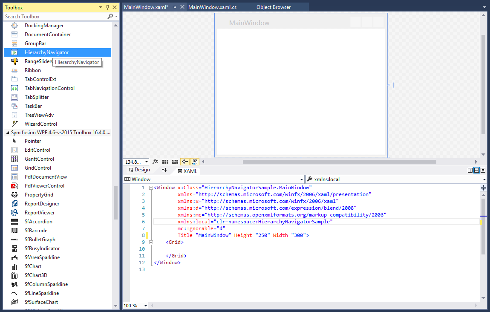
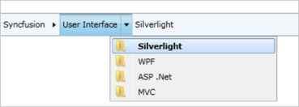

# Getting Started

## Assembly deployment

Refer to the [control dependencies](https://help.syncfusion.com/wpf/control-dependencies#hierarchynavigator) section to get the list of assemblies or NuGet package that needs to be added as a reference to use the control in any application.

You can find more details about installing the NuGet packages in a WPF application in the following link: 

[How to install nuget packages](https://help.syncfusion.com/wpf/nuget-packages)

## Create a simple application with HierarchyNavigator

You can create a WPF application with the HierarchyNavigator control using the following steps:

## Create  a project

Create a new WPF project in Visual Studio to display the HierarchyNavigator with functionalities.

## Add control through designer

The HierarchyNavigator control can be added to an application by dragging it from the toolbox and dropping it into a designer view. The following required assembly references will be added automatically to the project:

* Syncfusion.Tools.WPF
* Syncfusion.Shared.WPF 

## Add control manually in XAML

To add the control manually in XAML, follow the given steps:
1.	Add the following required assembly references to the project:
    * Syncfusion.Tools.WPF
    * Syncfusion.Shared.WPF 
2.	Import Syncfusion WPF schema **http://schemas.syncfusion.com/wpf** in the XAML page.
3.	Declare the HierarchyNavigator control the in XAML page.



<Window xmlns="http://schemas.microsoft.com/winfx/2006/xaml/presentation"
		xmlns:x="http://schemas.microsoft.com/winfx/2006/xaml"
		xmlns:syncfusion="http://schemas.syncfusion.com/wpf" 
		x:Class="HierarchicalNavigatorSample.MainWindow"
		Title="HierarchicalNavigator Sample" Height="350" Width="525">
	<Grid>
		<!--Adding HierarchicalNavigator control -->
		<syncfusion:HierarchicalNavigator x:Name="hierarchicalNavigator" Width="100" Height="100" VerticalAlignment="Center" HorizontalAlignment="Center"/>
	</Grid>
</Window>



## Add control manually in C\#

To add the control manually in C#, follow the given steps:

1.	Add the following required assembly references to the project:
    * Syncfusion.Tools.WPF
    * Syncfusion.Shared.WPF
2.	Import the HierarchyNavigator namespace **using Syncfusion.Windows.Tools.Controls;**.
3.	Create a HierarchyNavigator instance, and add it to the window.



using Syncfusion.Windows.Tools;
namespace HierarchicalNavigatorSample
{
	/// 

	/// Interaction logic for MainWindow.xaml
	/// 

	public partial class MainWindow : Window
	{
		public MainWindow()
		{
			InitializeComponent();
			//Creating an instance of HierarchicalNavigator control
			HierarchicalNavigator hierarchicalNavigator = new HierarchicalNavigator();
			//Adding HierarchicalNavigator as window content
			this.Content = hierarchicalNavigator;
		}
	}
}



## Add items using HierarchyNavigatorItem

You can add the items inside the HierarchyNavigator control using [HierarchyNavigatorItem](https://help.syncfusion.com/cr/wpf/Syncfusion.Windows.Tools.Controls.HierarchyNavigatorItem.html).



<syncfusion:HierarchyNavigator x:Name="hierarchyNavigatorcontrol1" VerticalAlignment="Top" Height="30" Width="600">
    <syncfusion:HierarchyNavigator.Items>
        <syncfusion:HierarchyNavigatorItem Content="Syncfusion">
            <syncfusion:HierarchyNavigatorItem.Items>
                <syncfusion:HierarchyNavigatorItem Content="User Interface"/>
                    <syncfusion:HierarchyNavigatorItem Content="Silverlight">
                        <syncfusion:HierarchyNavigatorItem.Items>
                            <syncfusion:HierarchyNavigatorItem Content="Tools"/>
                        </syncfusion:HierarchyNavigatorItem.Items>
                    </syncfusion:HierarchyNavigatorItem>
                </syncfusion:HierarchyNavigatorItem.Items>
            </syncfusion:HierarchyNavigatorItem>
        </syncfusion:HierarchyNavigator.Items>
</syncfusion:HierarchyNavigator>


HierarchyNavigator hierarchyNavigator1 = new HierarchyNavigator() { Height = 30 };
HierarchyNavigatorItem hierarchyNavigatorItem1 = new HierarchyNavigatorItem();
hierarchyNavigatorItem1.Content = "Syncfusion";
HierarchyNavigatorItem hierarchyNavigatorItem11 = new HierarchyNavigatorItem();

hierarchyNavigatorItem11.Content = "User Interface";
HierarchyNavigatorItem hierarchyNavigatorItem111 = new HierarchyNavigatorItem();

hierarchyNavigatorItem111.Content = "Silverlight";
HierarchyNavigatorItem hierarchyNavigatorItem112 = new HierarchyNavigatorItem();

hierarchyNavigatorItem112.Content = "WPF";
HierarchyNavigatorItem hierarchyNavigatorItem113 = new HierarchyNavigatorItem();

hierarchyNavigatorItem113.Content = "ASP .Net";
HierarchyNavigatorItem hierarchyNavigatorItem114 = new HierarchyNavigatorItem();

hierarchyNavigatorItem114.Content = "MVC";
hierarchyNavigatorItem11.Items.Add(hierarchyNavigatorItem111);
hierarchyNavigatorItem11.Items.Add(hierarchyNavigatorItem112);
hierarchyNavigatorItem11.Items.Add(hierarchyNavigatorItem113);
hierarchyNavigatorItem11.Items.Add(hierarchyNavigatorItem114);
hierarchyNavigatorItem1.Items.Add(hierarchyNavigatorItem11);
hierarchyNavigator1.Items.Add(hierarchyNavigatorItem1);
this.Content = hierarchyNavigator1;



## Bind data

HierarchyNavigator accepts any business object collection to be bound to its [ItemsSource](https://docs.microsoft.com/en-us/dotnet/api/system.windows.controls.itemscontrol.itemssourceproperty?view=netframework-4.7.2) property. Refer [Data binding](https://help.syncfusion.com/wpf/hierarchynavigator/populating-data) section for more details.

The steps to bind to a Business Object collection are as follows:

**1. Create a class named HierarchyItem.**



public class HierarchyItem
{
	public string ContentString { get; set; }
	public HierarchyItem(string content, params HierarchyItem[] myItems)
	{
		this.ContentString = content;
		itemsObservableCollection = new ObservableCollection<HierarchyItem>();
		foreach (var item in myItems)
		{
			itemsObservableCollection.Add(item);
		}
		HierarchyItems = itemsObservableCollection;
	}
	private ObservableCollection<HierarchyItem> itemsObservableCollection;
	public ObservableCollection<HierarchyItem> HierarchyItems
	{
		get { return itemsObservableCollection; }
		set
		{
			if (itemsObservableCollection != value)
			{
				itemsObservableCollection = value;
			}
		}		
	}
}



**2. Create a collection for ItemsSource to bind HierarchyItem.**



public class HierarchicalItemsSource : ObservableCollection<HierarchyItem>
{
	public HierarchicalItemsSource()
	{
		this.Add(new HierarchyItem("Syncfusion",
		new HierarchyItem("User Interface",
		new HierarchyItem("Silverlight"),
		new HierarchyItem("WPF"),
		new HierarchyItem("ASP .Net"),
		new HierarchyItem("MVC")),
		new HierarchyItem("Reporting Edition",
		new HierarchyItem("IO"),
		new HierarchyItem("PDF generator"),
		new HierarchyItem("WPF")
		)));
	}
}



**3. In XAML, bind the collections to the ItemsSource property of the HierarchyNavigator control**



<syncfusion:HierarchyNavigator Name="hierarchyNavigator2" Width="250" Height="25">
	<syncfusion:HierarchyNavigator.ItemsSource>
		<local:HierarchicalItemsSource />
	</syncfusion:HierarchyNavigator.ItemsSource>
	<syncfusion:HierarchyNavigator.ItemTemplate>
		<HierarchicalDataTemplate ItemsSource="{Binding HierarchyItems}">
			<TextBlock Text="{Binding ContentString}" Margin="2,0" />
		</HierarchicalDataTemplate>
	</syncfusion:HierarchyNavigator.ItemTemplate>
</syncfusion:HierarchyNavigator>



