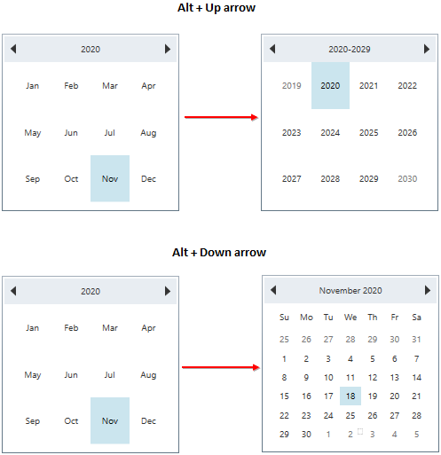
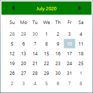
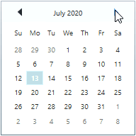
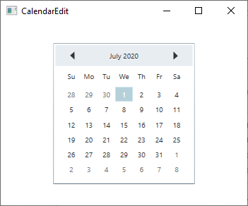

# Navigation support in WPF CalendarEdit

This section explains navigation between day, month or year mode in [CalendarEdit](https://help.syncfusion.com/cr/wpf/Syncfusion.Windows.Shared.CalendarEdit.html) control.

## Navigate to the day, month or year modes using header

You can easily navigate to the day, month or year or decade modes by clicking the `CalenderEdit` header.

### Navigate to the day, month or year modes using key navigation

You can easily navigate to the day, month or year or decade modes by pressing the `Alt` with `Up` or `Down` arrow keys. If you will press the `Alt + Up` arrow key combination, it will navigate from dates to month, year and then decade mode. If you will press `Alt + Down` arrow key combination, it will navigate from decade to year, month and then dates mode.

For example, if you will start navigation from month mode, it will be move to next or previous mode as follows,

### Change animation time for calendar mode navigation 

If you want to change the animation time for navigate to the day, month or year mode by clicking the `CalenderEdit` header, set value to [ChangeModeTime](https://help.syncfusion.com/cr/wpf/Syncfusion.Windows.Shared.CalendarEdit.html#Syncfusion_Windows_Shared_CalendarEdit_ChangeModeTime) property. The default value of `ChangeModeTime` property is `300`.




<syncfusion:CalendarEdit ChangeModeTime="0"
                         Name="calendarEdit" />



calendarEdit.ChangeModeTime = 0;




Here, `ChangeModeTime` property value is `0`. So. navigation between day, month or year mode is done without any animation delay.

N> [View Sample in GitHub](https://github.com/SyncfusionExamples/syncfusin-wpf-calendar-examples/tree/master/Samples/Navigation)

### Custom appearance of header

You can change the background and foreground of the `CalendarEdit` header by using the [HeaderBackground](https://help.syncfusion.com/cr/wpf/Syncfusion.Windows.Shared.CalendarEdit.html#Syncfusion_Windows_Shared_CalendarEdit_HeaderBackground) and [HeaderForeground](https://help.syncfusion.com/cr/wpf/Syncfusion.Windows.Shared.CalendarEdit.html#Syncfusion_Windows_Shared_CalendarEdit_HeaderForeground) properties. The default value of `HeaderBackground` is `Lavender` and `HeaderForeground` is `Dark SlateGray`.




<syncfusion:CalendarEdit HeaderBackground="Green"
                         HeaderForeground="Yellow"
                         Name="calendarEdit" />



calendarEdit.HeaderBackground = Brushes.Green;
calendarEdit.HeaderForeground = Brushes.Yellow;




N> [View Sample in GitHub](https://github.com/SyncfusionExamples/syncfusin-wpf-calendar-examples/tree/master/Samples/Navigation)

## Navigate to previous or next month

You can navigate to the previous or next month by clicking on the `Previous-Next` navigation buttons in the header. You can also navigate to the previous or next month by scrolling the mouse or pressing the `Alt + (Left or Right)` key combination. If you want to change the animation time for navigate to the previous or next month, set value to [FrameMovingTime](https://help.syncfusion.com/cr/wpf/Syncfusion.Windows.Shared.CalendarEdit.html#Syncfusion_Windows_Shared_CalendarEdit_FrameMovingTime) property. The default value of `FrameMovingTime` property is `300`.




<syncfusion:CalendarEdit FrameMovingTime="0"
                         Name="calendarEdit" />



calendarEdit.FrameMovingTime = 0;




Here, `FrameMovingTime` property value is `0`. So. navigation between next and previous month is done without any animation delay.

N> [View Sample in GitHub](https://github.com/SyncfusionExamples/syncfusin-wpf-calendar-examples/tree/master/Samples/Navigation)

## Custom UI for previous and next navigation buttons

You can customize the previous and next navigation buttons by using the [PreviousScrollButtonTemplate](https://help.syncfusion.com/cr/wpf/Syncfusion.Windows.Shared.CalendarEdit.html#Syncfusion_Windows_Shared_CalendarEdit_PreviousScrollButtonTemplate) an [NextScrollButtonTemplate](https://help.syncfusion.com/cr/wpf/Syncfusion.Windows.Shared.CalendarEdit.html#Syncfusion_Windows_Shared_CalendarEdit_NextScrollButtonTemplate) properties.




<Window.Resources>
    <!--Template for Next Buttons in Calendar Control -->
    <ControlTemplate x:Key="nextScrollButtonTemplate">
        <Border>
            <Button Command="syncfusion:CalendarEdit.NextCommand" >
                <Button.Content>
                    <Image Source="Images/1.png"
                           Height="16" Width="16"
                           VerticalAlignment="Center" />
                </Button.Content>
            </Button>
        </Border>
    </ControlTemplate>
    
    <!--Template for Previous Buttons in Calendar Control -->
    <ControlTemplate x:Key="previousScrollButtonTemplate">
        <Border>
            <Button Command="syncfusion:CalendarEdit.PrevCommand">
                <Button.Content>
                    <Image Source="Images/2.png"
                           Height="16" Width="16"
                           VerticalAlignment="Center" />
                </Button.Content>
            </Button>
        </Border>
    </ControlTemplate>
</Window.Resources>

<Grid>
    <syncfusion:CalendarEdit PreviousScrollButtonTemplate="{StaticResource previousScrollButtonTemplate}" 
                             NextScrollButtonTemplate="{StaticResource nextScrollButtonTemplate}"
                             Name="calendarEdit" 
                             Width="200" Height="200"/>
</Grid>




N> [View Sample in GitHub](https://github.com/SyncfusionExamples/syncfusin-wpf-calendar-examples/tree/master/Samples/Previous-NextButton)

## Change navigation direction

You can change previous or next month navigation direction to either `Horizontal` or `Vertical` by using the [MonthChangeDirection](https://help.syncfusion.com/cr/wpf/Syncfusion.Windows.Shared.CalendarEdit.html#Syncfusion_Windows_Shared_CalendarEdit_MonthChangeDirection) property. The default value of `MonthChangeDirection` property is `Horizontal`.




<syncfusion:CalendarEdit MonthChangeDirection="Vertical"
                         Name="calendarEdit" />



calendarEdit.MonthChangeDirection = AnimationDirection.Vertical;




N> [View Sample in GitHub](https://github.com/SyncfusionExamples/syncfusin-wpf-calendar-examples/tree/master/Samples/Navigation)

## Touch support for CalendarEdit

Swipe support is provided for the calendar. When you swipe from right to left over the calendar, it moves to the next month. When you swipe from left to right over the calendar, it moves to the previous month.

N> [View Sample in GitHub](https://github.com/SyncfusionExamples/syncfusin-wpf-calendar-examples/tree/master/Samples/Navigation)

