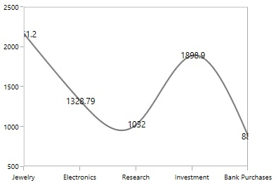
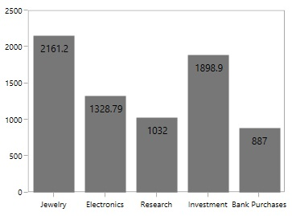
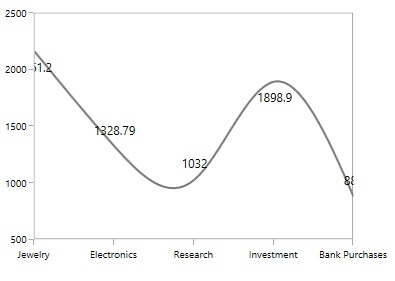
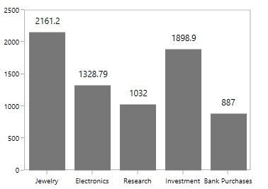
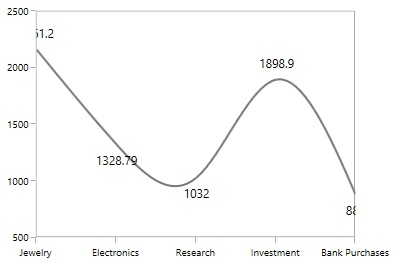

# Positioning the Data Markers in WPF Charts (SfChart)

The positioning of adornments inside the series is defined using [`AdornmentPosition`](https://help.syncfusion.com/cr/wpf/Syncfusion.UI.Xaml.Charts.ChartAdornmentInfoBase.html#Syncfusion_UI_Xaml_Charts_ChartAdornmentInfoBase_AdornmentsPosition) property. 

* [`Top`](https://help.syncfusion.com/cr/wpf/Syncfusion.UI.Xaml.Charts.AdornmentsPosition.html) - Positions the Adornment at the top edge point of a chart segment.
* [`Bottom`](https://help.syncfusion.com/cr/wpf/Syncfusion.UI.Xaml.Charts.AdornmentsPosition.html) - Positions the Adornment at the bottom edge point of a chart segment.
* [`TopAndBottom`](https://help.syncfusion.com/cr/wpf/Syncfusion.UI.Xaml.Charts.AdornmentsPosition.html) - Positions the Adornment at the center point of a chart segment.

N> This behavior varies based on the chart series type.

The following code example explains the positioning of adornments in the middle of the segment.





        <syncfusion:ChartAdornmentInfo ShowMarker="True" AdornmentsPosition="TopAndBottom" SymbolInterior="DarkGray"  Symbol="Ellipse">
        </syncfusion:ChartAdornmentInfo>





        ColumnSeries series = new ColumnSeries();
            ChartAdornmentInfo adornmentInfo = new ChartAdornmentInfo()
            {
                ShowMarker = true,
                Symbol = ChartSymbol.Ellipse,
                SymbolInterior = new SolidColorBrush(Colors.DarkGray),
                AdornmentsPosition=AdornmentsPosition.TopAndBottom
            };
        series.AdornmentsInfo = adornmentInfo;





Also, you can define the label alignment using  [`HorizontalAlignment`](https://help.syncfusion.com/cr/wpf/Syncfusion.UI.Xaml.Charts.ChartAdornmentInfoBase.html#Syncfusion_UI_Xaml_Charts_ChartAdornmentInfoBase_HorizontalAlignment) and [`VerticalAlignment`](https://help.syncfusion.com/cr/wpf/Syncfusion.UI.Xaml.Charts.ChartAdornmentInfoBase.html#Syncfusion_UI_Xaml_Charts_ChartAdornmentInfoBase_VerticalAlignment) properties.

## Label Position

Other than the above positioning options, SfChart providing additional customization option to position the adornments smartly based on series types using [`LabelPosition`](https://help.syncfusion.com/cr/wpf/Syncfusion.UI.Xaml.Charts.ChartAdornmentInfoBase.html#Syncfusion_UI_Xaml_Charts_ChartAdornmentInfoBase_LabelPosition) property.

The following are the values for this property: 

* [`Default`](https://help.syncfusion.com/cr/wpf/Syncfusion.UI.Xaml.Charts.AdornmentsLabelPosition.html)
* [`Auto`](https://help.syncfusion.com/cr/wpf/Syncfusion.UI.Xaml.Charts.AdornmentsLabelPosition.html)
* [`Inner`](https://help.syncfusion.com/cr/wpf/Syncfusion.UI.Xaml.Charts.AdornmentsLabelPosition.html)
* [`Outer`](https://help.syncfusion.com/cr/wpf/Syncfusion.UI.Xaml.Charts.AdornmentsLabelPosition.html)
* [`Center`](https://help.syncfusion.com/cr/wpf/Syncfusion.UI.Xaml.Charts.AdornmentsLabelPosition.html)

The following code sample illustrates the center position of data marker labels,





        <chart:ChartAdornmentInfo  ShowLabel="True" LabelPosition="Center"/>





        ChartAdornmentInfo adornmentInfo = new ChartAdornmentInfo()
            {
                ShowLabel = true,
                LabelPosition =AdornmentsLabelPosition.Center
            };      





| Column | Spline |
|--|--|
|||

The following code sample illustrates the inner position of data marker labels,





        <chart:ChartAdornmentInfo  ShowLabel="True" LabelPosition="Inner"/>





        ChartAdornmentInfo adornmentInfo = new ChartAdornmentInfo()
            {
                ShowLabel = true,
                LabelPosition =AdornmentsLabelPosition.Inner
            };      





| Column | Spline |
|--|--|
|||

The following code sample illustrates the outer position of data marker labels,





        <chart:ChartAdornmentInfo  ShowLabel="True" LabelPosition="Outer"/>





        ChartAdornmentInfo adornmentInfo = new ChartAdornmentInfo()
            {
                ShowLabel = true,
                LabelPosition =AdornmentsLabelPosition.Outer
            };      





| Column | Spline |
|--|--|
|||

