# Nodes

Nodes are graphical objects that can be placed on the page. It is usually used to represent visual data to be placed on the page.

<table>
<tr>
<th>
Property</th><th>
Description</th><th>
Type of the property</th><th>
Value it Accept</th><th>
Any other dependencies/ sub properties associated</th></tr>
<tr>
<td>
IsLabelEditable</td><td>
Gets or sets a value indicating whether node's label can be edited or not. The default value is set to true.</td><td>
Dependency property</td><td>
Boolean (true/ false)</td><td>
No</td></tr>
<tr>
<td>
Label</td><td>
Gets or sets the node label.</td><td>
Dependency property</td><td>
string</td><td>
No</td></tr>
<tr>
<td>
LabelVisibility</td><td>
Gets or sets the label visibility.</td><td>
Dependency property</td><td>
Visibility.HiddenVisibility.CollapsedVisibility.Visible</td><td>
No</td></tr>
<tr>
<td>
LabelHorizontalAlignment</td><td>
Specifies the horizontal alignment for the node label.</td><td>
Dependency property</td><td>
HorizontalAlignment.CenterHorizontalAlignment.LeftHorizontalAlignment.RightHorizontalAlignment.Stretch</td><td>
No</td></tr>
<tr>
<td>
LabelVerticalAlignment</td><td>
Specifies the vertical alignment for the node label.</td><td>
Dependency property</td><td>
VerticalAlignment.BottomVerticalAlignment.CenterVerticalAlignment.StretchVerticalAlignment.Top</td><td>
No</td></tr>
<tr>
<td>
HorizontalContentAlignment</td><td>
Specifies the horizontal alignment for the node content.</td><td>
Dependency property</td><td>
HorizontalAlignment.CenterHorizontalAlignment.LeftHorizontalAlignment.RightHorizontalAlignment.Stretch</td><td>
No</td></tr>
<tr>
<td>
VerticalContentAlignment</td><td>
Specifies the vertical alignment for the node content.</td><td>
Dependency property</td><td>
VerticalAlignment.BottomVerticalAlignment.CenterVerticalAlignment.StretchVerticalAlignment.Top</td><td>
No</td></tr>
<tr>
<td>
LabelAngle</td><td>
Gets or sets the angle of the node label.</td><td>
Dependency property</td><td>
double</td><td>
No</td></tr>
<tr>
<td>
Shape</td><td>
Specifies the shape of the node.</td><td>
Dependency property</td><td>
Shapes</td><td>
No</td></tr>
<tr>
<td>
CustomPathStyle</td><td>
Gets or sets the CustomPathStyle for the node.</td><td>
Dependency property</td><td>
Style</td><td>
No</td></tr>
<tr>
<td>
Level</td><td>
Gets or sets the node level.</td><td>
Dependency property</td><td>
int</td><td>
No</td></tr>
<tr>
<td>
OffsetX</td><td>
Gets or sets the offset x value of the node. </td><td>
CLR property</td><td>
double</td><td>
No</td></tr>
<tr>
<td>
OffsetY</td><td>
Gets or sets the offset y value of the node.</td><td>
CLR property</td><td>
double</td><td>
No</td></tr>
<tr>
<td>
Content</td><td>
Gets or sets the node's content.</td><td>
Dependency property</td><td>
object</td><td>
No</td></tr>
<tr>
<td>
AllowMove</td><td>
Gets or sets a value indicating whether node can be moved or not. The default value is set to true.</td><td>
Dependency property</td><td>
Boolean (true/ false)</td><td>
No</td></tr>
<tr>
<td>
AllowSelect</td><td>
Gets or sets a value indicating whether node can be selected or not. The default value is set to true.</td><td>
Dependency property</td><td>
Boolean (true/ false)</td><td>
No</td></tr>
<tr>
<td>
AllowRotate</td><td>
Gets or sets a value indicating whether node can be rotated or not. The default value is set to true.</td><td>
Dependency property</td><td>
Boolean (true/ false)</td><td>
No</td></tr>
<tr>
<td>
AllowResize</td><td>
Gets or sets a value indicating whether node can be resized or not. The default value is set to true.</td><td>
Dependency property</td><td>
Boolean (true/ false)</td><td>
No</td></tr>
<tr>
<td>
LabelTextTrimming</td><td>
Gets or sets the text trimming style. Default value is CharacterEllipsis.</td><td>
Dependency property</td><td>
TextTrimming.CharacterEllipsisTextTrimming.NoneTextTrimming.WordEllipsis</td><td>
No</td></tr>
<tr>
<td>
LabelForeground</td><td>
Gets or sets the foreground of the label. Default value is Black.</td><td>
Dependency property</td><td>
Brush</td><td>
No</td></tr>
<tr>
<td>
LabelBackground</td><td>
Gets or sets the background of the label. Default value is White.</td><td>
Dependency property</td><td>
Brush</td><td>
No</td></tr>
<tr>
<td>
LabelFontStyle</td><td>
Gets or sets the background of the label. Default value is White.</td><td>
Dependency property</td><td>
FontStyle</td><td>
No</td></tr>
<tr>
<td>
LabelFontFamily</td><td>
Gets or sets the font family of the label. Default value is Arial.</td><td>
Dependency property</td><td>
FontFamily</td><td>
No</td></tr>
<tr>
<td>
LabelTextAlignment</td><td>
Gets or sets the text alignment of the label. Default value is Center.</td><td>
Dependency property</td><td>
TextAlignment.CenterTextAlignment.JustifyTextAlignment.LeftTextAlignment.Right</td><td>
No</td></tr>
<tr>
<td>
LabelFontSize</td><td>
Gets or sets the font size of the label. Default value is 11.</td><td>
Dependency property</td><td>
Double</td><td>
No</td></tr>
<tr>
<td>
LabelFontWeight</td><td>
Gets or sets the font weight of the label. Default value is SemiBold.</td><td>
Dependency property</td><td>
FontWeight</td><td>
No</td></tr>
<tr>
<td>
LabelTextWrapping</td><td>
Gets or sets the text wrapping of the label. Default value is NoWrap.</td><td>
Dependency property</td><td>
TextWrapping.NoWrapTextWrapping.WrapTextWrapping.WrapWithOverflow</td><td>
No</td></tr>
<tr>
<td>
LabelWidth</td><td>
Gets or sets the width of the label. Default value is node’s width.</td><td>
Dependency property</td><td>
Double</td><td>
No</td></tr>
<tr>
<td>
IsLabelDraggable </td><td>
Gets or sets the Label of Node is Dragging or Not.</td><td>
Dependency  property </td><td>
bool(true/false)</td><td>
False</td></tr>
<tr>
<td>
LabelDisplacement</td><td>
Gets or sets the different between the Original position and the Current position of the Node’s Label.</td><td>
Dependency  property</td><td>
Point</td><td>
Point(0,0)</td></tr>
<tr>
<td>
OutDegree</td><td>
Gets the out-degree of the node, the number of edges for which this node is the source.</td><td>
CLR property</td><td>
int </td><td>
No</td></tr>
<tr>
<td>
OutEdges</td><td>
Gets the collection of all outgoing edges for which this node is the source.</td><td>
CLR property</td><td>
CollectionExt</td><td>
No</td></tr>
<tr>
<td>
OutNeighbors</td><td>
Gets the collection of adjacent nodes connected to this node by an outgoing edge (i.e., all nodes "pointed" to by this one)</td><td>
CLR property</td><td>
CollectionExt</td><td>
No</td></tr>
<tr>
<td>
InDegree</td><td>
Gets the in-degree, or the number of edges for which this node is the target.</td><td>
CLR property</td><td>
int</td><td>
No</td></tr>
<tr>
<td>
InEdges</td><td>
Gets the collection of all incoming edges for which this node is the target.</td><td>
CLR property</td><td>
CollectionExt</td><td>
No</td></tr>
<tr>
<td>
InNeighbors</td><td>
Gets the collection of all adjacent nodes connected to this node by an incoming edge (i.e., all nodes that "point" to this one).</td><td>
CLR property</td><td>
CollectionExt</td><td>
No</td></tr>
<tr>
<td>
Edges</td><td>
Gets the collection of all incident edges for which this node is either the source or the target.</td><td>
CLR property</td><td>
CollectionExt</td><td>
No</td></tr>
<tr>
<td>
Neighbors</td><td>
Gets an iterator over all nodes connected to this node.</td><td>
CLR property</td><td>
CollectionExt</td><td>
No</td></tr>
<tr>
<td>
Degree</td><td>
Gets the degree of the node, or the number of edges for which this node is either the source or the target.</td><td>
CLR property</td><td>
int</td><td>
No</td></tr>
<tr>
<td>
ResizeThisNode</td><td>
Gets or sets a value indicating whether to resize this node. Used for serialization purposes.</td><td>
CLR property</td><td>
Boolean (true/false)</td><td>
No</td></tr>
<tr>
<td>
ContentHitTestVisible</td><td>
Gets or sets a value indicating whether content is hit test visible. Used for serialization purposes internally.</td><td>
</td><td>
Boolean (true/false)</td><td>
</td></tr>
<tr>
<td>
IntersectionMode</td><td>
Specifies the Intersection mode for a node. The default value is OnBorder.</td><td>
Dependency property</td><td>
IntersectionMode.OnBorderIntersectionMode.OnContent</td><td>
No</td></tr>
<tr>
<td>
IsDragConnectionOver</td><td>
Gets or sets a value indicating whether the connection drag is over.</td><td>
CLR property</td><td>
Boolean (true/false)</td><td>
No</td></tr>
<tr>
<td>
AllowDelete</td><td>
Gets or sets a value indicating whether a node can be deleted.</td><td>
Dependency property</td><td>
Boolean (true/false)</td><td>
No</td></tr>
</table>

<table>
<tr>
<th>
Name</th><th>
Parameters </th><th>
Return Type</th><th>
Description</th><th>
Reference Links</th></tr>
<tr>
<td>
Ports.Add(ConnectionPort)</td><td>
ConnectionPort</td><td>
void</td><td>
To add a port to the node</td><td>
Create Connection Port</td></tr>
</table>



* Node Shapes Refer Concepts and Features > Nodes > Node Shapes
* Custom Shape Refer Concepts and Features > Nodes > Node Shapes > Custom Shape
* Node Position Refer Concepts and Features > Nodes > Node Position
* Node Content Refer Concepts and Features -> Nodes > Node Content
* Node Label Refer Concepts and Features > Nodes > Node Label
* Customize the label of Nodes and LineConnectors Refer Concepts and Features -> General -> Customize the label of Nodes and LineConnectors
* Customize the ContextMenu of Nodes and LineConnectors Refer Concepts and Features -> General -> Customize the contextMenu of Nodes and LineConnectors



## Create Node

Nodes are graphical objects that can be drawn on the page by selecting them from the SymbolPalette and dropping on the page, or they can be added through code behind using a model.

Node can be created and added into the DiagramModel in three ways,

* Through SymbolPalette
* Through XAML
* Through Code Behind

### Adding Through SymbolPalette

Steps for adding a node to the diagram using the SymbolPalette.

* Click the desired node on the SymbolPalette.

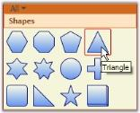

Item Selected

{:.caption}

* While pressing the left mouse button, drag the pointer to the drawing area.

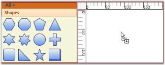

Item Dragged
{:.caption}

* Now release the mouse button. The desired node is now on the drawing area at the point where the pointer was released.

Item Dropped
{:.caption}

### Adding Through XAML

Node can also be added into the model through XAML. The following code shows how it can be done.



<syncfusion:DiagramControl Name="diagramControl" IsSymbolPaletteEnabled="True">

    <syncfusion:DiagramControl.Model>

        <syncfusion:DiagramModel   x:Name="diagramModel">

            <syncfusion:DiagramModel.Nodes>

                <syncfusion:Node Width="200" Height="70" Shape="FlowChart_Card">

                </syncfusion:Node>

            </syncfusion:DiagramModel.Nodes>

        </syncfusion:DiagramModel>

    </syncfusion:DiagramControl.Model>

    <syncfusion:DiagramControl.View>

        <syncfusion:DiagramView IsZoomEnabled="True" Bounds="0,0,1200,1200" Name="diagramView">

        </syncfusion:DiagramView>

    </syncfusion:DiagramControl.View>

</syncfusion:DiagramControl>



Here, a node is created and added into the model.

### Adding Through code behind

A Node can be created using one of the three different constructors

* Node ()
* Node (Guid)
* Node (Guid, sting)

Nodes can be added through the model. The following code shows how it can be done.



Node n = new Node();

n.Shape = Shapes.FlowChart_Card;

diagramModel.Nodes.Add(n);



Dim n As New Node()

n.Shape = Shapes.FlowChart_Card

diagramModel.Nodes.Add(n)



* A node can be created with a new ID. The following code shows how it can be done.



Node n = new Node(Guid.NewGuid());

n.Shape = Shapes.FlowChart_Card;

diagramModel.Nodes.Add(n);




Dim n As New Node(Guid.NewGuid())

n.Shape = Shapes.FlowChart_Card

diagramModel.Nodes.Add(n)



* A node can also be created with a new ID and a name. The following code shows how it can be done.



Node n = new Node(Guid.NewGuid(), "First");

n.Shape = Shapes.FlowChart_Card;

diagramModel.Nodes.Add(n);




Dim n As New Node(Guid.NewGuid(), "First")

n.Shape = Shapes.FlowChart_Card

diagramModel.Nodes.Add(n)



NewGuid() creates a new instance of the Guid class. The string value sets the identifying name of the element. The name provides a reference so that the code-behind, such as event handler code, can refer to a markup element after it is constructed during processing by an XAML processor.

N> If name is not specified for a node, a unique name will be automatically assigned to the node.

## Node Shapes

Node’s Shapes are collection of predefined geometry used to represent as Node’s style. Node Shape visually lies between Node’s Content and Node’s Background.

<table>
<tr>
<th>
Property</th><th>
Description</th><th>
Type of the property</th><th>
Value it Accept</th><th>
Any other dependencies/ sub properties associated</th></tr>
<tr>
<td>
Shape</td><td>
Specifies the shape of the node</td><td>
Dependency property</td><td>
Shapes</td><td>
No</td></tr>
<tr>
<td>
CustomPathStyle</td><td>
Gets or sets the CustomPathStyle for the node</td><td>
Dependency property</td><td>
Style</td><td>
No</td></tr>
</table>

### Predefined Node Shapes

A node can be assigned with a shape using the Shape property. Several built-in shapes are provided. The user can select from any of the built-in shapes or specify their own custom shape using the CustomPathStyle property, which will be explained later in this user guide.



Node n = new Node();

n.Shape = Shapes.FlowChart_Card;

diagramModel.Nodes.Add(n);




Dim n As New Node()

n.Shape = Shapes.FlowChart_Card

diagramModel.Nodes.Add(n)



The following is a list of built-in shapes.

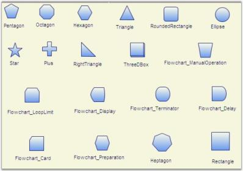

Built-in Shapes
{:.caption}

More Built-In Shapes
{:.caption}

### Customize the appearance of the pre-defined Shape

Appearance of the predefined shapes can be customized by applying Style for CustomPathStyle property.

Style can be applied for CustomPathStyle in two different ways,

* Through XAML
* Through Code Behind



        </Setter.Value>

    </Setter>

</Style>




Setter s = new Setter(System.Windows.Shapes.Path.FillProperty, Brushes.LightGray);

Style style = new Style();

style.Setters.Add(s);

Node n = new Node();

n.Shape = Shapes.FlowChart_Card;

diagramModel.Nodes.Add(n);




Dim s As New Setter(System.Windows.Shapes.Path.FillProperty, Brushes.LightGray)

Dim style As New Style()

style.Setters.Add(s)

Dim n As New Node()

n.Shape = Shapes.FlowChart_Card

diagramModel.Nodes.Add(n)



### Custom Shape

You can specify your own custom shapes to be used for the node as follows. First create a style resource that contains your custom shape.





Now use it for the node; the following code can be used as an example.



Style s = (Style)this.Resources["myNode"];

Node n = new Node();

n.Shape = Shapes.CustomPath;

n.CustomPathStyle = s;

diagramModel.Nodes.Add(n);




Dim s As Style = CType(Me.Resources("myNode"), Style)

Dim n As New Node()

n.Shape = Shapes.CustomPath

n.CustomPathStyle = s

diagramModel.Nodes.Add(n)



CustomNode
{:.caption}

## Node Content

Node is used to visually represent any UIElements using Content property. You can host any content inside the node using the Content property. Node supports control template too, by defined template for the nodes, business object can be assigned as Node’s Content and the template will look after how to present the business object. 

N> A Node can have both Content and Shape at the same time, doing so Content will be placed over the Shape.

<table>
<tr>
<th>
Property</th><th>
Description</th><th>
Type of the property</th><th>
Value it Accept</th><th>
Any other dependencies/ sub properties associated</th></tr>
<tr>
<td>
Content</td><td>
Gets or sets the node's content.</td><td>
Dependency property</td><td>
object</td><td>
No</td></tr>
<tr>
<td>
HorizontalContentAlignment</td><td>
Specifies the horizontal alignment for the node content.</td><td>
Dependency property</td><td>
HorizontalAlignment.CenterHorizontalAlignment.LeftHorizontalAlignment.RightHorizontalAlignment.Stretch</td><td>
No</td></tr>
<tr>
<td>
VerticalContentAlignment</td><td>
Specifies the vertical alignment for the node content.</td><td>
Dependency property</td><td>
VerticalAlignment.BottomVerticalAlignment.CenterVerticalAlignment.StretchVerticalAlignment.Top</td><td>
No</td></tr>
</table>

### UIElement Content

Node’s Content can be specified in two ways,

* Through XAML
* Through Code Behind



<syncfusion:DiagramControl Name="diagramControl" IsSymbolPaletteEnabled="True">

    <syncfusion:DiagramControl.Model>

        <syncfusion:DiagramModel   x:Name="diagramModel">

            <syncfusion:DiagramModel.Nodes>

                <syncfusion:Node Width="200" Height="70" Shape="FlowChart_Card" HorizontalContentAlignment="Center" VerticalContentAlignment="Center">

                    <Button Content="Click Me!"></Button>

                </syncfusion:Node>

            </syncfusion:DiagramModel.Nodes>

        </syncfusion:DiagramModel>

    </syncfusion:DiagramControl.Model>

    <syncfusion:DiagramControl.View>

        <syncfusion:DiagramView IsZoomEnabled="True" Bounds="0,0,1200,1200" Name="diagramView">

        </syncfusion:DiagramView>

    </syncfusion:DiagramControl.View>

</syncfusion:DiagramControl>




Node n = new Node();

n.Shape = Shapes.FlowChart_Card;

Button b = new Button();

b.Content = "Click ME!";

n.Content = b;

(n.Content as Button).IsHitTestVisible = true;




Dim n As New Node()

n.Shape = Shapes.FlowChart_Card

Dim b As New Button()

b.Content = "Click ME!"

n.Content = b

TryCast(n.Content, Button).IsHitTestVisible = True



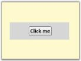

NodeContent

{:.caption}

### Business-Object Content with ContentTemplate

Node can even have a business object and a content template that can be used to define the how the business object should look line.

Assigning business object as Node’s Content:



    //Business Object.

    public class BusinessObject

    {

        //Business Property.

        public string BusinessProperty

        {

            get;

            set;

        }

    }

Node n = new Node();

//Assign an instance of Business Object to Node’s Content.

n.Content = new BusinessObject() { BusinessProperty = "BusinessProperty" };

diagramModel.Nodes.Add(n);




'Business Object.

        Public Class BusinessObject

            'Business Property.

            Private privateBusinessProperty As String

            Public Property BusinessProperty() As String

                Get

                    Return privateBusinessProperty

                End Get

                Set(ByVal value As String)

                    privateBusinessProperty = value

                End Set

            End Property

        End Class

Private n As New Node()

'Assign an instance of Business Object to Node’s Content.

n.Content = New BusinessObject() With {.BusinessProperty = "BusinessProperty"}

diagramModel.Nodes.Add(n)



Specify ContentTemplate for node.



<!-- Template for Node -->

<!-- Define the appearance of the Business Object -->

<DataTemplate x:Key="NodeTemplate">

    <Border BorderThickness="2" BorderBrush="Blue" CornerRadius="5">

        <TextBlock Text="{Binding Path=BusinessProperty}" HorizontalAlignment="Center" VerticalAlignment="Center"/>

    </Border>

</DataTemplate>

<!-- Style for Node -->



Node’s Content having Business Object with ContentTemplate

{:.caption}

## Node Position

The node's location on the drawing area can be manually specified using the node's OffsetX and OffsetY properties.

<table>
<tr>
<th>
Property</th><th>
Description</th><th>
Type of the property</th><th>
Value it Accept</th><th>
Any other dependencies/ sub properties associated</th></tr>
<tr>
<td>
OffsetX</td><td>
Gets or sets the offset x value of the node.</td><td>
CLR property</td><td>
double</td><td>
No</td></tr>
<tr>
<td>
OffsetY</td><td>
Gets or sets the offset y value of the node.</td><td>
CLR property</td><td>
double</td><td>
No</td></tr>
<tr>
<td>
AllowMove</td><td>
Gets or sets a value indicating whether node can be moved or not. The default value is set to true.</td><td>
Dependency property</td><td>
Boolean (true/ false)</td><td>
No</td></tr>
</table>

N> There are two more properties called LogicalOffsetX and LogicalOffsetY which is used only for internal calculations and they do not support negative values,.So use only OffsetX and OffsetY property.

Specify node’s location

Node’s location can be changed in following two ways:

* At Runtime
* Through Code Behind

At Runtime

Node’s location can be changed at run time by clicking and dragging the Node. To change the node’s location, follow the steps below. 

* Select the node that is to be dragged to change its location.
* Move the pointer and place it on the Node.
* The cursor will change to a four sided Arrow cursor.
* Now click and drag the node to the change the node’s location. The node's OffsetX and OffsetY values will correspondingly change.

Through Code Behind 

Node’s location can be changed using the following code snippet.



Node n = new Node();

n.OffsetX = 50;

n.OffsetY = 50;

n.Shape = Shapes.FlowChart_Card;

diagramModel.Nodes.Add(n);




Dim n As New Node()

n.OffsetX = 50

n.OffsetY = 50

n.Shape = Shapes.FlowChart_Card

diagramModel.Nodes.Add(n)


The node will be placed at the point: 50, 50.

N> To dynamically change the position of the node, specify the offset values and call the InvalidateMeasure() of the DiagramPage as follows:



node.OffsetX = 100;

node.OffsetY = 100;

DiagramPage page = new DiagramPage();

page = diagramView.Page as DiagramPage;

page.InvalidateMeasure();




node.OffsetX = 100

node.OffsetY = 100

Dim page As New DiagramPage()

page = TryCast(diagramView.Page, DiagramPage)

page.InvalidateMeasure()



In the above code, node refers to the instance of the node whose position is to be changed.

AllowMove

The AllowMove property can be used to enable/disable the node drag option.
When this property is set to True, it is possible to move the node. Otherwise the node cannot be moved.
The default value is True.

The AllowMove property can be set in the following way:



Node nodeobject = new Node();

nodeobject.AllowMove = false;




Dim nodeobject As New Node()

nodeobject.AllowMove = False



## Node Rotate

A node can be rotated to any angle by dragging the rotate thumb. A node always rotates on its center.

<table>
<tr>
<th>
Property</th><th>
Description</th><th>
Type of the property</th><th>
Value it Accept</th><th>
Any other dependencies/ sub properties associated</th></tr>
<tr>
<td>
AllowRotate</td><td>
Gets or sets a value indicating whether node can be rotated or not. The default value is set to True.</td><td>
Dependency property</td><td>
Boolean (true/ false)</td><td>
No</td></tr>
</table>

### Rotate Node

The steps to rotate a node are as follows.

* Select the node to be rotated. The rotate thumb will be displayed in the top left corner.
* Click the rotate thumb and drag it clockwise or counterclockwise; the node will rotate correspondingly.

Node Rotation
{:.caption}

### AllowRotate

The AllowRotate property can be used to enable/disable rotation of the node.

Node rotation is enabled when this property is set to ‘True’. Otherwise the rotation is disabled. The default value is ‘True’.

The AllowRotate property can be set in the following way.



Node nodeobject = new Node();

nodeobject.AllowRotate = false;



Dim nodeobject As New Node()

nodeobject.AllowRotate = False


Rotation through Code behind

Rotate angle property enables the rotation of the selected object with a specified angle. It enables the support to rotate all the selected Nodes.

<table>
<tr>
<th>
Property</th><th>
Description </th><th>
Type of the property</th><th>
Value it accepts</th><th>
Any other dependencies/ sub properties associated</th></tr>
<tr>
<td>
RotateAngle</td><td>
Gets or sets the angle for the Rotation.</td><td>
Dependency property</td><td>
Double </td><td>
No</td></tr>
</table>

### After Rotating the Node:

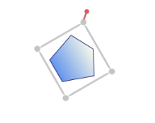

RotateAngle with 60 degree
{:.caption}

After rotating the Group

RotateAngle with 180 degree
{:.caption}

## Node Resize

Nodes can be resized to desired Width and Height by click and dragging the Resizer, based on the content alignment setting. The node’s content will also be resized accordingly. Resizing is supported in eight directions.

<table>
<tr>
<th>
Property</th><th>
Description</th><th>
Type of the property</th><th>
Value it Accept</th><th>
Any other dependencies/ sub properties associated</th></tr>
<tr>
<td>
AllowResize</td><td>
Gets or sets a value indicating whether node can be resized or not. The default value is set to true.</td><td>
Dependency property</td><td>
Boolean (true/ false)</td><td>
No</td></tr>
</table>

### Resizing through the Resize handle

Resizing a node affects the node's width and height. To resize a node, follow the steps below. 

* Select the node that is to be resized.
* Move the pointer to the edge that you want to resize.
* The cursor will change to one with two arrows.
* Now drag the edge to the size you want. The node's height and width will correspondingly change.

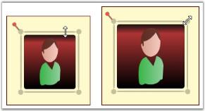

Node Resizing Illustrated
{:.caption}

To resize both the width and height by the same factor, click and drag the corners of the resize adorner.

AllowResize

The AllowResize property can be used to enable/disable the node resizing.
When this property is set to ‘True’, it is possible to resize the node. Otherwise the node cannot be resized.
The default value is ‘True’.

The AllowResize property can be set in the following way.



Node nodeobject = new Node();

nodeobject.AllowResize = false;




Dim nodeobject As New Node()

nodeobject.AllowResize = False



### Resize Single Node on Multiple Selection

When multiple nodes are selected, then by default on resizing any node in the selection list, all the other nodes also get resized. However the user can set this default behavior to false by specifying the EnableResizingCurrentNodeOnMultipleSelection property. Once this property is set to ‘True’, only the current node will get resized.

This property is in DiagramPage and can be set in the following ways.



DiagramPage diagramPage = new DiagramPage();

diagramPage.EnableResizingCurrentNodeOnMultipleSelection = true;




Dim diagramPage As New DiagramPage()

diagramPage.EnableResizingCurrentNodeOnMultipleSelection = True




    <!--Diagram Control-->

    <syncfusion:DiagramControl  Name="diagramControl">

        <!-- Model to add nodes and connections-->

        <syncfusion:DiagramControl.Model>

            <syncfusion:DiagramModel x:Name="diagramModel">

            </syncfusion:DiagramModel>

        </syncfusion:DiagramControl.Model>

        <!--View to display nodes and connections added through model.-->

        <syncfusion:DiagramControl.View>

            <syncfusion:DiagramView Name="diagramView">

<syncfusion:DiagramView.Page>

<syncfusion:DiagramPage EnableResizingCurrentNodeOnMultipleSelection="True" x:Name="diagramPage"/>

</syncfusion:DiagramView.Page>

            </syncfusion:DiagramView>

        </syncfusion:DiagramControl.View>

    </syncfusion:DiagramControl>



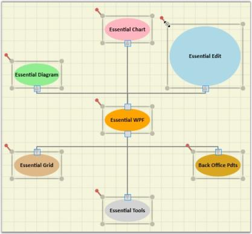

Resizing Single Node

{:.caption}

## Node Label

Label is a single line or multiline text that is displayed over the Node. This Label is used to textually represent a Node with a string that can be edited in run time, there are many properties used to change the alignment and appearance settings. Label can be represented as multiline text using the TextWrapping property.

<table>
<tr>
<th>
Property</th><th>
Description</th><th>
Type of the property</th><th>
Value it Accept</th><th>
Any other dependencies/ sub properties associated</th></tr>
<tr>
<td>
IsLabelEditable</td><td>
Gets or sets a value indicating whether node's label can be edited or not. The default value is set to True.</td><td>
Dependency property</td><td>
Boolean (true/ false)</td><td>
No</td></tr>
<tr>
<td>
Label</td><td>
Gets or sets the node label.</td><td>
Dependency property</td><td>
string</td><td>
No</td></tr>
<tr>
<td>
LabelVisibility</td><td>
Gets or sets the label visibility.</td><td>
Dependency property</td><td>
Visibility.HiddenVisibility.CollapsedVisibility.Visible</td><td>
No</td></tr>
<tr>
<td>
LabelHorizontalAlignment</td><td>
Specifies the horizontal alignment for the node label.</td><td>
Dependency property</td><td>
HorizontalAlignment.CenterHorizontalAlignment.LeftHorizontalAlignment.RightHorizontalAlignment.Stretch</td><td>
No</td></tr>
<tr>
<td>
LabelVerticalAlignment</td><td>
Specifies the vertical alignment for the node label.</td><td>
Dependency property</td><td>
VerticalAlignment.BottomVerticalAlignment.CenterVerticalAlignment.StretchVerticalAlignment.Top</td><td>
No</td></tr>
<tr>
<td>
LabelAngle</td><td>
Gets or sets the angle of the node label.</td><td>
Dependency property</td><td>
double</td><td>
No</td></tr>
<tr>
<td>
LabelTextTrimming</td><td>
Gets or sets the text trimming style. Default value is CharacterEllipsis.</td><td>
Dependency property</td><td>
TextTrimming.CharacterEllipsisTextTrimming.NoneTextTrimming.WordEllipsis</td><td>
No</td></tr>
<tr>
<td>
LabelForeground</td><td>
Gets or sets the foreground of the label. Default value is Black.</td><td>
Dependency property</td><td>
Brush</td><td>
No</td></tr>
<tr>
<td>
LabelBackground</td><td>
Gets or sets the background of the label. Default value is White.</td><td>
Dependency property</td><td>
Brush</td><td>
No</td></tr>
<tr>
<td>
LabelFontStyle</td><td>
Gets or sets the background of the label. Default value is White.</td><td>
Dependency property</td><td>
FontStyle</td><td>
No</td></tr>
<tr>
<td>
LabelFontFamily</td><td>
Gets or sets the font family of the label. Default value is Arial.</td><td>
Dependency property</td><td>
FontFamily</td><td>
No</td></tr>
<tr>
<td>
LabelTextAlignment</td><td>
Gets or sets the text alignment of the label. Default value is Center.</td><td>
Dependency property</td><td>
TextAlignment.CenterTextAlignment.JustifyTextAlignment.LeftTextAlignment.Right</td><td>
No</td></tr>
<tr>
<td>
LabelFontSize</td><td>
Gets or sets the font size of the label. Default value is 11.</td><td>
Dependency property</td><td>
Double</td><td>
No</td></tr>
<tr>
<td>
LabelFontWeight</td><td>
Gets or sets the font weight of the label. Default value is SemiBold.</td><td>
Dependency property</td><td>
FontWeight</td><td>
No</td></tr>
<tr>
<td>
LabelTextWrapping</td><td>
Gets or sets the text wrapping of the label. Default value is NoWrap.</td><td>
Dependency property</td><td>
TextWrapping.NoWrapTextWrapping.WrapTextWrapping.WrapWithOverflow</td><td>
No</td></tr>
<tr>
<td>
LabelWidth</td><td>
Gets or sets the width of the label. Default value is node’s width.</td><td>
Dependency property</td><td>
Double</td><td>
No</td></tr>
<tr>
<td>
EnableMultilineLabel</td><td>
Gets or sets a value indicating whether the Node’s label can be multiline or not. Default value is False.</td><td>
Dependency Property</td><td>
Boolean (True / False)</td><td>
No</td></tr>
<tr>
<td>
LabelTextDecorations</td><td>
Gets or sets the text alignment of the label. Default value is Center.</td><td>
Dependency property</td><td>
TextDecorations.UnderlineTextDecorations.BaselineTextDecorations.OverLineTextDecorations.Strikethrough</td><td>
No</td></tr>
</table>

Following is list of topics explained subsequently,

* Set Label for Node
* Label Editing
* Multiline label 
* Label Visibility
* Label Angle

Set a label for the node using the Label property. The default value is an empty string. By default, the label is displayed at the top-center position.



Node n = new Node();

n.OffsetX = 50;

n.OffsetY = 50;

n.Shape = Shapes.FlowChart_Card;

n.Label = "WPF";

diagramModel.Nodes.Add(n);




Dim n As New Node()

n.OffsetX = 50

n.OffsetY = 50

n.Shape = Shapes.FlowChart_Card

n.Label = "WPF"

diagramModel.Nodes.Add(n)



Label

{:.caption}

Label Editing

A node's label can be edited at run time by setting IsLabelEditable property to True.



Node n = new Node();

n.Shape = Shapes.RoundedRectangle;

n.IsLabelEditable = true;




Dim n As New Node()

n.Shape = Shapes.RoundedRectangle

n.IsLabelEditable = True



A user can specify a label at run time by following the below mentioned steps.

* Double click the left mouse button on the node. A text box will appear with the cursor at the beginning.
* Now type the label name and press ENTER. The label will be displayed on the node. Press ESC key if you do not want to apply the new label value.

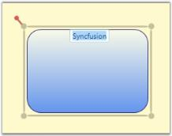

LabelEditor
{:.caption}



Customize the Label of Nodes and Line Connectors Refer Concepts and Features -> General -> Customize the Label of Node and LineConnectors 



Multiline label 

Label text can be displayed in multiple lines using LabelTextWrapping property set to Wrap. If there is no enough space for the text to get displayed over the node in a single line then the text will get wrapped within the node boundaries and will start to display the label in multiple lines.


Node n = new Node();

n.Shape = Shapes.RoundedRectangle;

n.Label = "This is Multiline Label";

n.Width = 75;

n.Height = 100;

n.LabelTextWrapping = TextWrapping.Wrap;

n.IsLabelEditable = true;




Dim n As New Node()

n.Shape = Shapes.RoundedRectangle

n.Label = "This is Multiline Label"

n.Width = 75

n.Height = 100

n.LabelTextWrapping = TextWrapping.Wrap

n.IsLabelEditable = True


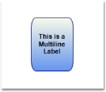

Multi line label
{:.caption}

Label Visibility

A label's visibility can be changed using the LabelVisibility property. The default value is visible.



Node n = new Node();

n.Shape = Shapes.FlowChart_Card;

n.Label = "Syncfusion";

n.LabelVisibility = Visibility.Hidden;




Dim n As New Node()

n.Shape = Shapes.FlowChart_Card

n.Label = "Syncfusion"

n.LabelVisibility = Visibility.Hidden



Label Vertical Alignment & Label Horizontal Alignment

Vertical and horizontal alignments of a label is specified using LabelVerticalAlignment and LabelHorizontalAlignment properties. By default, LabelVerticalAlignment is set to Top and LabelHorizontalAlignment is set to Center.



Node n = new Node();

n.Shape = Shapes.FlowChart_Card;

n.Label = "Diagram";

n.LabelHorizontalAlignment = HorizontalAlignment.Center;

n.LabelVerticalAlignment = VerticalAlignment.Center;




Dim n As New Node()

n.Shape = Shapes.FlowChart_Card

n.Label = "Diagram"

n.LabelHorizontalAlignment = HorizontalAlignment.Center

n.LabelVerticalAlignment = VerticalAlignment.Center


This will place the label at the center of the node.

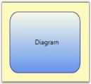

LabelAlignment
{:.caption}

LabelAngle

The user can rotate the label by a specified angle and display it using the below code snippet.



Node n = new Node();

n.Shape = Shapes.FlowChart_Card;

n.Label = "Diagram";

n.LabelHorizontalAlignment = HorizontalAlignment.Right;

n.LabelVerticalAlignment = VerticalAlignment.Top;

n.Label = 45;




Dim n As New Node()

n.Shape = Shapes.FlowChart_Card

n.Label = "Diagram"

n.LabelHorizontalAlignment = HorizontalAlignment.Right

n.LabelVerticalAlignment = VerticalAlignment.Top

n.Label = 45



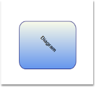

LabelAngle
{:.caption}

Multiline Label Support for LabelEditor:

Node’s Label can be set as Multiline Label by setting the EnableMultiline property as True. The default Value is False.



 

<syncfusion:Node Shape="FlowChart_Card" Height="100" Width="100" OffsetX="500" OffsetY="500" Name="Node1" EnableMultilineLabel="true”/>




Node node1 = new Node();

node1.Shape = Shapes.RoundedSquare;

node1.OffsetX = 500;

node1.OffsetY = 500;

node1.Width = 100;

node1.Height = 100;

node1.EnableMultilineLabel = true;

diagramModel.Nodes.Add(node1); 




Dim node1 As New Node()

node1.Shape = Shapes.RoundedSquare

node1.OffsetX = 500

node1.OffsetY = 500

node1.Width = 100

node1.Height = 100

node1.EnableMultilineLabel = True

diagramModel.Nodes.Add(node1) 


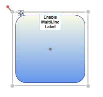

MultilineLabel for Node
{:.caption}

Custom Label Support for Node

This feature enables you to customize the Label Position of the Nodes. The IsLabelDraggable and LabelDisplacement property is used to customize the Label position of the node. LabelDisplacement property depends on LabelHorizontalAlignment and LabelVerticalAlignment.

<table>
<tr>
<th>
Property </th><th>
Description </th><th>
Type </th><th>
Value It Accepts</th><th>
Default Values</th></tr>
<tr>
<td>
IsLabelDraggable </td><td>
Gets or sets the Label of the Node to be  Dragged or Not.</td><td>
Dependency  property </td><td>
bool(true/false)</td><td>
False</td></tr>
<tr>
<td>
LabelDisplacement</td><td>
Gets or sets the different between the Original position and the Current position of the Node’s Label.</td><td>
Dependency  property</td><td>
Point</td><td>
Point(0,0)</td></tr>
</table>

Adding Custom Label Enhancements for Node to an Application 

Set the LabelDisplacement for Node

Label is aligned within the bounds of Node using LabelHorizontalAlignment and LabelVerticalAlignment property, the LabelDisplacement can be used as to displace the Label from this original position. This value can be positive or negative. 



       (node as Node).LabelDisplacement = new Point(100,100);



Label Dragging support for Node

The Label can be dragged from the Node at runtime, if this property is set to true. When a label is dragged, it will automatically update the LabelDisplacement value.



       (node as Node).IsLabelDraggable = true;



## Gripper

Gripper is a small rectangle which appears near the top-left corner of the node. It facilitates the node drag operation. You can drag a node by clicking and dragging the gripper. This gripper will be useful when a content of a node is specified. If this content’s IsHitTestVisible property is True clicking and dragging the node will be difficult or even impossible because all mouse operations will be handled by the Node’s Content. In this scenario Gripper will be very helpful to drag the node in the page.

<table>
<tr>
<th>
Property</th><th>
Description</th><th>
Type of the property</th><th>
Value it accepts</th><th>
Any other dependencies/ sub properties associated</th></tr>
<tr>
<td>
GripperVisibility</td><td>
Gets or sets the gripper visibility.</td><td>
Dependency property</td><td>
Visibility.HiddenVisibility.CollapsedVisibility.Visible</td><td>
No</td></tr>
<tr>
<td>
GripperStyle</td><td>
Gets or sets the gripper style.</td><td>
Dependency property</td><td>
Style</td><td>
No</td></tr>
</table>

### Gripper Visibility

The gripper can be made visible by setting the GripperVisibility property to ‘True’.



Node n = new Node();

n.GripperVisibility = Visibility.Visible;

diagramModel.Nodes.Add(n);




Dim n As New Node()

n.GripperVisibility = Visibility.Visible

diagramModel.Nodes.Add(n)



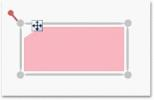

Gripper for Nodes
{:.caption}

### Gripper Style

Gripper can be customized using the GripperStyle property of the Node.  However, on overriding the style, it is necessary to specify the Width, Height, HorizontalAlignment, VerticalAlignment and the Margin property to position the Gripper properly.





This can be applied to the node in the following way:



Node node = new Node();

node.GripperStyle = this.Resources["GripperStyle"] as Style;

diagramModel.Nodes.Add(node);




Dim node As New Node()

node.GripperStyle = TryCast(Me.Resources("GripperStyle"), Style)

diagramModel.Nodes.Add(node)



Customized Gripper
{:.caption}

## Node Selection

A selected node is indicated using a rectangular resizer over the node’s border. Many interactions using keyboard, mouse commands will affect the elements that is currently selected. 

<table>
<tr>
<th>
Property</th><th>
Description</th><th>
Type of the property</th><th>
Value it Accept</th><th>
Any other dependencies/ sub properties associated</th></tr>
<tr>
<td>
AllowSelect</td><td>
Gets or sets a value indicating whether node can be selected or not. The default value is set to True.</td><td>
Dependency property</td><td>
Boolean (true/ false)</td><td>
No</td></tr>
<tr>
<td>
IsSelected</td><td>
Gets or sets a value indicating whether this instance is selected.</td><td>
Dependency property</td><td>
Boolean (true/ false)</td><td>
No</td></tr>
</table>

A node can be selected in two ways,

* At run time
* Through Code

Node can be selected at run time just by clicking on the node.

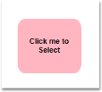

Node before selection
{:.caption}

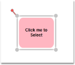

Node after selection
{:.caption}

The above two images differentiates the appearance of the node before and after selection.

Node can also be selected using the IsSelected property of the Node.



Node n = new Node();

n.Shape = Shapes.FlowChart_Card;

n.IsSelected = true;

diagramModel.Nodes.Add(n);




Dim n As New Node()

n.Shape = Shapes.FlowChart_Card

n.IsSelected = True

diagramModel.Nodes.Add(n)



### Node Multi-Selection

Multiple items on the drawing area can be selected.

Multiple selection can be performed by following the below mentioned steps.

* Items on the drawing area are selected only if they fall within the bounds of the drag adorner.
* The drag adorner is displayed when you click anywhere on the page and start dragging the pointer.
* The rectangle formed with the drag start-point as one of its points, and the point where the mouse button was released as its second point, defines the drag adorner's bounds.
* Nodes connected to one or more nodes are selected only if one of the connected nodes is also within the drag adorner bounds. The nodes and the connector connecting them act as a single selection.

N> Resizing or moving any one item affects the other items by the same factor. However, rotating affects only the current node.

Items can be deselected by clicking on any part of the drawing area other than the selected items.

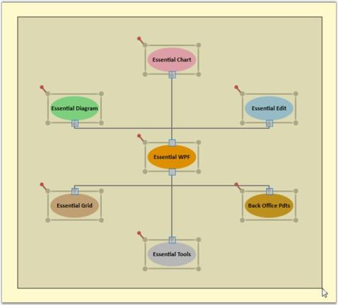

Multiple Selections
{:.caption}

### AllowSelect

The AllowSelect property can be used to enable/disable the node selection.
When this property is set to ‘True’, it is possible to select the node. Otherwise the node cannot be selected.
The default value is ‘True’.

The AllowSelect property can be set in the following way:



Node nodeobject = new Node();

nodeobject.AllowSelect = false;




Dim nodeobject As New Node()

nodeobject.AllowSelect = False





Select Nodes and Connectors Refer Concepts and Features -> General -> Select Nodes and Connectors



## Select and Move Nodes

As this is a general topic to be share between Node and LineConnector, please refer general topic under Concepts and features using the following links.

* Select Node and Connectors Refer Concepts and Features -> General -> Select Node and Connectors
* Move Node and Connectors Refer Concepts and Features -> General -> Move Node and Connectors

## Deleting Node Without its Edges 

This feature enables the user to delete the node without deleting its dependent edges by using the DeletingMode property of the node.

Properties

<table>
<tr>
<th>
Property</th><th>
Description</th><th>
Type</th><th>
Data Type</th></tr>
<tr>
<td>
DeletingMode </td><td>
Decides whether the node alone has to be deleted or node along with its dependent edges has to be deleted. </td><td>
Dependency Property </td><td>
Enum </td></tr>
</table>

### Enabling Deletion of Node Without its Edges

To enable the deletion of node, the DeletingMode property can be set to:

1. DeleteDependentEdges
2. None

By default, this property is set to DeleteDependentEdges.

Setting DeletingMode to None

If the DeletingMode property of the node is set to None while trying to delete the node, the node alone is deleted. The dependent edges are not deleted.

To set the DeletingMode property to None, use the following code.



Node n1 = new Node();

n1.OffsetX = 200;

n1.OffsetY = 200;

n1.Shape = Shapes.Rectangle;

n1.DeletingMode = DeletingMode.None;

diagrammodel.Nodes.Add(n1);




Dim n1 As New Node()

n1.OffsetX = 200

n1.OffsetY = 200

n1.Shape = Shapes.Rectangle

n1.DeletingMode = DeletingMode.None

diagramModel.Nodes.Add(n1)



Setting DeletingMode to DeleteDependentEdges

If the DeletingMode property of the node is set to DeleteDependentEdges while trying to delete the node, the node along with the dependent edges is deleted. 

To set the DeletingMode property to DeleteDependentEdges, use the following code example.



Node n = new Node();

n.OffsetX = 100;

n.OffsetY = 100;

n.Shape = Shapes.Rectangle;

n.DeletingMode = DeletingMode.DeleteDependentEdges;

diagrammodel.Nodes.Add(n);




Dim n1 As New Node()

n1.OffsetX = 200

n1.OffsetY = 200

n1.Shape = Shapes.Rectangle

n1.DeletingMode = DeletingMode.DeleteDependentEdges

diagramModel.Nodes.Add(n1)



## Customize the Label, Context Menu for Nodes

As this is a general topic to be share between Node and LineConnector, please refer general topic under Concepts and features using the following links.

* Customize Label Refer Concepts and Features -> General -> Customize Label
* Customize ContextMenu Refer Concepts and Features -> General -> Customize ContextMenu

## Customization of Node Movement

While dragging the node in the diagram page, the user can customize the movement of the node by setting the following DiagramView properties. This customization is used to control the node dragging in a single direction. 

Properties

<table>
<tr>
<th>
Property</th><th>
Description</th><th>
Type</th><th>
Data type</th></tr>
<tr>
<td>
DirectionBehaviorEnabled</td><td>
Sets or gets the DirectionBehaviorEnabled value.</td><td>
Dependency property</td><td>
Boolean</td></tr>
<tr>
<td>
TranslateRailsMode</td><td>
Specifies the direction in which the node has to be moved. The default value is None.</td><td>
Dependency property </td><td>
Enum</td></tr>
<tr>
<td>
NodeMovementX</td><td>
Sets or gets the key value for the node movement on X-axis.</td><td>
Dependency property </td><td>
Enum</td></tr>
<tr>
<td>
NodeMovementY</td><td>
Sets or gets the key value for the node movement on Y-axis.</td><td>
Dependency property </td><td>
Enum</td></tr>
</table>

### Adding Customization of Node in an Application

#### DirectionBehaviorEnabled

The DirectionBehaviorEnabled property restricts the node movement to only one direction at a time.

If the DirectionBehaviorEnabled property is set to ‘True’, the node is dragged only one direction; in which the node is initially dragged.

If the node is once dragged in X-direction, then the node can move only in X-direction for a while. Likewise, if the node is once dragged in Y-direction then the node can be moved only in Y-direction for a while.

Hence, the direction is decided at the beginning of each drag.  By default, this property is set to _false_. Use the following code snippet to enable this property. 



DiagramView View1 = new DiagramView();

View1.DirectionBehaviorEnabled = true; 




Dim view As New DiagramView ()

View1.DirectionBehaviorEnabled = True


This property can be disabled by setting it to ‘false’.



DiagramView View1 = new DiagramView();

View1.DirectionBehaviorEnabled = false; 




Dim view As New DiagramView ()

View1.DirectionBehaviorEnabled = False


### TranslateRailsMode

This property is used to define the node movement through code. This Enum property has three values.

1. TranslateRailsX
2. TranslateRailsY
3. None 

By default, this property value is ‘_None’_.

To enable the node movement only on X-axis, use the following code.



DiagramView View1 = new DiagramView();

View1.TranslateRailsMode = TranslateRailsMode.TranslateRailsX;




Dim view As New DiagramView ()

View1. TranslateRailsMode = TranslateRailsMode.TranslateRailsX



To enable the node movement only in Y-axis, use the following code example.



DiagramView View1 = new DiagramView();

View1.TranslateRailsMode = TranslateRailsMode.TranslateRailsY;




Dim view As New DiagramView ()

View1. TranslateRailsMode = TranslateRailsMode.TranslateRailsY


### NodeMovementX/NodeMovementY

The node movement can be controlled by the keys. 

#### NodeMovementX:

The keys that support NodeMovement on X-axis are: “Alt”, “X” and “Z”.

By default, the enum property value is _None_. Pressing and dragging, selected key controls the node movement only in X-axis.



DiagramView View1 = new DiagramView();

View1.NodeMovementX = NodeMovementX.X;

View1.NodeMovementY = NodeMovementX.Y;



 

Dim view As New DiagramView ()

View1.NodeMovementX = NodeMovementX.X

View1.NodeMovementY = NodeMovementX.Y



#### NodeMovementY:

The key combinations that support the node movement on Y-axis are: 

4. Alt+Y 
5. Alt+Z  
6. Y 
7. Space

By default, the Enum property value is None. Pressing and dragging, selected Key controls the node movement only X-axis.



DiagramView View1 = new DiagramView();

View1.NodeMovementX = NodeMovementX.X;

View1.NodeMovementY = NodeMovementX.Y;



 

Dim view As New DiagramView ()

View1.NodeMovementX = NodeMovementX.X

View1.NodeMovementY = NodeMovementX.Y


## Resize Handler Customization

This feature provides different styles for Resize Handler. This enables you to customize the complete look and feel of the eight resize handler.

Use Case Scenarios

The appearance of the Resizer Handler can be effectively changed by applying different styles to the Thumb, using the Resize Handler Customization.  

Creating Custom Style for Resize Handler 

The Resize Handler consists of eight Resizer Thumbs. You can set different styles to a ResizerThumb by using the Resize Handler Properties.

Follow the below steps to create custom styles for Resize Handler.

Step1: Creating Style for ResizerThumb

Prepare styles with template for each ResizerThumb.

* Through XAML.

The following code illustrates how to create the style for ResizerThumb 





Step2:  Assign the Style to Node

* Through XAML.

The following code illustrates how to assign the Resize Handler Style to Node





* Through Code behind

The following code illustrates how to assign the Resize Handler Style to Node.



 

Node n = shape as Node; 

n.TopResizer = this.Resources["TopResizerThump"] as Style;

n.LeftResizer =this.Resources["LeftResizerThump"] as Style;

n.RightResizer =this.Resources["RightResizerThump"] as Style;

n.BottomResizer =this.Resources["BottomResizerThump"] as Style;

n.TopLeftCornerResizer =this.Resources["TopLeftCornerResizerThump"] as Style;

n.TopRightCornerResizer =this.Resources["TopRightCornerResizerThump"] as Style;

n.BottomLeftCornerResizer =this.Resources["BottomLeftCornerResizerThump"] as Style;

n.BottomRightCornerResizer =this.Resources["BottomRightCornerResizerThump"] as Style;




 

Dim n As Node = TryCast(Shape, Node)

n.TopResizer = TryCast(Me.Resources("TopResizerThump"), Style)

n.LeftResizer =TryCast(Me.Resources("LeftResizerThump"), Style)

n.RightResizer =TryCast(Me.Resources("RightResizerThump"), Style)

n.BottomResizer =TryCast(Me.Resources("BottomResizerThump"), Style)

n.TopLeftCornerResizer =TryCast(Me.Resources("TopLeftCornerResizerThump"), Style)

n.TopRightCornerResizer =TryCast(Me.Resources("TopRightCornerResizerThump"), Style)

n.BottomLeftCornerResizer =TryCast(Me.Resources("BottomLeftCornerResizerThump"), Style)

n.BottomRightCornerResizer =TryCast(Me.Resources("BottomRightCornerResizerThump"), Style)


Setting ResizerThumb Template as null

ResizerThumb will not be visible When the ResizerThumb Template value as Null.

The following code illustrates how to set the ResizerThumb Template to Null.





Following is a sample screenshot of customized resizer that has only four corners. 

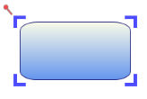

Custom Style
{:.caption}

Tables for Properties, Methods, and Events

Properties

<table>
<tr>
<th>
Property</th><th>
Description</th><th>
 Type</th><th>
Data Type</th><th>
Reference links</th></tr>
<tr>
<td>
TopResizer</td><td>
Gets or sets a value of TopResizer Style for Resize Handler</td><td>
Dependency property</td><td>
Style</td><td>
No</td></tr>
<tr>
<td>
BottomResizer</td><td>
Gets or sets a value of BottomResizer Style for Resize Handler</td><td>
Dependency property</td><td>
Style</td><td>
No</td></tr>
<tr>
<td>
LeftResizer</td><td>
Gets or sets a value of LeftResizer Style for  Resize Handler</td><td>
Dependency property</td><td>
Style</td><td>
No</td></tr>
<tr>
<td>
RightResizer</td><td>
Gets or sets a value of RightResizer Style for Resize Handle</td><td>
Dependency property</td><td>
Style</td><td>
No</td></tr>
<tr>
<td>
TopLeftResizer</td><td>
Gets or sets a value of TopLeftResizer Style for Resize Handler</td><td>
Dependency property</td><td>
Style</td><td>
No</td></tr>
<tr>
<td>
TopRightResizer</td><td>
Gets or sets a value of TopRightResizer Style for Resize Handler</td><td>
Dependency property</td><td>
Style</td><td>
No</td></tr>
<tr>
<td>
BottomLeftResizer</td><td>
Gets or sets a value of BottomLeftResizer Style for  Resize Handler</td><td>
Dependency property</td><td>
Style</td><td>
No</td></tr>
<tr>
<td>
BottomRightResizer</td><td>
Gets or sets a value of BottomRightResizer Style for Resize Handler</td><td>
Dependency property</td><td>
Style</td><td>
No</td></tr>
</table>

Sample Link

To view sample,

1. Open the WPF sample browser from the dashboard. 
2. Navigate to WPF Diagram -> Editable Diagram->ResizerCustomization Demo

## Edges, Degree and Neighbors

### Edges Properties for Node:

The Edges properties for Node are used to retrieve the collection of incoming and outgoing connections for Node.

<table>
<tr>
<th>
Property</th><th>
Description</th><th>
Type of Property</th><th>
Any other dependencies/ sub-properties associated</th></tr>
<tr>
<td>
Edges</td><td>
Gets the collection of the incoming and outgoing connections of the node.</td><td>
CLR Property – read-only property </td><td>
No</td></tr>
<tr>
<td>
InEdges </td><td>
Gets the collection of all incoming connections to the node. </td><td>
CLR Property – read-only property </td><td>
No</td></tr>
<tr>
<td>
OutEdges </td><td>
Gets the collection of all outgoing connections from the node.</td><td>
CLR Property – read-only property </td><td>
No</td></tr>
</table>

The Edges, InEdges, and OutEdges properties can be retrieved as follows:



  //Getting the Edges of the Node 

Node node = new Node();

CollectionExt ext = node.Edges;

//Getting the InEdges of the Node 

Node node = new Node();

CollectionExt ext = node.InEdges;

//Getting the InEdges of the Node 

Node node = new Node();

CollectionExt ext = node.OutEdges;



### Degree Properties for Node:

The Degree properties for Node are used to retrieve the count of incoming and outgoing edges for Node. 

<table>
<tr>
<th>
Property</th><th>
Description</th><th>
Type of Property</th><th>
Return Type</th><th>
Any other dependencies/sub-properties associated</th></tr>
<tr>
<td>
Degree  </td><td>
Gets the total number count of incoming and outgoing edges.</td><td>
CLR Property – read-only property </td><td>
Integer </td><td>
No</td></tr>
<tr>
<td>
InDegree  </td><td>
Gets the number count of incoming edges.</td><td>
CLR Property – read-only property </td><td>
Integer</td><td>
No</td></tr>
<tr>
<td>
OutDegree </td><td>
Gets the number count of outgoing edges. </td><td>
CLR Property – read-only property </td><td>
Integer </td><td>
No</td></tr>
</table>

The Degree, InDegree, and OutDegree properties can be retrieved in the following way: 



//Getting the Degree of the Node

Node node = new Node();

int degree = node4.Degree;

//Getting the InDegree of the Node

Node node = new Node();

int indegree = node4.InDegree;

//Getting the OutDegree of the Node

Node node = new Node();

int outdegree = node4.OutDegree;



### Neighbors Properties for Node:

The Neighbors properties for Node are used to retrieve the collection of all of the nodes connected to the specified Node. 

<table>
<tr>
<th>
Property</th><th>
Description</th><th>
Type of Property</th><th>
Any other dependencies/sub-properties associated</th></tr>
<tr>
<td>
Neighbors </td><td>
Gets the collection of all of the nodes connected to the specified Node. </td><td>
CLR Property – read-only property </td><td>
No</td></tr>
<tr>
<td>
InNeighbors </td><td>
Gets the collection of all adjacent nodes connected to the specified node.In other words, gets the collection of nodes that are connected to the node, or all nodes that "point" at this one. </td><td>
CLR Property – read-only property </td><td>
No</td></tr>
<tr>
<td>
OutNeighbors</td><td>
Gets the collection of nodes that are connected from the node, or all nodes "pointed" to by this one.</td><td>
CLR Property – read-only property </td><td>
No</td></tr>
</table>

The Neighbors, InNeighbors, and OutNeighbors properties can be retrieved as illustrated in the following code: 



//Getting the Neighbors of the Node

Node node = new Node();

CollectionExt ext = node.Neighbors;

//Getting the InNeighbors of the Node

Node node = new Node();

CollectionExt ext = node.InNeighbors;

//Getting the OutNeighbors of the Node

Node node = new Node();

CollectionExt ext = node.OutNeighbors;



## Node Layout

Essential Diagram for WPF provides layout representation for nodes. Numerous nodes and line connectors can be connected together to form various types of layouts, including hierarchical, tree, and table layouts.

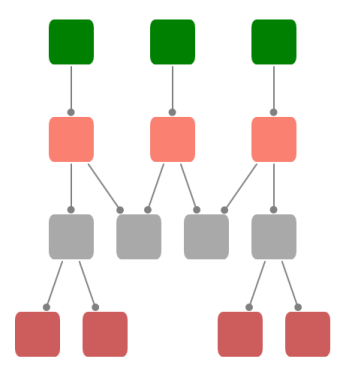

Node Layout
{:.caption}

Properties:

<table>
<tr>
<th>
Property</th><th>
Description</th><th>
Type of property</th><th>
Value it Accepts</th><th>
Any other dependencies/ sub properties associated</th></tr>
<tr>
<td>
FirstChild </td><td>
Gets node’s first tree child. </td><td>
CLR property</td><td>
Node </td><td>
No</td></tr>
<tr>
<td>
LastChild</td><td>
Gets node’s last tree child.</td><td>
CLR property</td><td>
Node</td><td>
No</td></tr>
<tr>
<td>
ParentNode</td><td>
Gets or sets the parent of the node.</td><td>
CLR property</td><td>
IShape</td><td>
No</td></tr>
<tr>
<td>
Row</td><td>
Gets or sets the row.</td><td>
CLR property</td><td>
int</td><td>
No</td></tr>
<tr>
<td>
ParentEdge</td><td>
Gets or sets the edge between this node and its parent node in tree structure. </td><td>
CLR property</td><td>
IEdge</td><td>
No</td></tr>
<tr>
<td>
NextSibling</td><td>
Gets this node’s next tree sibling.</td><td>
CLR property</td><td>
IShape</td><td>
No</td></tr>
<tr>
<td>
IsExpanded</td><td>
Gets or sets the values indicating whether this instance is expanded.</td><td>
CLR property</td><td>
Boolean (true/false)</td><td>
No</td></tr>
<tr>
<td>
ChildCount</td><td>
Gets the number of tree children for this node.</td><td>
CLR property</td><td>
int</td><td>
No</td></tr>
<tr>
<td>
Column</td><td>
Gets or sets the column.</td><td>
CLR property</td><td>
int</td><td>
No</td></tr>
</table>

