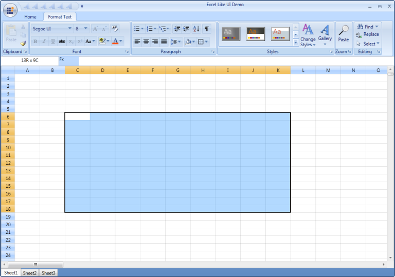
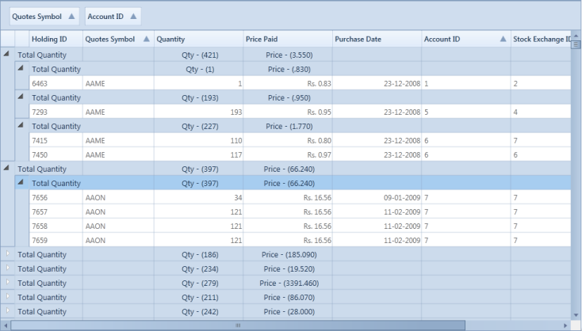
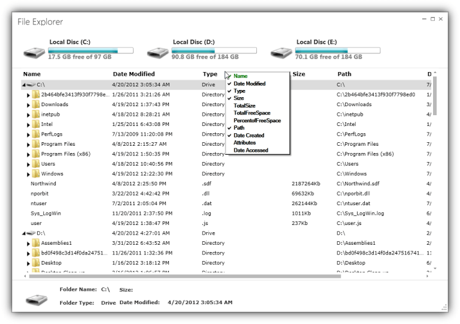
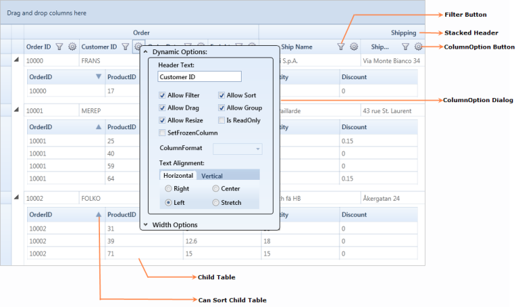
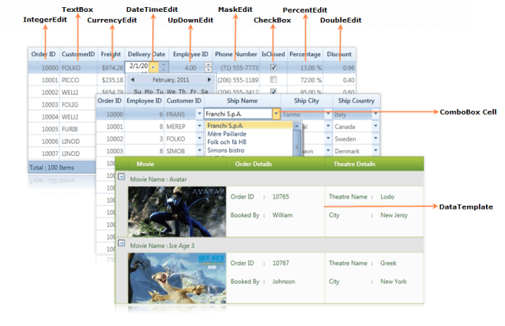
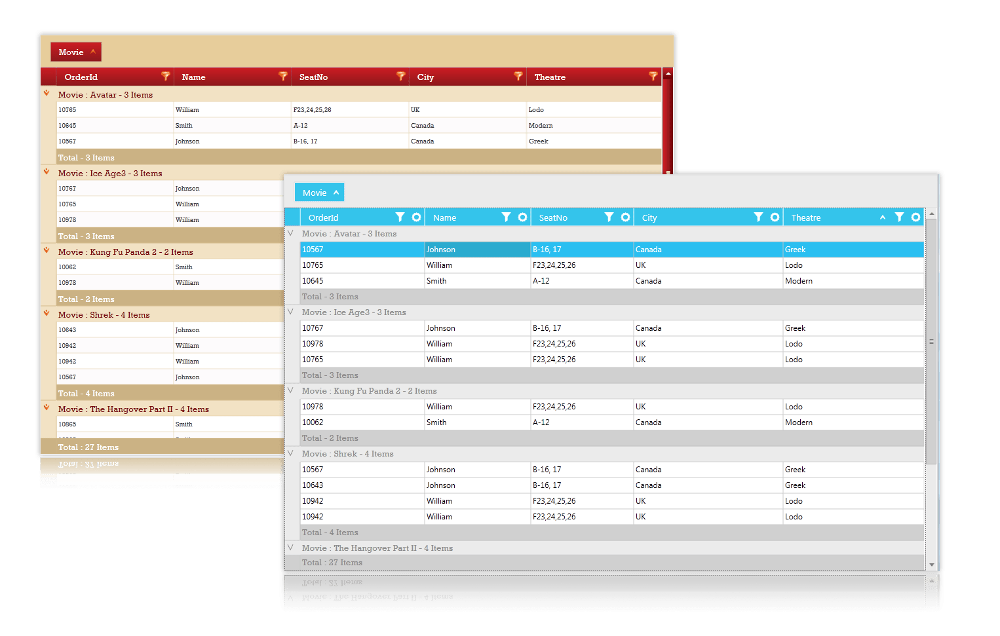

# Overview

The grid at its core functions as a very efficient display engine for tabular data that can be customized down to the cell level. It does not make any assumptions on the structure of the data (many grid controls implemented as straight data-bound controls make such explicit assumptions). This leads to a very flexible design that can be easily adapted to a variety of tasks including the display of completely unstructured data and the display of structured data from a database. 

The display system also hosts a powerful and complete styles architecture. Settings can be specified at the cell level or higher levels using parent styles that are referred to as base styles. Base styles can affect groups of cells. Cell level settings override any higher-level settings and enable easy customization right down to the cell level.

With this version, our core focus has been on the underlying architecture for displaying cells with virtualized cell editors in a manner that enables good performance characteristics. The core display system also supports several building-block features such as nested grids, virtual modes, and support for a virtually unlimited number of rows and columns.

### Use Case Scenarios

EssentialGrid for WPF can be applied to a variety of industries such as finance, banking, software, etc. Some of its important features are:

Excel-Like UI: Essential Grid’s rich feature set allows you to build Excel-like UI applications. 

High Performance - EssentialGrid is a great asset to high-performance applications, as it can display large amounts of real-time data that tends to periodic changes without any performance hits. Following is an illustration of a stock portfolio application using the GridData control.

File Explorer - Applications that deal with hierarchical data can make use of Essential Grid’s file explorer feature, which allows child items to be displayed on-demand by using the GridTree control.

## Key Features

You can find the following features of EssentialGrid for WPF:

* Easy APIs to add, delete, or move rows andcolumns – You can easily add, delete, or move rows and columns throughout the Grid control using its well-defined APIs.
* Clipboard Support – Essential Grid provides excellent clipboard support that allows you to copy and paste grid cell content to text or any format.
* Frozen Rows and Columns – Essential Grid allows you to freeze grid columns to the left or right or freeze rows to the top or bottom of the grid.
* Resize Rows and Columns – Essential Grid provides options for resizing rows and columns. 
* Hide Rows and Columns – Essential Grid provides support for hiding or displaying a range of rows and columns.
* Keyboard Interface – Essential Grid provides extensive support for keyboard handling. The following list contains some supported keys and actions:
* Arrow keys – To move cell focus.
* PageUp/PageDown – To scroll a grid by page.
* F2  – To activate/deactivate a current cell.
* F4+ALT – To open/close the pop-up of a drop-down cell.
* CTRL + Arrow – To move to the first or last row or column.
* SHIFT + Arrow keys – To select cells.
* DELETE – To delete an entire row in the GridData control.
* CTRL+X, CTRL+V, CTRL+C – For common clipboard operations.
* All keyboard operations can be customized. 
* Selection Modes - Essential Grid offers different kinds of selection modes such as row only, column only, and cell only for selecting a particular row, column, or cell, respectively.
* Drag-Drop Support - Essential Grid lets you drag any column and drop it at any position in the grid. This allows columns to be repositioned as required.
* Virtual Mode - Essential Grid for WPF supports a virtual mode, which lets you dynamically provide data to the grid from an external data source through an event. This means the grid does not store any data in its internal data structure.

## User Guide Organization

EssentialGrid for WPF comes with numerous samples as well as extensive documentation for your reference. This user guide provides detailed information on features and functionalities. It is organized into the following sections:

* Overview – This section provides a brief introduction to Essential Grid and its key features.
* Getting Started – This section guides you on getting started with a WPF application and WPF controls.
* Concepts and Features –Under this section, the features of individual controls are illustrated with use-case scenarios, code examples, and screenshots.
* Frequently Asked Questions – This section contains answers to frequently asked questions about Essential Grid.

## Document Conventions 

The conventions below help you quickly identify important sections of information when using this user guide:

<table>
<tr>
<th>
Convention</th><th>
Description</th></tr>
<tr>
<td>
Note</td><td>
Represents important information to be noted.</td></tr>
<tr>
<td>
Example</td><td>
Represents an example.</td></tr>
<tr>
<td>
Tip</td><td>
Represents useful hints that help you use the controls and features.</td></tr>
<tr>
<td>
Additional information</td><td>
Represents additional information on the corresponding topic.</td></tr>
</table>

## Feature Summary

This section provides basic information, such as definitions and usage, regarding important features of EssentialGrid.

### GridData Control 

The GridData control is a data-bound control that supports editing, sorting, and grouping. The main features of the GridData control are explained in the following list.

#### Working with Data: 

The GridData control supports all popular data sources including the following: 

* Observable collections.
* Data tables.
* Collection views.
* Business objects. 
* ADO.NET Entity Framework.
* LINQ to SQL.
* ORM.ADO.NET.
* DataView.
* ICollectionView. 
* ObjectDataProvider. 
* IEnumerable.
* IList. 
* IBindingList.
* IQueryable.
* ITypedList.

Complex objects can bind with the GridData control and the GridData control can display related information through hierarchies. The master-detail relationship can be represented through nested grids, which can be expanded and collapsed as required. Multilevel nesting is also supported.

## Data Presentation

Cell Types - Several built-in cell types can be used to display and edit any underlying data type. The cell types include the following:

* Static-text cells.
* Check-box cells.
* Button cells.
* Image cells.
* Combo-box cells.
* Drop-down lists.
* Currency cells.
* Date-time cells.
* Double edit cells. 
* Integer edit cells.
* Mask edit cells.
* Percent edit cells.
* Rich-text-box cells. 
* Up-down edit cells.
* Nested grid cells.

## Interactive Features

The GridData control contains a number of features for managing data effectively, including grouping, sorting, and Excel-like filteringwith filter bars and advanced filtering. You can choose a column with the ColumnChooser feature, and column-related options such as dragging, sorting, grouping, and resizing can be enabled or disabled dynamically by using a separate dialog called ColumnOptions. Other specialized interactive features include stackedheaders, context menus, ToolTips, and paging.

## Visual Styles and Expression Blend

The GridData control has a rich selection of over 14 built-in styles that provide an attractive look and feel for the grid. The GridData control also allows you to customize all aspects of grid appearance by using Microsoft Expression Blend. 

