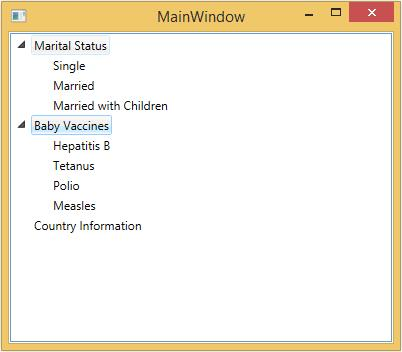

# Root Lines for Items in TreeViewAdv

The TreeViewAdv displays root lines, which link the nodes of a tree structure. These TreeViewAdv root lines are displayed or hidden by using the ShowRootLines property of the class TreeViewAdv. To set this property, use the below code





<!-- Adding TreeViewAdv With show root lines -->
<syncfusion:TreeViewAdv Name="treeViewAdv" ShowRootLines="False">
<!-- Adding TreeViewItemAdv -->
<syncfusion:TreeViewItemAdv Header="Marital Status">
<syncfusion:TreeViewItemAdv Header="Single"/>
<syncfusion:TreeViewItemAdv Header="Married"/>
<syncfusion:TreeViewItemAdv Header="Married with Children"/>
</syncfusion:TreeViewItemAdv>
<syncfusion:TreeViewItemAdv Header="Baby Vaccines">
<syncfusion:TreeViewItemAdv Header="Hepatitis B"/>
<syncfusion:TreeViewItemAdv Header="Tetanus"/>
<syncfusion:TreeViewItemAdv Header="Polio"/>
<syncfusion:TreeViewItemAdv Header="Measles"/>
</syncfusion:TreeViewItemAdv>
<syncfusion:TreeViewItemAdv Header="Country Information"/>
</syncfusion:TreeViewAdv>





// Show root lines
treeViewAdv.ShowRootLines = false;





' Show root lines
treeViewAdv.ShowRootLines = False



 

