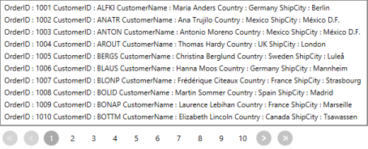

# DataBinding

Data binding is the master feature of SfDataPager. SfDataPager is bound to an external data source to display the data. 

## Source and PagedSource

SfDataPager exposes the Source property, where you can pass your collection of data for Paging. SfDataPager automatically wrap the collection in the PagedCollectionView and exposes to the PagedSource property. You can pass the PagedSource property to any ItemsControl’s ItemsSource property.

The following code example explains how to use the Source and PagedSource property.



<Window.DataContext>
    <local:Viewmodel/>
</Window.DataContext>
<Grid>
    <Grid.RowDefinitions>
        <RowDefinition Height="*" />
        <RowDefinition Height="Auto" />
    </Grid.RowDefinitions>
    <sfGrid:SfDataGrid AutoGenerateColumns="True" 
                       ItemsSource="{Binding ElementName=sfDataPager,Path=PagedSource}"/>
    <datapager:SfDataPager x:Name="sfDataPager" 
                           Grid.Row="1"
                           NumericButtonCount="10"
                           PageSize="16" 
                           Source="{Binding OrdersDetails}" />
</Grid>



The following screenshot displays the output of the above code.

### PageIndex

SfDataPager exposes the PageIndex property. It contains the index of the currently selected page.You can use this property to set or get the current page of the SfDataPager. 

Events

<table>
<tr>
<th>
Event</th><th>
Parameters</th><th>
Description</th></tr>
<tr>
<td>
PageIndexChanging</td><td>
 OldPageIndex  NewPageIndex Cancel</td><td>
Event is triggered when the current page index is changing. By using this event, you can cancel the page navigation operation by setting Cancel {{ '__' | markdownify }} to true.</td></tr>
<tr>
<td>
PageIndexChanged</td><td>
 OldPageIndex NewPageIndex</td><td>
Event is triggered after the current page index is changed.</td></tr>
</table>

### How to bind the PageCollection to the other controls?

SfDataPager automatically wraps the collection in PagedCollectionView and exposes to the PagedSource property. You can pass the PagedSource property to any ItemsControl’s ItemsSource property. Here, the PagesSource property is binded to the ListBox.

The following code explains how to use Source and PagedSource property in ListBox.



<Window.DataContext>
    <local:ViewModel/>
</Window.DataContext>
<Grid>
    <Grid.RowDefinitions>
        <RowDefinition Height="*" />
        <RowDefinition Height="Auto" />
    </Grid.RowDefinitions>
    <ListBox ItemsSource="{Binding ElementName=sfDataPager,Path=PagedSource}">
        <ListBox.ItemTemplate>
            <DataTemplate>
                <Grid>
                    <Grid.ColumnDefinitions>
                        <ColumnDefinition Width="*"/>
                        <ColumnDefinition Width="*"/>
                        <ColumnDefinition Width="*"/>
                        <ColumnDefinition Width="*"/>
                        <ColumnDefinition Width="*"/>
                        <ColumnDefinition Width="*"/>
                    </Grid.ColumnDefinitions>
                    <TextBlock Text="{Binding Data.OrderID}" Grid.Column="0"/>
                    <TextBlock Text="{Binding Data.CustomerName}" Grid.Column="1"/>
                    <TextBlock Text="{Binding Data.Country}" Grid.Column="2"/>
                    <TextBlock Text="{Binding Data.CustomerID}" Grid.Column="3"/>
                    <TextBlock Text="{Binding Data.ShipCity}" Grid.Column="4"/>
                </Grid>
            </DataTemplate>
        </ListBox.ItemTemplate>
    </ListBox>
    <datapager:SfDataPager x:Name="sfDataPager" 
                           Grid.Row="1"
                           NumericButtonCount="10"
                           PageSize="10" 
                           Source="{Binding OrdersDetails}" />
</Grid>



The following screenshot displays the output for ListView binded with PagedCollection.

## On DemandPaging

In normal paging, the entire data collection is initially loaded into the SfDataPager control. However, the SfDataPager control allows you to load the data for the current page dynamically. To enable on demand paging, set UseOnDemandPaging to true.__

OnDemandPaging can be achieved by using the OnDemandLoading event and LoadDynamicItems method.

The OnDemandLoading event is triggered when the pager moves to the corresponding page. The OnDemandLoading event contains the following event arguments,

* StartIndex: Corresponding page start index.
* PageSize: Number of items to be load for that page.

In an OnDemandLoading event, you can use the LoadDynamicItems method to load the data for the corresponding page.

N> In OnDemandPaging, you cannot assign a value for the Source property.

The following steps help you to achieve an OnDemandLoading with the SfDataPager control.

1. Set the UseOnDemandPaging property to true.
2. Set the PageCount value for the SfDataPager control.



<Window.DataContext>
    <local:ViewModel/>
</Window.DataContext>
<Grid>
    <Grid.RowDefinitions>
        <RowDefinition Height="*" />
        <RowDefinition Height="Auto" />
    </Grid.RowDefinitions>
    <syncfusion:SfDataGrid x:Name="dataGrid"
                           AllowResizingColumns="True"
                           ColumnSizer="Star"
                           ItemsSource="{Binding Path=PagedSource,ElementName=sfDataPager}"/>
    <datapager:SfDataPager x:Name="sfDataPager" 
                           OnDemandLoading="OnDemandDataLoading" 
                           PageCount="50"
                           PageSize="16" 
                           UseOnDemandPaging="True" />
</Grid>



3. Wire up the OnDemandLoading event of SfDataPager.



void OnDemandLoading(object sender, OnDemandLoadingEventArgs args)
{
    AssociatedObject.sfDataPager.LoadDynamicItems(args.StartIndex,source.Skip(args.StartIndex).Take(args.PageSize));
}



The following screenshot displays the output for OnDemandPaging,

## Page Size

SfDataPager splits the data into separate pages based on the PageSize. In order to specify the size of the page, you can use the PageSize property. By defaults, it is set to 0 and all the data is displayed in a single page.

The following code example explains how to use PageSize property in SfDataPager.



<Grid>
    <Grid.RowDefinitions>
        <RowDefinition Height="*" />
        <RowDefinition Height="Auto" />
    </Grid.RowDefinitions>
    <syncfusion:SfDataGrid AutoGenerateColumns="True" 
                           ItemsSource="{Binding ElementName=sfDataPager,Path=PagedSource}"/>
    <datapager:SfDataPager x:Name="sfDataPager" 
						   Grid.Row="1"
						   NumericButtonCount="10"
						   PageSize="10" 
						   Source="{Binding OrdersDetails}" />
</Grid>



The following screenshot displays the output for PageSize set as 5.

## How To

### How to change the PageSize in Runtime

In general, the size of the page is defined in the PageSize property. In some cases, you may want to change it during the run time. The following code example explains how to change the size of the page during runtime for a ComboBox.



<Window.DataContext>
    <local:ViewModel/>
</Window.DataContext>
<Grid>
    <Grid.RowDefinitions>
        <RowDefinition Height="*" />
        <RowDefinition Height="Auto" />
    </Grid.RowDefinitions>
    <Grid.ColumnDefinitions>
        <ColumnDefinition Width="*" />
        <ColumnDefinition Width="Auto" />
    </Grid.ColumnDefinitions>
    <StackPanel Grid.Column="1" Grid.Row="1" Height="20" Margin="3,0" Orientation="Horizontal">
        <ComboBox Name="combobox"  SelectedIndex="0" ItemsSource="{Binding ComboBoxitem}" />
    </StackPanel>
    <sfgrid:SfDataGrid AutoGenerateColumns="True" 
                       ItemsSource="{Binding ElementName=sfDataPager,Path =PagedSource}"/>
    <datapager:SfDataPager x:Name="sfDataPager" 
                           AccentBackground="DodgerBlue"
                           NumericButtonCount="10"
                           Grid.Row="1"
                           PageSize="{Binding Path =SelectedValue,ElementName=combobox}"
                           Source="{Binding OrdersDetails}" />
</Grid>



The following screenshot displays the output for changing the PageSize value during runtime. 

