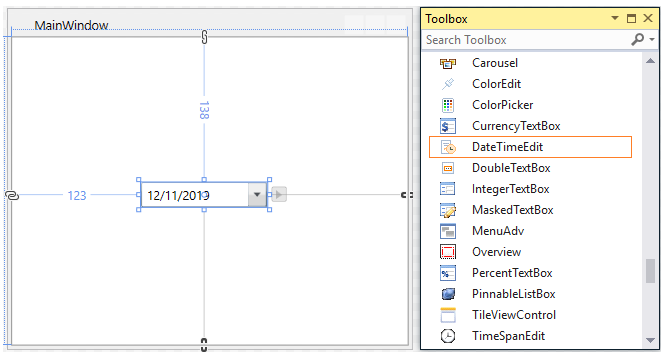
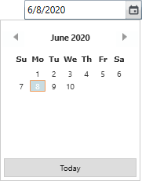
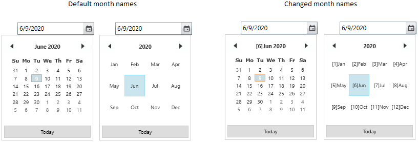
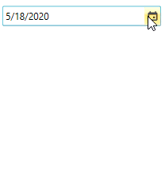

# Getting Started with WPF DateTimePicker (DateTimeEdit)

This section explains how to create a WPF [DateTimeEdit](https://help.syncfusion.com/cr/wpf/Syncfusion.Windows.Shared.DateTimeEdit.html)  and explains about its structure.

## Structure of DateTimeEdit

The various elements of `DateTimeEdit` are illustrated in the following screenshot.

## Assembly deployment

Refer to the [Control Dependencies](https://help.syncfusion.com/wpf/control-dependencies#datetimeedit) section to get the list of assemblies or NuGet package that needs to be added as a reference to use the control in any application.

Refer to this [documentation](https://help.syncfusion.com/wpf/visual-studio-integration/nuget-packages) to find more details about installing nuget packages in a WPF application.

## Adding WPF DateTimeEdit via designer

1) The `DateTimeEdit` can be added to an application by dragging it from the toolbox to a designer view. The following dependent assemblies will be added automatically:

* Syncfusion.Shared.WPF

2) Set the properties for DateTimeEdit in design mode using the SmartTag feature.

## Adding WPF DateTimeEdit via XAML

To add the `DateTimeEdit` manually in XAML, follow these steps:

1) Create a new WPF project in Visual Studio.

2) Add the following required assembly references to the project:

* Syncfusion.Shared.WPF

3) Import Syncfusion WPF schema **http://schemas.syncfusion.com/wpf**, and declare the DateTimeEdit in XAML page.





<Window x:Class="DateTimeEdit_sample.MainWindow"
        xmlns="http://schemas.microsoft.com/winfx/2006/xaml/presentation"
        xmlns:x="http://schemas.microsoft.com/winfx/2006/xaml"
        xmlns:d="http://schemas.microsoft.com/expression/blend/2008"
        xmlns:mc="http://schemas.openxmlformats.org/markup-compatibility/2006"
        xmlns:local="clr-namespace:DateTimeEdit_sample"
        xmlns:syncfusion="http://schemas.syncfusion.com/wpf"
        mc:Ignorable="d"
        Title="MainWindow" Height="450" Width="800">

    <Grid Name="grid">
        <syncfusion:DateTimeEdit Name="dateTimeEdit"
                                 Height="25"
                                 Width="200"/>
    </Grid>
</Window>




## Adding WPF DateTimeEdit via C#

To add the `DateTimeEdit` manually in C#, follow these steps:

1) Create a new WPF application via Visual Studio.

2) Add the following required assembly references to the project:

* Syncfusion.Shared.WPF

3) Include the required namespace.




using Syncfusion.Windows.Shared;




4) Create an instance of `DateTimeEdit`, and add it to the window.




// Creating an instance of the DateTimeEdit
DateTimeEdit dateTimeEdit = new DateTimeEdit();

// Setting height and width to DateTimeEdit
dateTimeEdit.Height = 25;
dateTimeEdit.Width = 200;

// Adding control into the main window
grid.Children.Add(dateTimeEdit); 




## Setting date time value

You can set the date using the [DateTime](https://help.syncfusion.com/cr/wpf/Syncfusion.Windows.Shared.DateTimeEdit.html#Syncfusion_Windows_Shared_DateTimeEdit_DateTime) property of `DateTimeEdit`.




<!--Setting date -->
<syncfusion:DateTimeEdit DateTime="07/05/2010"
                         Name="dateTimeEdit" 
                         Height="25"
                         Width="200" />




//Setting date
dateTimeEdit.DateTime = new DateTime(2010, 07, 05);




N> View [Sample](https://github.com/SyncfusionExamples/wpf-date-time-edit-examples/tree/master/Samples/SettingDate) in GitHub

## Binding date time value

You can bind the selected date time value by using the `DateTime` property.

The following code snippets illustrate the value binding from one `DateTimeEdit` to another.




//ViewModel.cs
class ViewModel : NotificationObject {
    private DateTime selectedDate = DateTime.Now;

    public DateTime SelectedDate {
        get {
            return selectedDate;
        }
        set {
            selectedDate = value;
            this.RaisePropertyChanged(nameof(SelectedDate));
        }
    }
}







<Window.DataContext>
    <local:ViewModel/>
</Window.DataContext>

<StackPanel HorizontalAlignment="Center" 
            VerticalAlignment="Center">
    <syncfusion:DateTimeEdit Name="dateTimeEdit1"
                             Height="25" 
                             Width="200" 
                             DateTime="{Binding SelectedDate, Mode=TwoWay}"/>
    <syncfusion:DateTimeEdit Name="dateTimeEdit2"
                             Height="25" 
                             Width="200" 
                             DateTime="{Binding SelectedDate, Mode=TwoWay}"
                             Margin="10"/>
</StackPanel>




N> View [Sample](https://github.com/SyncfusionExamples/wpf-datetimepicker-examples/tree/master/Samples/Data-Binding) in GitHub

## Value Changed Notification

The selected datetime changed in `DateTimeEdit` can be examined using [DateTimeChanged](https://help.syncfusion.com/cr/wpf/Syncfusion.Windows.Shared.DateTimeEdit.html) event. The `DateTimeChanged` event contains the old and newly selected date time values in the `OldValue` and `NewValue` properties.




 <syncfusion:DateTimeEdit DateTimeChanged="dateTimeEdit_DateTimeChanged" 
                          Name="dateTimeEdit"/>




DateTimeEdit dateTimeEdit = new DateTimeEdit();
dateTimeEdit.DateTimeChanged += dateTimeEdit_DateTimeChanged;




You can handle the event as follows,




private void dateTimeEdit_DateTimeChanged(DependencyObject d, DependencyPropertyChangedEventArgs e) {
    //Get old and new values
    var oldValue = e.OldValue;
    var newValue = e.NewValue;
}




## Applying built-in pattern

You can change the date-time pattern using the [Pattern](https://help.syncfusion.com/cr/wpf/Syncfusion.Windows.Shared.DateTimeBase.html#Syncfusion_Windows_Shared_DateTimeBase_Pattern) property of the DateTimeEdit. The `DateTimeEdit` control supports the following DateTime format:

* LongDate
* LongTime
* ShortDate
* ShortTime
* FullDateTime
* MonthDay
* CustomPattern
* ShortableDateTime
* UniversalShortableDateTime
* RFC1123
* YearMonth 




<!--Setting ShortDate Pattern-->
<syncfusion:DateTimeEdit x:Name="dateTimeEdit" 
                         DateTime="07/15/2010" 
                         Pattern="ShortDate"/>




//Setting predefined ShortDate pattern
dateTimeEdit.Pattern = DateTimePattern.ShortDate;




N> View [Sample](https://github.com/SyncfusionExamples/wpf-datetimepicker-examples/tree/master/Samples/DateTimeFormatting) in GitHub

## Applying custom pattern

You can also set the custom pattern for displaying the date in the `DateTimeEdit` control by using either [CustomPattern](https://help.syncfusion.com/cr/wpf/Syncfusion.Windows.Shared.DateTimeBase.html#Syncfusion_Windows_Shared_DateTimeBase_CustomPattern) property or [DateTimeFormat](https://help.syncfusion.com/cr/wpf/Syncfusion.Windows.Shared.DateTimeBase.html#Syncfusion_Windows_Shared_DateTimeBase_DateTimeFormat) property. `CustomPattern` support can be enabled by setting the `Pattern` property to the `DateTimePattern.CustomPattern`.




<syncfusion:DateTimeEdit CustomPattern="MM**dd**yy hh:mm:ss"
                         Pattern="CustomPattern" 
                         DateTime="07/15/2010" 
                         Name="dateTimeEdit"/>
                      




DateTimeEdit dateTimeEdit = new DateTimeEdit();
dateTimeEdit.CustomPattern = "MM**dd**yy hh:mm:ss";
dateTimeEdit.Pattern = DateTimePattern.CustomPattern;
dateTimeEdit.DateTime = new DateTime(2019, 07, 15);


 

N> View [Sample](https://github.com/SyncfusionExamples/wpf-datetimepicker-examples/tree/master/Samples/DateTimeFormatting) in GitHub

## Editing date time

`DateTimeEdit` supports both free form editing(like normal textbox editing) and mask based editing. Editing modes can be changed using the [CanEdit](https://help.syncfusion.com/cr/wpf/Syncfusion.Windows.Shared.DateTimeBase.html#Syncfusion_Windows_Shared_DateTimeBase_CanEdit) property of `DateTimeEdit`. You can enable free low editing mode by setting the `CanEdit` property as `true`. Input given by an end-user, will be validated when pressing `Enter` key or if control lost its focus in the free form editing mode. 

 The following code example demonstrates free form editing.




<syncfusion:DateTimeEdit CanEdit="True"
                         DateTime="07/15/2010" 
                         Name="dateTimeEdit"/>




DateTimeEdit dateTimeEdit = new DateTimeEdit();
dateTimeEdit.CanEdit = true;




N> View [Sample](https://github.com/SyncfusionExamples/wpf-datetimepicker-examples/tree/master/Samples/Dropdown-Options) in GitHub

## Restrict date range

You can restrict the users from selecting a date and time in a particular range by specifying [minimum](https://help.syncfusion.com/cr/wpf/Syncfusion.Windows.Shared.DateTimeEdit.html#Syncfusion_Windows_Shared_DateTimeEdit_MinDateTime) and [maximum](https://help.syncfusion.com/cr/wpf/Syncfusion.Windows.Shared.DateTimeEdit.html#Syncfusion_Windows_Shared_DateTimeEdit_MaxDateTime) dates in `DateTimeEdit` control.




<!--Setting date range -->
<syncfusion:DateTimeEdit MinDateTime="06/1/2020" 
                         MaxDateTime="06/10/2020"
                         Name="dateTimeEdit"/>




DateTimeEdit dateTimeEdit = new DateTimeEdit();
dateTimeEdit.MinDateTime = new DateTime(2020, 06, 01);
dateTimeEdit.MaxDateTime = new DateTime(2020, 06, 10);




N> View [Sample](https://github.com/SyncfusionExamples/wpf-datetimepicker-examples/tree/master/Samples/Dropdown-Options) in GitHub

## Show watermark when value is null

If you want to display any watermark text instead of null value, use the [NoneDateText](https://help.syncfusion.com/cr/wpf/Syncfusion.Windows.Shared.DateTimeBase.html#Syncfusion_Windows_Shared_DateTimeBase_NoneDateText) property to setting the watermark text. you can enable it only by setting the `IsEmptyDateEnabled` property as `true`, `ShowMaskOnNullValue` property as `false`  and `NullValue` property as `null`. The default value of `NoneDateText` property is `string.Empty`.




<syncfusion:DateTimeEdit NoneDateText="Select the date"
                         ShowMaskOnNullValue="True"
                         NullValue="{x:Null}"
                         IsEmptyDateEnabled="True" 
                         Name="dateTimeEdit"/>




DateTimeEdit dateTimeEdit = new DateTimeEdit();
dateTimeEdit.NoneDateText= "Select the date";
dateTimeEdit.ShowMaskOnNullValue= true;
dateTimeEdit.IsEmptyDateEnabled= true;
dateTimeEdit.NullValue = null;




N> View [Sample](https://github.com/SyncfusionExamples/wpf-datetimepicker-examples/tree/master/Samples/NullValue-Options) in GitHub

## Change month names

You can change the popup calendar month names by adding the respective new names to the [AbbreviatedMonthNames](https://help.syncfusion.com/cr/wpf/Syncfusion.Windows.Shared.DateTimeEdit.html#Syncfusion_Windows_Shared_DateTimeEdit_AbbreviatedMonthNames) property. The default value of `AbbreviatedMonthNames` property is `null`.




<syncfusion:DateTimeEdit Name="dateTimeEdit" >
    <syncfusion:DateTimeEdit.AbbreviatedMonthNames>
        <x:Array Type="sys:String" 
                 xmlns:sys="clr-namespace:System;assembly=mscorlib">
            <sys:String>[1]Jan</sys:String>
            <sys:String>[2]Feb</sys:String>
            <sys:String>[3]Mar</sys:String>
            <sys:String>[4]Apr</sys:String>
            <sys:String>[5]May</sys:String>
            <sys:String>[6]Jun</sys:String>
            <sys:String>[7]Jul</sys:String>
            <sys:String>[8]Aug</sys:String>
            <sys:String>[9]Sep</sys:String>
            <sys:String>[10]Oct</sys:String>
            <sys:String>[11]Nov</sys:String>
            <sys:String>[12]Dec</sys:String>
        </x:Array>
    </syncfusion:DateTimeEdit.AbbreviatedMonthNames>    
</syncfusion:DateTimeEdit>




DateTimeEdit dateTimeEdit = new DateTimeEdit();
dateTimeEdit.AbbreviatedMonthNames = new string[]
{
    "[1]Jan",
    "[2]Feb",
    "[3]Mar",
    "[4]Apr",
    "[5]May",
    "[6]Jun",
    "[7]Jul",
    "[8]Aug",
    "[9]Sep",
    "[10]Oct",
    "[11]Nov",
    "[12]Dec"
};




N> View [Sample](https://github.com/SyncfusionExamples/wpf-datetimepicker-examples/tree/master/Samples/MonthNames) in GitHub

## Change week day names

You can change the popup calendar week day names by adding the respective new names to the [AbbreviatedMonthNames](https://help.syncfusion.com/cr/wpf/Syncfusion.Windows.Shared.DateTimeEdit.html#Syncfusion_Windows_Shared_DateTimeEdit_AbbreviatedMonthNames) property. The default value of `AbbreviatedMonthNames` property is `null`.




<syncfusion:DateTimeEdit Name="dateTimeEdit" >
    <syncfusion:DateTimeEdit.ShortestDayNames>
        <x:Array Type="sys:String" 
                 xmlns:sys="clr-namespace:System;assembly=mscorlib">
            <sys:String>Sunday</sys:String>
            <sys:String>Monday</sys:String>
            <sys:String>Tuesday</sys:String>
            <sys:String>Wednesday</sys:String>
            <sys:String>Thursday</sys:String>
            <sys:String>Friday</sys:String>
            <sys:String>Saturday</sys:String>
        </x:Array>
    </syncfusion:DateTimeEdit.ShortestDayNames>    
</syncfusion:DateTimeEdit>




DateTimeEdit dateTimeEdit = new DateTimeEdit();
dateTimeEdit.ShortestDayNames= new string[]
{
    "Sunday",
    "Monday",
    "Tuesday",
    "Wednesday",
    "Thursday",
    "Friday",
    "Saturday"
};




N> View [Sample](https://github.com/SyncfusionExamples/wpf-datetimepicker-examples/tree/master/Samples/WeekDayNames) in GitHub

## Block particular dates 

You can restrict the user to select the date within some range by blocking the particular date in the `DateTimeEdit`. If you try to set the blackout dates as the selected datetime through editing or when pressing down arrow, it will reset the previous valid date from `StartDate` of blackout dates in `DateTimeEdit`. If you try to set the blackout dates as the selected datetime  by pressing down arrow, it will reset the next valid date from `EndDate` of blackout dates in `DateTimeEdit`.

N> If you try to set the `DateTime` value which contained in blackout dates collection or  try to add the selected `DateTime` value in blackout dates collection, its throws the `Specified argument was out of the range of valid values`.




<syncfusion:DateTimeEdit Loaded="DateTimeEdit_Loaded" 
                         Name="dateTimeEdit"/>



DateTimeEdit dateTimeEdit = new  DateTimeEdit();
dateTimeEdit.Loaded += DateTimeEdit_Loaded; 







//Setting the blockout days
private void DateTimeEdit_Loaded(object sender, RoutedEventArgs e) {
    //Setting start and end range for blocking dates
    DateTime StartDate = new DateTime(DateTime.Now.Year, DateTime.Now.Month, 1);
    DateTime EndDate = new DateTime(DateTime.Now.Year, DateTime.Now.Month, DateTime.Now.Day - 2);
    Syncfusion.Windows.Controls.CalendarDateRange blackOutDays = new Syncfusion.Windows.Controls.CalendarDateRange() 
    {
        Start = StartDate, 
        End = EndDate
    };
    Syncfusion.Windows.Controls.Calendar calendar = dateTimeEdit.DateTimeCalender as Syncfusion.Windows.Controls.Calendar;
    calendar.BlackoutDates.Add(blackOutDays);
}




N> View [Sample](https://github.com/SyncfusionExamples/wpf-date-time-edit-examples/tree/master/Samples/BlackOutdates) in GitHub
