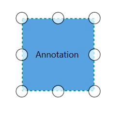
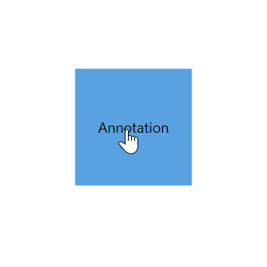
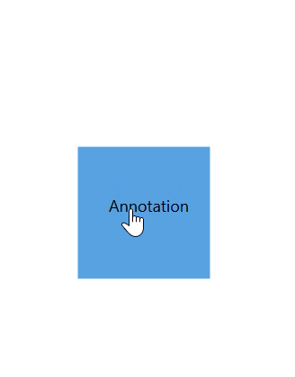

# How to drag the annotation

Dragging process can be applied over annotation and dragging can be controlled by the annotation and its parent node or connector.
To learn about annotation constraints, refer to the [Annotation Constraints](https://help.syncfusion.com/cr/wpf/Syncfusion.UI.Xaml.Diagram.AnnotationConstraints.html).

## Dragging the annotation

Dragging of annotation can be enabled by using the `Constraints` property of `AnnotationEditorViewModel` class and setting its value as `AnnotationConstraints.Draggable`.





<!--Initialize the Annotation Collection-->
<syncfusion:AnnotationCollection>
    <!--Initialize the annotation with draggable constraint-->
    <syncfusion:AnnotationEditorViewModel Content="Annotation" Constraints="Draggable"/>
</syncfusion:AnnotationCollection>
                                



//Initialize the Annotation Collection
Annotations = new ObservableCollection<IAnnotation>()
{
    new AnnotationEditorViewModel()
    {
        Content = "Annotation",
        //Initialize the constraint as draggable
        Constraints = AnnotationConstraints.Draggable 
    }
}




## How to restrict the dragging area

Diagram allows you to specify the amount of dragging area around the annotation by enabling the `Constraints` as `AnnotationConstraints.DragLimit` and dragging area can be specified by using the `DragLimit` property. You cannot drag the annotation behind this drag limit value. Default value is (10, 10, 10, 10).




<!--Initialize the AnnotationCollection-->
<syncfusion:AnnotationCollection>
    <!--Initialize the annotation with drag limit value-->
    <syncfusion:AnnotationEditorViewModel Content="Annotation" 
                                          Constraints="Draggable,DragLimit" 
                                          DragLimit="40,80,40,40"/>
</syncfusion:AnnotationCollection>
                                



//Initialize the AnnotationCollection
Annotations = new ObservableCollection<IAnnotation>()
{
    new AnnotationEditorViewModel()
    {
        Content = "Annotation",
        //Initialize the drag limit constraint
        Constraints = AnnotationConstraints.Draggable | AnnotationConstraints.DragLimit,
        //Initialize the drag limit value
        DragLimit = new Thickness(40,80,40,40),
    }
}




| Property | Value | Output |
|---|---|---|---|
| DragLimit | (10,10,10,10) |  |
| |(40,80,40,40) |  |
