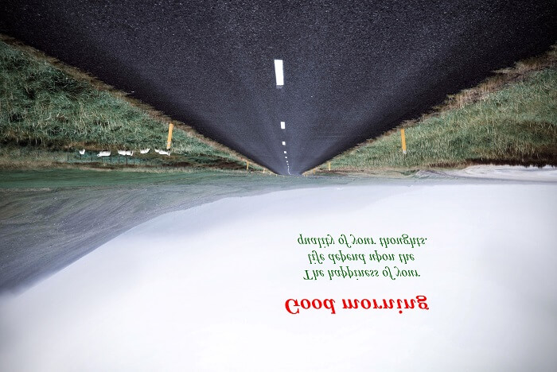

# Transformation

The image editor control provides the following two transformations:

* Flip
* Rotate

## Flip

Images can be flipped either in horizontal or vertical direction. By default, images will be flipped in horizontal direction.

### Using toolbar

To flip an image, click the Flip icon in the toolbar. Popup will be displayed prompting for whether horizontal flip or vertical flip. Select the required flip direction to flip the image.

### Using code

Programmatically, you can flip an image using the Flip method. This method takes the [`FlipDirection`](https://help.syncfusion.com/cr/wpf/Syncfusion.UI.Xaml.ImageEditor.Enums.FlipDirection.html) as the parameter to specify whether it is a horizontal flip or vertical flip.

 

 

editor.Flip(FlipDirection.Horizontal);



 

The following screenshot depicts the horizontal flip.

   

Vertical flip of the image.

   

## Rotate

### Using toolbar

To rotate an image, click the rotate icon in the toolbar. This rotates the image to 90 degrees from the current state. By continuous clicking, angle will be increased since it is rotated from the current state.

### Using code

Use the rotate method to rotate an image to 90 degrees from the current state. 

 
