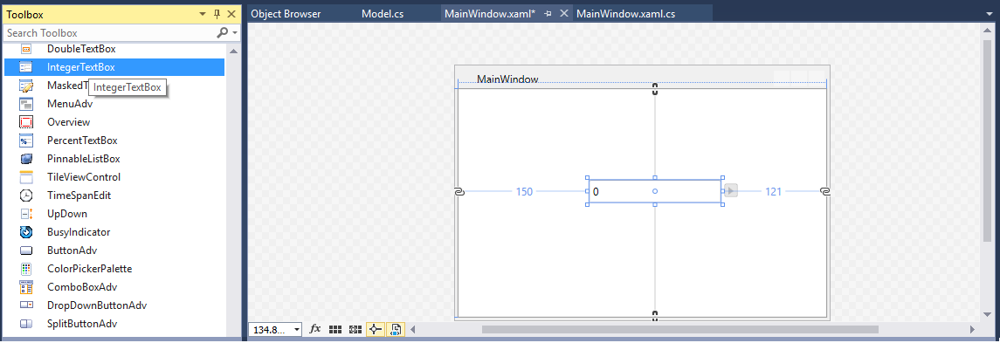
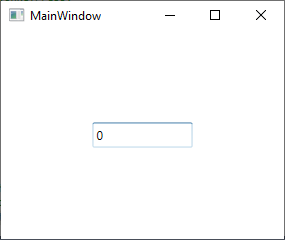

# Getting started with WPF IntegerTextBox

This section explains how to create a WPF `IntegerTextBox` control and its features.

## Assembly deployment

Refer to the [control dependencies](https://help.syncfusion.com/wpf/control-dependencies#integertextbox) section to get the list of assemblies or NuGet package that needs to be added as a reference to use the control in any application.

You can find more details about installing the NuGet packages in a WPF application in the following link:

[How to install nuget packages](https://help.syncfusion.com/wpf/nuget-packages)

## Adding WPF IntegerTextBox via designer

You can add the [IntegerTextBox](https://www.syncfusion.com/wpf-ui-controls/integer-textbox) control to an application by dragging it from the toolbox to a view of the designer. The following dependent assembly will be added automatically:

* Syncfusion.Shared.WPF

## Adding WPF IntegerTextBox via XAML

To add the IntegerTextBox control manually in XAML, follow these steps:
1. Create a new WPF project in Visual Studio.

2. Add the **Syncfusion.Shared.WPF** assembly references to the project.
 
3. Import Syncfusion WPF schema **http://schemas.syncfusion.com/wpf** and declare the `IntegerTextBox` control in XAML page.



<Window xmlns="http://schemas.microsoft.com/winfx/2006/xaml/presentation"
        xmlns:x="http://schemas.microsoft.com/winfx/2006/xaml"
        xmlns:syncfusion="http://schemas.syncfusion.com/wpf" 
        x:Class="IntegerTextBoxSample.MainWindow"
        Title="IntegerTextBox Sample" Height="350" Width="525">
    <Grid>
        <!--Adding IntegerTextBox control -->
       <syncfusion:IntegerTextBox x:Name="integerTextBox" Width="100" Height="20" VerticalAlignment="Center" HorizontalAlignment="Center"/>
    </Grid>
</Window>



## Adding WPF IntegerTextBox via C\#

To add the IntegerTextBox control manually in C#, follow these steps:

1. Create a new WPF application via Visual Studio.

2. Add the **Syncfusion.Shared.WPF** assembly references to the project.

3. Include the required namespace.




using Syncfusion.Windows.Shared;




4. Create an instance of IntegerTextBox and add it to the window.




//Creating an instance of IntegerTextBox control

IntegerTextBox integerTextBox = new IntegerTextBox();

// Setting height and width to IntegerTextBox

integerTextBox.Height = 25;
integerTextBox.Width = 100;

//Adding IntegerTextBox as window content

this.Content = integerTextBox;




## Setting Value

The value of the `IntegerTextBox` can be set by using the [Value](https://help.syncfusion.com/cr/wpf/Syncfusion.Windows.Shared.IntegerTextBox.html#Syncfusion_Windows_Shared_IntegerTextBox_Value) property.




<syncfusion:IntegerTextBox x:Name="integerTextBox" Width="100" Height="23" Value="100"/>




IntegerTextBox integerTextBox = new IntegerTextBox();
integerTextBox.Width = 100;
integerTextBox.Height = 23;
integerTextBox.Value = 100;




N> Do not use the [Text](https://docs.microsoft.com/en-us/dotnet/api/system.windows.controls.textbox.text?redirectedfrom=MSDN&view=netframework-4.7.2#System_Windows_Controls_TextBox_Text) property to set the value for the IntegerTextBox. Use only the `Value` property.

### Binding Value

Data binding is the method of forming a connection between the application  UI and business logic. Data binding can be unidirectional (source -> target or target <- source) or bidirectional (source <-> target). You can bind data to the `IntegerTextBox` using the `Value` Property.

The following code snippets illustrate the value binding from one `IntegerTextBox` to another.




<StackPanel>
<syncfusion:IntegerTextBox x:Name="integerTextBox1" Height="25" Width="100" Value="{Binding MyValue,UpdateSourceTrigger=PropertyChanged}"/>
<syncfusion:IntegerTextBox x:Name="integerTextBox2" Width="100" Height="25" Value="{Binding MyValue,UpdateSourceTrigger=PropertyChanged}" />
</StackPanel>






class ViewModel : NotificationObject
{
    private int myValue;
    public int MyValue
    {
        get
        {
            return myValue;
        }
        set
        {
            myValue = value;
            RaisePropertyChanged("MyValue");
        }
    }
}




## Value Changed Notification

The `IntegerTextBox` control can notifies the value changes through the [ValueChanged](https://help.syncfusion.com/cr/wpf/Syncfusion.Windows.Shared.IntegerTextBox.html) event. You can get old value and new Value from `OldValue` and `NewValue` properties in `ValueChanged` event.


 

<syncfusion:IntegerTextBox ValueChanged="IntegerTextBox_ValueChanged"/>


 

IntegerTextBox integerTextBox = new IntegerTextBox();
integerTextBox.ValueChanged += new PropertyChangedCallback(IntegerTextBox_ValueChanged);




You can handle the event as follows:




private void IntegerTextBox_ValueChanged(DependencyObject d, DependencyPropertyChangedEventArgs e)
{
    // Get old and new value
    var newValue = e.NewValue;
    var oldValue = e.OldValue;
}




## Min Max Value Restriction

The `Value` of `IntegerTextBox` can be restricted within maximum and minimum limit. You can define the minimum and maximum values by setting the [MinValue](https://help.syncfusion.com/cr/wpf/Syncfusion.Windows.Shared.IntegerTextBox.html#Syncfusion_Windows_Shared_IntegerTextBox_MinValue) and [MaxValue](https://help.syncfusion.com/cr/wpf/Syncfusion.Windows.Shared.IntegerTextBox.html#Syncfusion_Windows_Shared_IntegerTextBox_MaxValue) properties. It allows the user to enter the value between `MinValue` and `MaxValue`. 




<syncfusion:IntegerTextBox x:Name="integerTextBox" Width="100" Height="25" Value="100" MaxValue="999" MinValue="-999"/>




IntegerTextBox integerTextBox = new IntegerTextBox();
integerTextBox.Width = 100;
integerTextBox.Height = 25;
//Setting minimum value
integerTextBox.MinValue = -999;
//Setting maximum value
integerTextBox.MaxValue = 999;
integerTextBox.Value = 100;




## Step Interval to increase or decrease the value

The `IntegerTextBox` control allows to increase or decrease the value by pressing up and down arrow keys in keyboard or mouse wheel over the control. The [ScrollInterval](https://help.syncfusion.com/cr/wpf/Syncfusion.Windows.Shared.IntegerTextBox.html#Syncfusion_Windows_Shared_IntegerTextBox_ScrollInterval) property is used to specify the increment or decrement intervals. The default value of `ScrollInterval` is 1.




<syncfusion:IntegerTextBox x:Name="integerTextBox" Width="150" Height="25" Value="8" 
                          IsScrollingOnCircle="True" ScrollInterval="4"/>




IntegerTextBox integerTextBox = new IntegerTextBox();
integerTextBox.Width = 150;
integerTextBox.Height = 25;
integerTextBox.MinValue = 0;
integerTextBox.MaxValue = 100;
integerTextBox.Value = 8;
integerTextBox.IsScrollingOnCircle = true;
integerTextBox.ScrollInterval = 4;




## Formatting the value

You can customize the number format by either setting the [NumberFormat](https://help.syncfusion.com/cr/wpf/Syncfusion.Windows.Shared.EditorBase.html#Syncfusion_Windows_Shared_EditorBase_NumberFormat) property or the [NumberGroupSeparator](https://help.syncfusion.com/cr/wpf/Syncfusion.Windows.Shared.IntegerTextBox.html#Syncfusion_Windows_Shared_IntegerTextBox_NumberGroupSeparator) and the [NumberGroupSizes](https://help.syncfusion.com/cr/wpf/Syncfusion.Windows.Shared.IntegerTextBox.html#Syncfusion_Windows_Shared_IntegerTextBox_NumberGroupSizes) property of IntegerTextBox.




<!--Number Format -->
<syncfusion:IntegerTextBox x:Name="integerTextBox" Height="25" Width="150" Culture="en-US" Value="123456789012345" NumberGroupSeparator="/"/>




IntegerTextBox integerTextBox = new IntegerTextBox();
integerTextBox.Width = 150;
integerTextBox.Height = 25;
integerTextBox.Value = 123456789012345;
integerTextBox.Culture = new System.Globalization.CultureInfo("en-US");
integerTextBox.NumberFormat = new System.Globalization.NumberFormatInfo() 
{ 
NumberGroupSeparator = "/" 
};



## Setting the Culture

The `IntegerTextBox` provides support for globalization by using the [Culture](https://help.syncfusion.com/cr/wpf/Syncfusion.Windows.Shared.EditorBase.html#Syncfusion_Windows_Shared_EditorBase_Culture) property. The `Culture` is used to format the group separator of the `IntegerTextBox` value based on the respective culture.


 

<syncfusion:IntegerTextBox x:Name="integerTextBox" Height="25" Width="100" Culture="en-US" Value="1234567"/>


 

IntegerTextBox integerTextBox = new IntegerTextBox();
integerTextBox.Width = 100;
integerTextBox.Height = 25;
integerTextBox.Value = 1234567;
integerTextBox.Culture = new System.Globalization.CultureInfo("en-US");




N> When you use both `NumberFormat` and  `Culture`, the `NumberFormat` will have a higher priority.