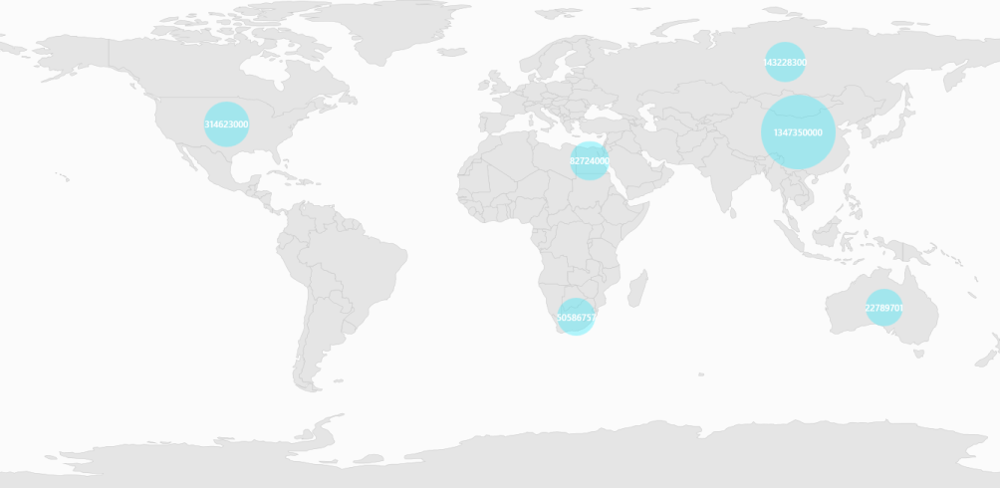
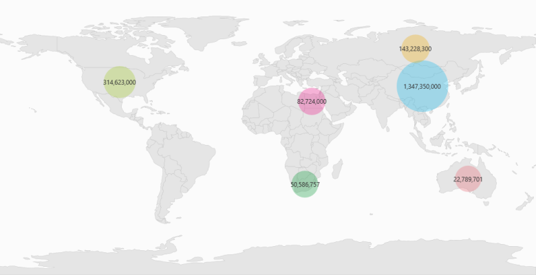

# Bubbles in WPF Maps (SfMap)

Bubbles in the Maps control represent the under-bound data values of the map. Bubbles are scattered throughout map shapes that contain bound values.

Bubbles are included when data binding is set as mentioned above and the BubbleMarkerSetting is set. 

The following properties are available in [`BubbleMarkerSetting`](https://help.syncfusion.com/cr/wpf/Syncfusion.UI.Xaml.Maps.BubbleMarkerSetting.html):

<table>
<tr>
<th>
Property</th><th>
Type</th><th>
Description</th></tr>
<tr>
<td>
AutoFillColor</td><td>
Boolean (true / false)</td><td>
Gets or sets whether the colors should be automatically filled.</td></tr>
<tr>
<td>
MaxSize</td><td>
Double</td><td>
Get or sets the maximum height and width of the bubble.</td></tr>
<tr>
<td>
MinSize</td><td>
Double</td><td>
Gets or sets the minimum height and width of the bubble.</td></tr>
<tr>
<td>
StrokeThickness</td><td>
Double</td><td>
Get or sets the border thickness of the bubbles.</td></tr>
<tr>
<td>
ValuePath</td><td>
String</td><td>
Gets or sets the name of the under-bound property in ItemsSource.</td></tr>
<tr>
<td>
ColorValuePath</td><td>
String</td><td>
Gets or sets colors to bubble shape. </td></tr>
<tr>
<td>
ColorMapping</td><td>
ObservableCollection&lt;RangeColorMapping&gt;</td><td>
Gets or sets the tree map colors.</td></tr>
<tr>
<td>
Fill</td><td>
Brush</td><td>
Gets or sets the fill brush of the bubble when auto fill color is set to true.</td></tr>
<tr>
<td>
Stroke</td><td>
Brush</td><td>
Gets or sets the border color of the bubble.</td></tr>
</table>

## Adding Bubbles to a Map

To add bubbles to a map, the bubble marker setting has to be added to the shape file layer.  Set the [`AutoFillColor`](https://help.syncfusion.com/cr/wpf/Syncfusion.UI.Xaml.Maps.BubbleMarkerSetting.html#Syncfusion_UI_Xaml_Maps_BubbleMarkerSetting_AutoFillColor) as true and set the [`Fill`](https://help.syncfusion.com/cr/wpf/Syncfusion.UI.Xaml.Maps.BubbleMarkerSetting.html#Syncfusion_UI_Xaml_Maps_BubbleMarkerSetting_Fill) property. Create the Model and ViewModel as illustrated in the [`Data Binding`](https://help.syncfusion.com/wpf/maps/custom-data-binding) topic and add the following code. 

Also set the [`MaxSize`](https://help.syncfusion.com/cr/wpf/Syncfusion.UI.Xaml.Maps.BubbleMarkerSetting.html#Syncfusion_UI_Xaml_Maps_BubbleMarkerSetting_MaxSize), [`MinSize`](https://help.syncfusion.com/cr/wpf/Syncfusion.UI.Xaml.Maps.BubbleMarkerSetting.html#Syncfusion_UI_Xaml_Maps_BubbleMarkerSetting_MinSize), and [`ValuePath`](https://help.syncfusion.com/cr/wpf/Syncfusion.UI.Xaml.Maps.BubbleMarkerSetting.html#Syncfusion_UI_Xaml_Maps_BubbleMarkerSetting_ValuePath) properties as illustrated in the following code example.





       <syncfusion:SfMap>
            <syncfusion:SfMap.Layers>
                <syncfusion:ShapeFileLayer EnableSelection="False" ItemsSource="{Binding Countries}" 
                                           ShapeIDPath="Name"  ShapeIDTableField="NAME" 
                                           Uri="DataMarkers.ShapeFiles.world1.shp">
                    <syncfusion:ShapeFileLayer.BubbleMarkerSetting>
                        <syncfusion:BubbleMarkerSetting AutoFillColor="False" MaxSize="100" MinSize="50" 
                                                        Fill="#FF26E8FB" StrokeThickness="0" 
                                                        ValuePath="Population" >
                        </syncfusion:BubbleMarkerSetting>
                    </syncfusion:ShapeFileLayer.BubbleMarkerSetting>
                    <syncfusion:ShapeFileLayer.ShapeSettings>
                        <syncfusion:ShapeSetting ShapeStroke="#C1C1C1" ShapeStrokeThickness="0.5" 
                                                 ShapeValuePath="Population" ShapeFill="#E5E5E5"/>
                    </syncfusion:ShapeFileLayer.ShapeSettings>
                    <syncfusion:ShapeFileLayer.ItemsTemplate>
                        <DataTemplate>
                            <Border Background="Transparent">
                                <TextBlock FontFamily="Segoe UI" FontSize="12" Foreground="White" 
                                           Text="{Binding Data.Population}"/>
                            </Border>
                        </DataTemplate>
                    </syncfusion:ShapeFileLayer.ItemsTemplate>
                </syncfusion:ShapeFileLayer>
            </syncfusion:SfMap.Layers>
        </syncfusion:SfMap>





    public class Country
    {
        private string name;
        public string Name
        {
            get { return name; }
            set { name = value; }
        }

        private double population;

        public double Population
        {
            get { return population; }
            set { population = value; }
        }

    }

    public class ViewModel
    {
        private ObservableCollection<Country> countries;
        public ObservableCollection<Country> Countries
        {
            get { return countries; }
            set { countries = value; }
        }

        public ViewModel()
        {
            Countries = new ObservableCollection<Country>
            {
                new Country { Name = "Russia", Population = 143228300},
                new Country { Name = "China",  Population = 1347350000 },
                new Country { Name = "Australia", Population = 22789701  },
                new Country { Name = "South Africa", Population = 50586757},
                new Country { Name = "United States", Population = 314623000 },
                new Country { Name = "Egypt", Population = 82724000},
            };
        }
    }





## Customizing Bubble Symbol

The shape of the bubble symbol can be modified by using built-in symbols like circle, rectangle, diamond, triangle, trapezoid, star, pentagon, and pushpin that are available in the [`BubbleType`](https://help.syncfusion.com/cr/wpf/Syncfusion.UI.Xaml.Maps.BubbleMarkerSetting.html#Syncfusion_UI_Xaml_Maps_BubbleMarkerSetting_BubbleType) enum property. Also, bubbles can be customized by setting the [`CustomTemplate`](https://help.syncfusion.com/cr/wpf/Syncfusion.UI.Xaml.Maps.BubbleMarkerSetting.html#Syncfusion_UI_Xaml_Maps_BubbleMarkerSetting_CustomTemplate) of the BubbleMarkerSetting.

<table>
<tr>
<th>
Property</th><th>
Type</th><th>
Description</th></tr>
<tr>
<td>
BubbleType</td><td>
BubbleType (enum)</td><td>
Gets or sets the type of bubble symbol needed to be used in maps.</td></tr>
<tr>
<td>
CustomTemplate</td><td>
DataTemplate</td><td>
Gets or sets the template to customize the bubble.</td></tr>
</table>



         <syncfusion:SfMap>
            <syncfusion:SfMap.Layers>
                <syncfusion:ShapeFileLayer x:Name="shapeFileLayer"   
                                       ItemsSource="{Binding Countries}"
                                       ShapeIDPath="Name" 
                                       ShapeIDTableField="NAME"                                       
                                       Uri="DataMarkers.ShapeFiles.world1.shp">
                    <syncfusion:ShapeFileLayer.BubbleMarkerSetting>
                        <syncfusion:BubbleMarkerSetting AutoFillColor="False" MaxSize="100" MinSize="50" 
                                                        ColorValuePath="Population"                                                        
                                                        ValuePath="Population" BubbleType="Star">
                            <syncfusion:BubbleMarkerSetting.ColorMappings>
                                <syncfusion:RangeColorMapping Color="#7F20BCEE" To="1347350000" From="314623001"/>
                                <syncfusion:RangeColorMapping Color="#7FA7CE38" To="314623001" From="143228301"/>
                                <syncfusion:RangeColorMapping Color="#7FF1B21A" To="143228301" From="82724090"/>
                                <syncfusion:RangeColorMapping Color="#7F1DA249" To="50586757" From="22789702"/>
                                <syncfusion:RangeColorMapping Color="#7FEB737C" To="22789702" From="0"/>
                                <syncfusion:RangeColorMapping Color="#7FED2D95" To="82724090" From="50586757"/>
                            </syncfusion:BubbleMarkerSetting.ColorMappings>
                        </syncfusion:BubbleMarkerSetting>
                    </syncfusion:ShapeFileLayer.BubbleMarkerSetting>
                    <syncfusion:ShapeFileLayer.ItemsTemplate>
                        <DataTemplate>
                            <Border Background="Transparent">
                                <TextBlock FontFamily="Segoe UI" FontSize="12" Foreground="#FF333333" 
                                           Text="{Binding Data.Population}"/>
                            </Border>
                        </DataTemplate>
                    </syncfusion:ShapeFileLayer.ItemsTemplate>
                    <syncfusion:ShapeFileLayer.ShapeSettings>
                        <syncfusion:ShapeSetting ShapeStroke="#C1C1C1" ShapeStrokeThickness="0.5" 
                                                 ShapeValuePath="Population" ShapeFill="#E5E5E5"/>
                    </syncfusion:ShapeFileLayer.ShapeSettings>
                </syncfusion:ShapeFileLayer>
            </syncfusion:SfMap.Layers>
        </syncfusion:SfMap>



## Range Color Mapping

Range color mapping is one of the features used to differentiate the bubble fill, based on its under-bound value and color ranges. It contains the following properties:

<table>
<tr>
<th>
Property</th><th>
Type</th><th>
Description</th></tr>
<tr>
<td>
From & To</td><td>
Double</td><td>
Gets or sets the value range of the bubble.</td></tr>
<tr>
<td>
Color</td><td>
Color</td><td>
Gets or sets the color values for a given range.</td></tr>
</table>

The fill color of a particular bubble fill can be determined by its under-bound value and the color range. For example, consider the following color ranges:



 <syncfusion:BubbleMarkerSetting AutoFillColor="False" MaxSize="100" MinSize="50" 
                          ColorValuePath="Population"                                                        
                          ValuePath="Population" BubbleType="Star">
          <syncfusion:BubbleMarkerSetting.ColorMappings>
          <syncfusion:RangeColorMapping Color="#7F20BCEE" To="1347350000" From="314623001"/>
          <syncfusion:RangeColorMapping Color="#7FA7CE38" To="314623001" From="143228301"/>
          <syncfusion:RangeColorMapping Color="#7FF1B21A" To="143228301" From="82724090"/>
          <syncfusion:RangeColorMapping Color="#7F1DA249" To="50586757" From="22789702"/>
          <syncfusion:RangeColorMapping Color="#7FEB737C" To="22789702" From="0"/>
     </syncfusion:BubbleMarkerSetting.ColorMappings>
 </syncfusion:BubbleMarkerSetting>



When the under-bound object value is 22789702, then the fill color of the corresponding bubble is set to `#7FEB737C`.  As mentioned earlier, the under-bound value of the bubble is set through the `ValuePath` in the BubbleMarkerSetting.

When the under-bound value is under any of the given sorted range or above the sorted range, then the fill is set as `Black`.

`AutoFillColor` must be set as `false` to enable range color mapping.
