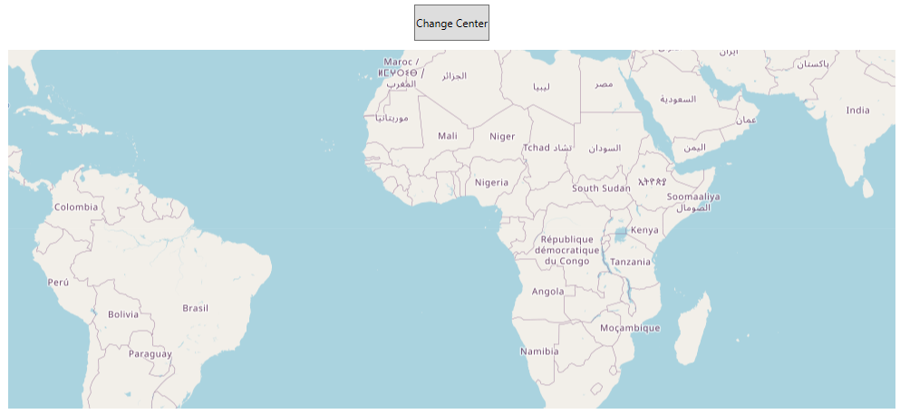
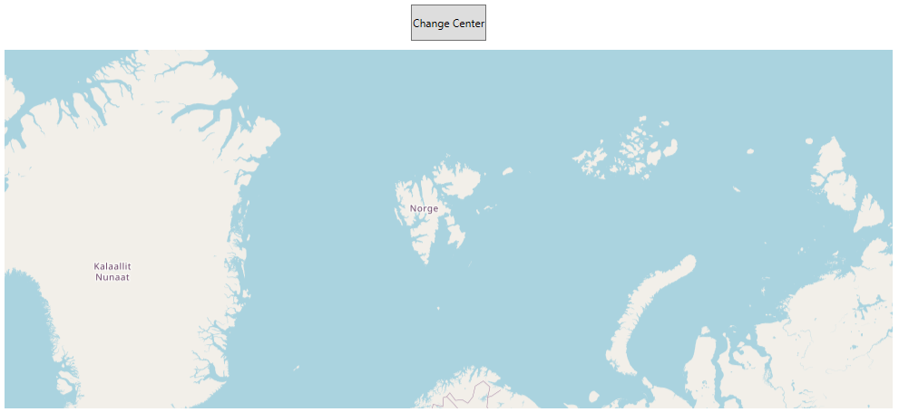

## Transform latitude and longitude value to pixel value and vice-versa

SfMap offers two utility methods to transform the pixel values to longitude and latitude values and vice-versa. This method is used for both ShapeFileLayer and ImageryLayer.

1. [`GeopointToViewPoint`](https://help.syncfusion.com/cr/wpf/Syncfusion.UI.Xaml.Maps.MapLayer.html#Syncfusion_UI_Xaml_Maps_MapLayer_GeopointToViewPoint_System_Double_System_Double_) - Converts the latitude and longitude values to screen point. Here, pass the parameters as latitude and longitude values, from that values we can get screen points x and y.
2. [`GetLatLonFromPoint`](https://help.syncfusion.com/cr/wpf/Syncfusion.UI.Xaml.Maps.MapLayer.html#Syncfusion_UI_Xaml_Maps_MapLayer_GetLatLonFromPoint_System_Windows_Point_) - Converts the screen point to longitude and latitude values. Here, pass the parameters as screen points x and y, from that points we can get longitude(Point.X) and latitude(Point.Y) values.





      <Grid>
         <Grid.RowDefinitions>
            <RowDefinition Height="60"/>
            <RowDefinition Height="*"/>
        </Grid.RowDefinitions>
        <Button x:Name="but" Content="Change Center"
                HorizontalAlignment="Center"
                Click="but_Click" Margin="10"/>
        <maps:SfMap Grid.Row="1" ZoomLevel="3">
            <maps:SfMap.Layers>
                <maps:ImageryLayer x:Name="layer">
                </maps:ImageryLayer>
            </maps:SfMap.Layers>
        </maps:SfMap>
    </Grid>





        private void but_Click(object sender, RoutedEventArgs e)
        {
            Point pixelPoint = layer.GeopointToViewPoint(21.00, 78.00);
            Point longitudeLatitude = layer.GetLatLonFromPoint(pixelPoint);
            layer.Center = longitudeLatitude;
        }





