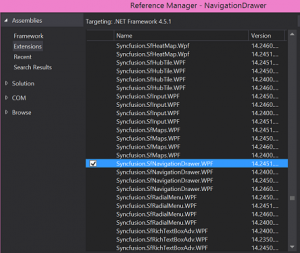

# Getting Started

This section helps you to build your application with SfNavigationDrawer.

## Steps

* Create new WPF project using Visual Studio.
* Add the SfNavigationDrawer assembly to your application.
* Initialize the NavigationDrawer control.
* Adding content view to the NavigationDrawer control.
* Adding drawer view to the NavigationDrawer control.

These steps are explained below for XAML.

## Create a simple NavigationDrawer from XAML

### Adding assembly reference

1. Open the Add Reference window from your project.
2. Choose Windows > Extensions > Syncfusion.SfNavigationDrawer.WPF.

This window differs for the Visual Basic project.

Select the .NET Framework version respective to your application. The version can be identified as below:

<table>
<tr>
<td>XX.X450.0.X</td>
<td>4.5 Framework</td>
</tr>
<tr>
<td>XX.X451.0.X</td>
<td>4.5.1 Framework</td>
</tr>
<tr>
<td>XX.X460.0.X</td>
<td>4.6 Framework</td>
</tr>
</table>

Add the following namespace in your XAML window.


      
      xmlns:syncfusion="http://schemas.syncfusion.com/wpf"



## Add SfNavigationDrawer from Toolbox

Drag and drop the SfNavigationDrawer control from the Toolbox to your application.

Now, the SyncfusionControls for UWP XAML reference is added to the application references and the xmlns namespace code is generated in MainWindow.xaml as below.

## Initialize the NavigationDrawer

You need to initialize the NavigationDrawer represented by the following class Syncfusion.UI.Xaml.NavigationDrawer.





<Window x:Class="NavigationDrawerWPF.MainWindow"
        xmlns="http://schemas.microsoft.com/winfx/2006/xaml/presentation"
        xmlns:x="http://schemas.microsoft.com/winfx/2006/xaml"
        xmlns:d="http://schemas.microsoft.com/expression/blend/2008"
        xmlns:mc="http://schemas.openxmlformats.org/markup-compatibility/2006"
        xmlns:syncfusion="http://schemas.syncfusion.com/wpf"
        xmlns:local="clr-namespace:NavigationDrawerWPF"
        mc:Ignorable="d"
        Title="MainWindow" Height="450" Width="800">
    <syncfusion:SfNavigationDrawer x:Name="navigationDrawer"/>
</Window>





using Syncfusion.UI.Xaml.NavigationDrawer;
using System.Windows;

namespace NavigationDrawerWPF
{
    /// 

    /// Interaction logic for MainWindow.xaml
    /// 

    public partial class MainWindow : Window
    {
        public MainWindow()
        {
            InitializeComponent();
            SfNavigationDrawer navigationDrawer = new SfNavigationDrawer();
            this.Content = navigationDrawer;
        }
    }
}





## Adding content view to the NavigationDrawer





	<syncfusion:SfNavigationDrawer x:Name="drawer">
		<syncfusion:SfNavigationDrawer.ContentView>
			<Grid Background="Black">
				<Button BorderBrush="#393939" BorderThickness="2" VerticalAlignment="Center" Click="ButtonBase_OnClick" HorizontalAlignment="Center" >
					<StackPanel Orientation="Vertical" VerticalAlignment="Center" HorizontalAlignment="Center">
						<Image Source="/Assets/NavigationDrawer/User.png" Height="80" Width="100"/>
						<TextBlock HorizontalAlignment="Center" Margin="0 10 0 0" Text="James Pollock"/>
					</StackPanel>
				</Button>
			</Grid>
		</syncfusion:SfNavigationDrawer.ContentView>
	</syncfusion:SfNavigationDrawer>





using Syncfusion.UI.Xaml.NavigationDrawer;
using System;
using System.Windows;
using System.Windows.Controls;
using System.Windows.Media;
using System.Windows.Media.Imaging;

namespace NavigationDrawerWPF
{
    /// 

    /// Interaction logic for MainWindow.xaml
    /// 

    public partial class MainWindow : Window
    {
        public MainWindow()
        {
            InitializeComponent();
            SfNavigationDrawer navigationDrawer = new SfNavigationDrawer();
            Grid grid = new Grid()
            {
                Background = new SolidColorBrush(Colors.Black)
            };

            Button button = new Button()
            {
                BorderBrush = new SolidColorBrush((Color)ColorConverter.ConvertFromString("#393939")),
                BorderThickness = new Thickness(2),
                VerticalAlignment = VerticalAlignment.Center,
                HorizontalAlignment = HorizontalAlignment.Center
            };

            StackPanel stackPanel = new StackPanel()
            {
                Orientation = Orientation.Vertical,
                VerticalAlignment = VerticalAlignment.Center,
                HorizontalAlignment = HorizontalAlignment.Center
            };

            Image image = new Image()
            {
                Source = new BitmapImage(new Uri("User.png", UriKind.Relative)),
                Height = 80,
                Width = 100
            };

            TextBlock textBlock = new TextBlock()
            {
                HorizontalAlignment = HorizontalAlignment.Center,
                Margin = new Thickness(0, 10, 0, 0),
                Text = "James Pollock"
            };

            stackPanel.Children.Add(image);
            stackPanel.Children.Add(textBlock);
            button.Content = stackPanel;
            grid.Children.Add(button);
            navigationDrawer.ContentView = grid;
            this.Content = navigationDrawer;
        }
    }
}





## Adding drawer view to the NavigationDrawer

The DrawerView is a panel that is the hidden content, brought to the view by manipulations like panning or swiping through the edges. The DrawerView has three sections namely:

   * DrawerHeaderView
   
   * DrawerContentView
   
   * DrawerFooterView




	<Window x:Class="NavigationDrawerWPF.MainWindow"
        xmlns="http://schemas.microsoft.com/winfx/2006/xaml/presentation"
        xmlns:x="http://schemas.microsoft.com/winfx/2006/xaml"
        xmlns:d="http://schemas.microsoft.com/expression/blend/2008"
        xmlns:mc="http://schemas.openxmlformats.org/markup-compatibility/2006"
        xmlns:syncfusion="http://schemas.syncfusion.com/wpf"
        xmlns:local="clr-namespace:NavigationDrawerWPF"
        mc:Ignorable="d"
        Title="MainWindow" Height="450" Width="800">
    <Window.DataContext>
        <local:ViewModel/>
    </Window.DataContext>
    <syncfusion:SfNavigationDrawer x:Name="navigationDrawer">
        <syncfusion:SfNavigationDrawer.DrawerHeaderView>
            <Grid Background="#31ade9">
                <Image Source="User.png" Height="75" VerticalAlignment="Center" HorizontalAlignment="Center" Margin="0 0 0 5" />
            </Grid>
        </syncfusion:SfNavigationDrawer.DrawerHeaderView>
        <syncfusion:SfNavigationDrawer.DrawerContentView>
            <Grid Background="Black">
                <ListBox x:Name="list" ItemsSource="{Binding Contents}">
                    <ListBox.ItemTemplate>
                        <DataTemplate>
                            <TextBlock  Text="{Binding Name}" Padding="15" TextAlignment="Center" FontSize="23" Foreground="White"/>
                        </DataTemplate>
                    </ListBox.ItemTemplate>
                </ListBox>
            </Grid>
        </syncfusion:SfNavigationDrawer.DrawerContentView>
        <syncfusion:SfNavigationDrawer.DrawerFooterView>
            <Grid Background="#31ade9">
                <Image Source="User.png" Height="75" VerticalAlignment="Center" HorizontalAlignment="Center" Margin="0 0 0 5" />
            </Grid>
        </syncfusion:SfNavigationDrawer.DrawerFooterView>
    </syncfusion:SfNavigationDrawer>
</Window>

    




using System.Collections.Generic;
using System.Windows;

namespace NavigationDrawerWPF
{
    /// 

    /// Interaction logic for MainWindow.xaml
    /// 

    public partial class MainWindow : Window
    {
        public MainWindow()
        {
            InitializeComponent();
        }
    }

    public class ViewModel
    {
        public ViewModel()
        {
            Contents = new List<Model>();

            Contents.Add(new Model() { Name = "Home" });
            Contents.Add(new Model() { Name = "Profile" });
            Contents.Add(new Model() { Name = "Inbox" });
            Contents.Add(new Model() { Name = "Outbox" });
            Contents.Add(new Model() { Name = "Sent" });
            Contents.Add(new Model() { Name = "Trash" });
            Contents.Add(new Model() { Name = "Sign Out" });
        }

        public List<Model> Contents { get; set; }
    }

    public class Model
    {
        public string Name { get; set; }
    }
}





                   

