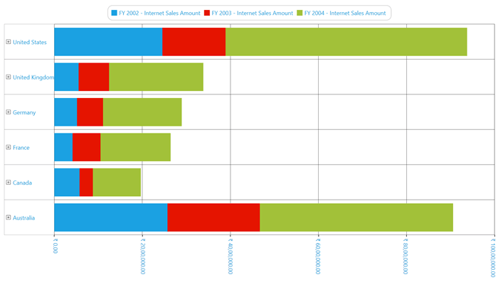
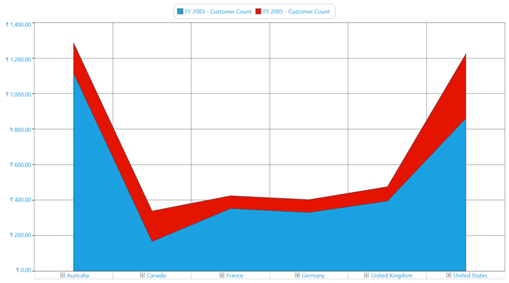
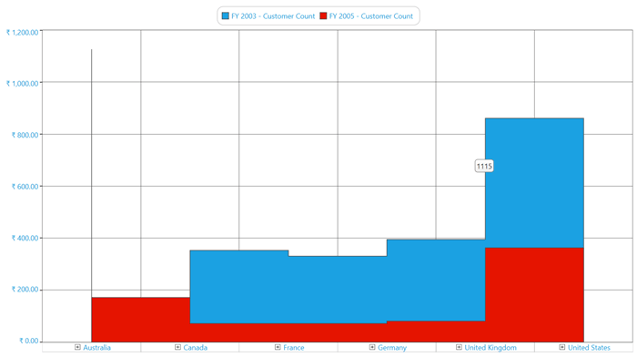
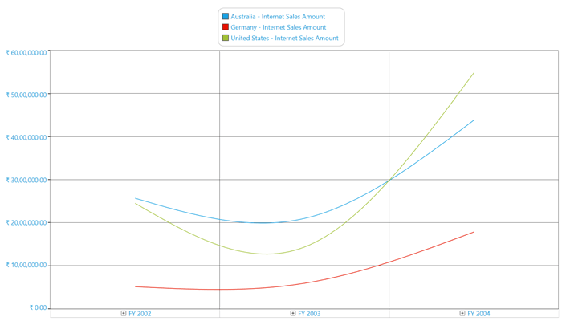
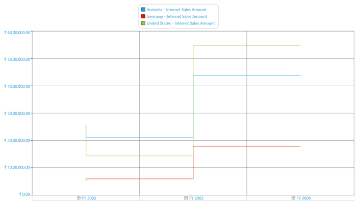

# Chart Types

The OLAP chart supports the following 16 types of charts:

* Column
* Stacking column
* Stacking column 100
* Bar
* Stacking bar
* Stacking bar 100
* Area
* Stacking area
* Spline area
* Step area
* Line
* Spline
* Rotated spline
* Step line
* Scatter
* Pie

N> Chart type must be set before invoking the DataBind() method. Whenever you change the chart type, you need to call the DataBind() method to get the changes reflected.

## Column chart

Column chart is the most basic type of all charts. Column charts are widely used for comparison analysis.

The following code sample shows how to select a simple column chart.





<syncfusion:OlapChart Name="olapChart" ChartType="Column" />





OlapChart olapChart = new OlapChart();
olapChart.ChartType = ChartTypes.Column;





Dim olapChart As OlapChart = New OlapChart()
olapChart.ChartType = ChartTypes.Column





A sample demo is available at the following location.  

{system drive}:\Users\&lt;User Name&gt;\AppData\Local\Syncfusion\EssentialStudio\&lt;Version Number&gt;\WPF\OlapChart.WPF\Samples\Chart Types\Column Chart Demo

## Stacking column chart

The stacking column chart is a simple form of chart, which contains segments in each series. This chart type is widely used for proportional analysis over a particular period of time.

The following code sample shows how to select a stacking column chart.





<syncfusion:OlapChart Name="olapChart" ChartType="StackingColumn" />





OlapChart olapChart = new OlapChart();
olapChart.ChartType = ChartTypes.StackingColumn;




  
Dim olapChart As OlapChart = New OlapChart()
olapChart.ChartType = ChartTypes.StackingColumn





A sample demo is available at the following location.

{system drive}:\Users\&lt;User Name&gt;\AppData\Local\Syncfusion\EssentialStudio\&lt;Version Number&gt;\WPF\OlapChart.WPF\Samples\Chart Types\Column Chart Demo

## Stacking column 100 chart

Stacking column 100 chart is a simple form of chart. Like stacking column chart, the stacking column 100 chart also contains segments in each series, which is added to equate each series to 100%. This chart type is widely used for proportional analysis over a particular period of time.

The following code sample shows how to select a stacking column 100 chart.





<syncfusion:OlapChart Name="olapChart" ChartType="StackingColumn100" />




 
OlapChart olapChart = new OlapChart();
olapChart.ChartType = ChartTypes.StackingColumn100;




  
Dim olapChart As OlapChart = New OlapChart()
olapChart.ChartType = ChartTypes.StackingColumn100





A sample demo is available at the following location.

{system drive}:\Users\&lt;User Name&gt;\AppData\Local\Syncfusion\EssentialStudio\&lt;Version Number&gt;\WPF\OlapChart.WPF\Samples\Chart Types\Column Chart Demo

## Bar chart

The bar chart is same as the column chart, but it can be rotated to 90 degrees in the clockwise direction. This chart type is widely used for comparison analysis over a particular period of time.

The following code sample shows how to select a bar chart.





<syncfusion:OlapChart Name="olapChart" ChartType="Bar" />




 
OlapChart olapChart = new OlapChart();
olapChart.ChartType = ChartTypes.Bar;




  
Dim olapChart As OlapChart = New OlapChart()
olapChart.ChartType = ChartTypes.Bar





A sample demo is available at the following location.

{system drive}:\Users\&lt;User Name&gt;\AppData\Local\Syncfusion\EssentialStudio\&lt;Version Number&gt;\WPF\OlapChart.WPF\Samples\Chart Types\Bar Chart Demo

## Stacking bar chart

Stacking bar chart functions same as the stacking column chart, but it can be rotated to 90 degrees in the clockwise direction. This chart type is widely used for proportional analysis over a particular period of time.

The following code sample shows how to select a stacking bar chart.





<syncfusion:OlapChart Name="olapChart" ChartType="StackingBar" />




 
OlapChart olapChart = new OlapChart();
olapChart.ChartType = ChartTypes.StackingBar;





Dim olapChart As OlapChart = New OlapChart()
olapChart.ChartType = ChartTypes.StackingBar





A sample demo is available at the following location.

{system drive}:\Users\&lt;User Name&gt;\AppData\Local\Syncfusion\EssentialStudio\&lt;Version Number&gt;\WPF\OlapChart.WPF\Samples\Chart Types\Bar Chart Demo

## Stacking bar 100 chart

The stacking bar 100 chart functions same as the stacking column 100 chart, but it can be rotated to 90 degrees in the clockwise direction. This chart type is widely used for proportional analysis over a particular period of time.

The following code sample shows how to select a stacking bar 100 chart.





<syncfusion:OlapChart Name="olapChart" ChartType="StackingBar100" />





OlapChart olapChart = new OlapChart();
olapChart.ChartType = ChartTypes.StackingBar100;




  
Dim olapChart As OlapChart = New OlapChart()
olapChart.ChartType = ChartTypes.StackingBar100





A sample demo is available at the following location.

{system drive}:\Users\&lt;User Name&gt;\AppData\Local\Syncfusion\EssentialStudio\&lt;Version Number&gt;\WPF\OlapChart.WPF\Samples\Chart Types\Bar Chart Demo

## Area chart

The area chart fills the quantitative data over a period of time. It is mainly used to compare the quantity plotted over two or more series.

The following code sample shows how to select an area chart.





<syncfusion:OlapChart Name="olapChart" ChartType="Area" />





OlapChart olapChart = new OlapChart();
olapChart.ChartType = ChartTypes.Area;




  
Dim olapChart As OlapChart = New OlapChart()
olapChart.ChartType = ChartTypes.Area





A sample demo is available at the following location.

{system drive}:\Users\&lt;User Name&gt;\AppData\Local\Syncfusion\EssentialStudio\&lt;Version Number&gt;\WPF\OlapChart.WPF\Samples\Chart Types\Area Chart Demo

## Stacking area chart

The stacking area chart fills the quantitative data over a period of time just like the line area chart, but it differs by the plotting method. In the stacking area chart, each series is plotted on the top of the previous series rather than starting from 0 of the horizontal axis. It is mainly used to compare the quantity plotted over two or more series.

The following code sample shows how to select a stacking area chart.





<syncfusion:OlapChart Name="olapChart" ChartType="StackingArea" />




 
OlapChart olapChart = new OlapChart();
olapChart.ChartType = ChartTypes.StackingArea;





Dim olapChart As OlapChart = New OlapChart()
olapChart.ChartType = ChartTypes.StackingArea





A sample demo is available at the following location.

{system drive}:\Users\&lt;User Name&gt;\AppData\Local\Syncfusion\EssentialStudio\&lt;Version Number&gt;\WPF\OlapChart.WPF\Samples\Chart Types\Area Chart Demo

## Spline area chart

The spline area chart is usually used in the case of approximating the intervals by using the spline curve. It is often used when data points are in limited number.

The following code sample shows how to select a spline area chart.





<syncfusion:OlapChart Name="olapChart" ChartType="SplineArea" />




 
OlapChart olapChart = new OlapChart();
olapChart.ChartType = ChartTypes.SplineArea;




  
Dim olapChart As OlapChart = New OlapChart()
olapChart.ChartType = ChartTypes.SplineArea





A sample demo is available at the following location.

{system drive}:\Users\&lt;User Name&gt;\AppData\Local\Syncfusion\EssentialStudio\&lt;Version Number&gt;\WPF\OlapChart.WPF\Samples\Chart Types\Area Chart Demo

## Step area chart

In the step area chart, the points are plotted instead of a straight line tracing the shortest path between points. The values are connected by continuous vertical and horizontal lines.

The following code sample shows how to select a step area chart.





<syncfusion:OlapChart Name="olapChart" ChartType="StepArea" />




 
OlapChart olapChart = new OlapChart();
olapChart.ChartType = ChartTypes.StepArea;




  
Dim olapChart As OlapChart = New OlapChart()
olapChart.ChartType = ChartTypes.StepArea





A sample demo is available at the following location.

{system drive}:\Users\&lt;User Name&gt;\AppData\Local\Syncfusion\EssentialStudio\&lt;Version Number&gt;\WPF\OlapChart.WPF\Samples\Chart Types\Area Chart Demo

## Line chart

The line chart is a simple form of chart, which connects a series of data points. Usually, it is used for Trend analysis, Forecasting, or in the case of large data points.

The following code sample shows how to select a line chart.





<syncfusion:OlapChart Name="olapChart" ChartType="Line" />




 
OlapChart olapChart = new OlapChart();
olapChart.ChartType = ChartTypes.Line;




  
Dim olapChart As OlapChart = New OlapChart()
olapChart.ChartType = ChartTypes.Line




 
A sample demo is available at the following location.

{system drive}:\Users\&lt;User Name&gt;\AppData\Local\Syncfusion\EssentialStudio\&lt;Version Number&gt;\WPF\OlapChart.WPF\Samples\Chart Types\Line Chart Demo

## Spline chart

The spline chart is a simple form of chart, which connects the series of data points with an arc rather than a straight line. 

The following code sample shows how to select a spline chart.





<syncfusion:OlapChart Name="olapChart" ChartType="Spline" />




 
OlapChart olapChart = new OlapChart();
olapChart.ChartType = ChartTypes.Spline;




  
Dim olapChart As OlapChart = New OlapChart()
olapChart.ChartType = ChartTypes.Spline





A sample demo is available at the following location.

{system drive}:\Users\&lt;User Name&gt;\AppData\Local\Syncfusion\EssentialStudio\&lt;Version Number&gt;\WPF\OlapChart.WPF\Samples\Chart Types\Line Chart Demo

## Rotated spline chart

The rotated spline chart is similar to the spline chart, but it can be rotated to 90 degrees in the clockwise direction.

The following code sample shows how to select a rotated spline chart.





<syncfusion:OlapChart Name="olapChart" ChartType="RotatedSpline" />





OlapChart olapChart = new OlapChart();
olapChart.ChartType = ChartTypes.RotatedSpline;




  
Dim olapChart As OlapChart = New OlapChart()
olapChart.ChartType = ChartTypes.RotatedSpline





A sample demo is available at the following location.

{system drive}:\Users\&lt;User Name&gt;\AppData\Local\Syncfusion\EssentialStudio\&lt;Version Number&gt;\WPF\OlapChart.WPF\Samples\Chart Types\Line Chart Demo

## Step line chart

The step line chart is another form of chart, which connects the series of data points by using horizontal and vertical lines.

The following code sample shows how to select a step line chart.





<syncfusion:OlapChart Name="olapChart" ChartType="StepLine" />




 
OlapChart olapChart = new OlapChart();
olapChart.ChartType = ChartTypes.StepLine;




  
Dim olapChart As OlapChart = New OlapChart()
olapChart.ChartType = ChartTypes.StepLine





A sample demo is available at the following location.

{system drive}:\Users\&lt;User Name&gt;\AppData\Local\Syncfusion\EssentialStudio\&lt;Version Number&gt;\WPF\OlapChart.WPF\Samples\Chart Types\Line Chart Demo

## Scatter chart

The scatter chart is a collection of points plotted in the rectangular co-ordinate system. It is often used in relationship analysis upto one independent variable.

The following code sample shows how to select a scatter chart.

 



<syncfusion:OlapChart Name="olapChart" ChartType="Scatter" />




 
OlapChart olapChart = new OlapChart();
olapChart.ChartType = ChartTypes.Scatter;





Dim olapChart As OlapChart = New OlapChart()
olapChart.ChartType = ChartTypes.Scatter





A sample demo is available at the following location.

{system drive}:\Users\&lt;User Name&gt;\AppData\Local\Syncfusion\EssentialStudio\&lt;Version Number&gt;\WPF\OlapChart.WPF\Samples\Chart Types\Scatter Chart Demo

## Pie chart

The pie chart renders the data points in segments. It can render only one series at a time. Usually, it is used for proportional analysis for a small set of data points.

The following code sample shows how to select a pie chart.





<syncfusion:OlapChart Name="olapChart" ChartType="Pie" />




 
OlapChart olapChart = new OlapChart();
olapChart.ChartType = ChartTypes.Pie;




  
Dim olapChart As OlapChart = New OlapChart()
olapChart.ChartType = ChartTypes.Pie





N> The pie chart should not be used for comparison analysis of large data points, because it is harder for people to estimate angles rather than distance.

A sample demo is available at the following location:

{system drive}:\Users\&lt;User Name&gt;\AppData\Local\Syncfusion\EssentialStudio\&lt;Version Number&gt;\WPF\OlapChart.WPF\Samples\Chart Types\Pie Chart Demo
