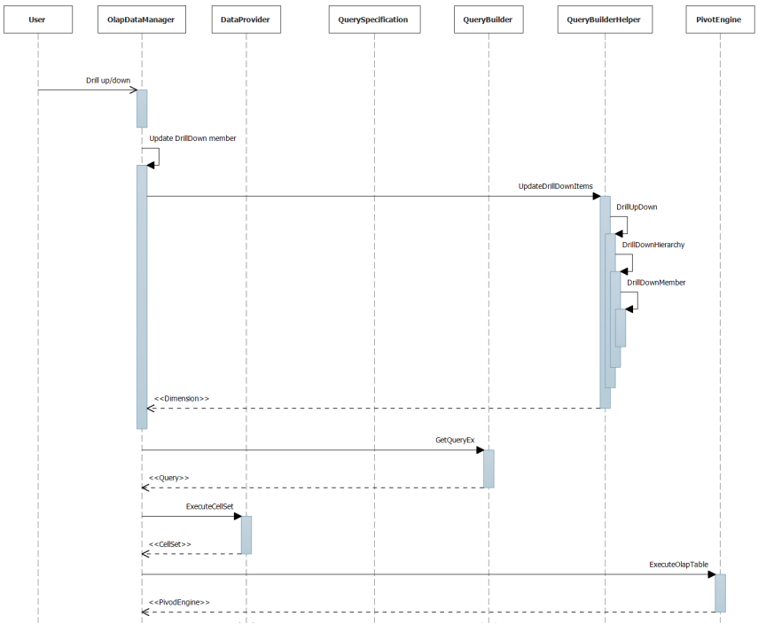

# Handle Drill Down/Up Process

Whenever we collapse or expand the controls like a grid or chart, the level member items will change and the query will be regenerated to create the new CellSet.

The important methods that identify the drill-down members are:

* ToggleExpandableState()
* UpdateDrillDowItems()
* DrillUpDown()

Whenever the drill-down button is clicked, the ToggleExpandableState() method in the OlapDataManager will be invoked by the control. From there, the UpdateDrillDowItems will be called by passing the arguments and there it checks the unique name and call the DrillUpDown() method, which accepts the hierarchy element as argument. This method is a recursive method and has an overload method that accepts the member element as an argument. By recursively iterating the drill-down level, all the members in that level will be created and added with its parent for the query creation.

Once the drill-down member is updated, the NotifyElementModified() will be invoked to generate the new query.

## Sequential Diagrams

The following screen shot explains sequential diagram for drill/down process:

OLAP base sequential diagram
{:.caption}

