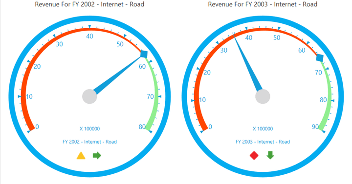

# XAML Configuration

XAML configuration is one of the important features of the OLAP gauge, as it helps users to configure the control entirely through XAML by eliminating the required code in code behind.

## Properties

* **DataSource.ConnectionString**: Specifies the connection string of the data manager.
* **DataSource.ConnectionName**: Specifies the connection name, which is available in the App.Config file of the application.
* **DataSource.DataManagerName**: Specifies the data manager name.
* **SharedDataManagerName**: Specifies the data manager name, which is available in the shared data manager collection.
* **ReportName**: Species the name of the OLAP report.
* **CurrentCubeName**: Specifies the current cube name of the OLAP report.
* **CategoricalAxis**: Specifies the categorical axis of the OLAP report.
* **SeriesAxis**: Specifies the series axis of the OLAP report.
* **SlicerAxis**: Specifies the slicer axis of the OLAP report.
* **CalculatedMembers**: Specifies the calculated members of the OLAP report.

The following code snippet illustrates about adding an OLAP report to OLAP gauge in design time.





<syncfusion:OlapGauge x:Name="olapGauge" CurrentCubeName="Adventure Works" ReportName="SalesReport"
                                         SharedDataManagerName="localManager"
                                         olapshared:DataSource.DataManagerName="localManager"
                                         olapshared:DataSource.ConnectionString="datasource=localhost; initial catalog=adventure works dw">
<!-- Adding Elements to Categorical Axis -->
    <syncfusion:OlapGauge.CategoricalAxis>
               <syncfusion:Dimension Name="Date" HierarchyName="Fiscal" LevelName="Fiscal Year" IncludeMembers="FY 2002, FY 2003"  />     <!- Multiple Members where specified by comma separate -->
               <syncfusion:Kpi Name="Revenue" ShowGoal="True" ShowStatus="True" ShowValue="True" ShowTrend="True" />
    </syncfusion:OlapGauge.CategoricalAxis>
<!-- Adding Elements to Series Axis -->
    <syncfusion:OlapGauge.SeriesAxis>
                <syncfusion:Dimension Name="Sales Channel" HierarchyName="Sales Channel" LevelName="Sales Channel" />
                <syncfusion:Dimension Name="Product" HierarchyName="Product Model Lines" LevelName="Product Line" IncludeMembers="Road" />
    </syncfusion:OlapGauge.SeriesAxis>
</syncfusion:OlapGauge>





A demo sample is available at the following location.

{system drive}:\Users\&lt;User Name&gt;\AppData\Local\Syncfusion\EssentialStudio\&lt;Version Number&gt;\WPF\OlapGauge.WPF\Samples\Defining Reports\XAML Configuration\