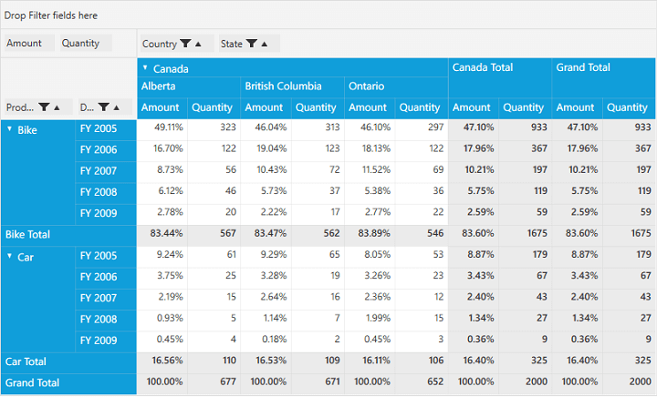
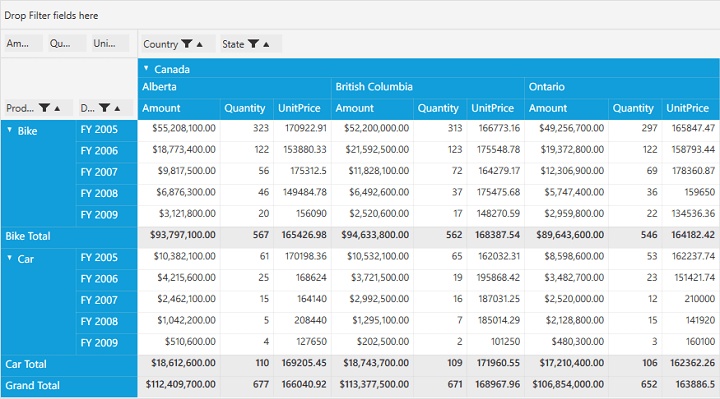

# Custom Calculations

**CalculationType** is an enumerator defined in the PivotComputationInfo class that is used to specify the type of calculation. The various types of calculations are:

* **NoCalculation**: Removes the custom calculations and restores to original values (default value). Displays the pivot values as default value.
* **PercentageOfGrandTotal**: Displays a value cell as a percentage of grand total of all value cells of PivotEngine.
* **PercentageOfColumnTotal**: Displays all value cells in each column as a percentage of its corresponding column total.
* **PercentageOfRowTotal**: Displays all value cells in each row as a percentage of its corresponding row total.
* **PercentageOfParentColumnTotal**: Displays a value cell as a percentage of parent column item values.
* **PercentageOfParentRowTotal**: Displays a value cell as a percentage of parent row item values.
* **PercentageOfParentTotal**: Displays a value cell as a percentage of base field (parent row/column total).
* **Index**: Displays a value cell as an index value based on PivotEngine generation.
* **Formula**: Displays a calculation based on a well formed algebraic expression involving other calculations.
* **PercentageOf**: Displays values as a percentage of the value of the base item in the base field.
* **DifferenceFrom**: Displays values as the difference from the value of the base item in the base field.
* **PercentageOfDifferenceFrom**: Displays values as the percentage difference from the value of the base item in the base field.
* **RunningTotalIn**: Displays the value for successive items in the base field as a running total.
* **PercentageOfRunningTotalIn**: Calculates the value for successive items in the base field that are displayed as a running total as a percentage.
* **RankSmallestToLargest**: Displays the rank of selected values in a specific field and lists the smallest item in the field as 1 and each larger value as a higher rank value.
* **RankLargestToSmallest**: Displays the rank of selected values in a specific field and lists the largest item in the field as 1 and each smaller value as a higher rank value.
* **Distinct**: Displays the subtotals based on the distinct values of BaseItem defined for the calculation item.

To achieve this, the `CalculationType` property is set for the corresponding pivot calculation item through the `PivotComputationInfo` class. It can be set through XAML or code-behind.

For XAML, refer to the following code sample.



    <Grid>
        <syncfusion:PivotGridControl HorizontalAlignment="Left" Name="pivotGrid" VerticalAlignment="Top" VisualStyle="Metro" ItemSource="{Binding   Source={StaticResource data}}">

            <syncfusion:PivotGridControl.PivotRows>
                <syncfusion:PivotItem FieldHeader="Product" FieldMappingName="Product" TotalHeader="Total" />
                <syncfusion:PivotItem FieldHeader="Date" FieldMappingName="Date" TotalHeader="Total" />
            </syncfusion:PivotGridControl.PivotRows>
            <syncfusion:PivotGridControl.PivotColumns>
                <syncfusion:PivotItem FieldHeader="Country" FieldMappingName="Country" TotalHeader="Total" />
                <syncfusion:PivotItem FieldHeader="State" FieldMappingName="State" TotalHeader="Total" />
            </syncfusion:PivotGridControl.PivotColumns>
            <syncfusion:PivotGridControl.PivotCalculations>
                <syncfusion:PivotComputationInfo CalculationName="Total" FieldName="Amount" Format="C" SummaryType="DoubleTotalSum" CalculationType="PercentageOfColumnTotal" />
                <syncfusion:PivotComputationInfo CalculationName="Total" FieldName="Quantity" SummaryType="Count" />
            </syncfusion:PivotGridControl.PivotCalculations>
    </Grid>



For code-behind, refer to the following code sample.



public partial class MainWindow: Window {
    PivotGridControl pivotGrid = new PivotGridControl();
    public MainWindow() {
        InitializeComponent();
        grid1.Children.Add(pivotGrid);
        pivotGrid.ItemSource = ProductSales.GetSalesData();
        PivotItem m_PivotItem = new PivotItem() {
            FieldHeader = "Product", FieldMappingName = "Product", TotalHeader = "Total"
        };
        PivotItem m_PivotItem1 = new PivotItem() {
            FieldHeader = "Date", FieldMappingName = "Date", TotalHeader = "Total"
        };
        PivotItem n_PivotItem = new PivotItem() {
            FieldHeader = "Country", FieldMappingName = "Country", TotalHeader = "Total"
        };
        PivotItem n_PivotItem1 = new PivotItem() {
            FieldHeader = "State", FieldMappingName = "State", TotalHeader = "Total"
        };
        // Adding PivotItem to PivotRows
        pivotGrid.PivotRows.Add(m_PivotItem);
        pivotGrid.PivotRows.Add(m_PivotItem1);
        // Adding PivotItem to PivotColumns
        pivotGrid.PivotColumns.Add(n_PivotItem);
        pivotGrid.PivotColumns.Add(n_PivotItem1);
        PivotComputationInfo m_PivotComputationInfo = new PivotComputationInfo() {
            CalculationName = "Amount", FieldName = "Amount", Format = "C", SummaryType = SummaryType.DoubleTotalSum, CalculationType = CalculationType.PercentageOfColumnTotal
        };
        PivotComputationInfo m_PivotComputationInfo1 = new PivotComputationInfo() {
            CalculationName = "Quantity", FieldName = "Quantity", SummaryType = SummaryType.Count
        };
        pivotGrid.PivotCalculations.Add(m_PivotComputationInfo);
        pivotGrid.PivotCalculations.Add(m_PivotComputationInfo1);
    }
}



## Providing expression field calculation for summaries

To provide a calculated field support to summary cells in the pivot grid and make it behave accordingly when options such as sum, count, maximum, and minimum are provided in summaries, set the calculation type to "Formula" and specify the appropriate formula. Refer to the following code samples and screenshots.



    <Grid>
        <syncfusion:PivotGridControl HorizontalAlignment="Left" Name="pivotGrid" VerticalAlignment="Top" VisualStyle="Metro" ItemSource="{Binding   Source={StaticResource data}}">

            <syncfusion:PivotGridControl.PivotRows>
                <syncfusion:PivotItem FieldHeader="Product" FieldMappingName="Product" TotalHeader="Total" />
                <syncfusion:PivotItem FieldHeader="Date" FieldMappingName="Date" TotalHeader="Total" />
            </syncfusion:PivotGridControl.PivotRows>
            <syncfusion:PivotGridControl.PivotColumns>
                <syncfusion:PivotItem FieldHeader="Country" FieldMappingName="Country" TotalHeader="Total" />
                <syncfusion:PivotItem FieldHeader="State" FieldMappingName="State" TotalHeader="Total" />
            </syncfusion:PivotGridControl.PivotColumns>
            <syncfusion:PivotGridControl.PivotCalculations>
                <syncfusion:PivotComputationInfo CalculationName="Total" FieldName="Amount" Format="C" SummaryType="DoubleTotalSum" />
                <syncfusion:PivotComputationInfo CalculationName="Total" FieldName="Quantity" SummaryType="Count" />
                <syncfusion:PivotComputationInfo CalculationName="Total" FieldName="UnitPrice" CalculationType="Formula" Formula="[Amount] / [Quantity]" />
            </syncfusion:PivotGridControl.PivotCalculations>
        </syncfusion:PivotGridControl>
    </Grid>





public partial class MainWindow: Window {
    PivotGridControl pivotGrid = new PivotGridControl();
    public MainWindow() {
        InitializeComponent();
        grid1.Children.Add(pivotGrid);
        pivotGrid.ItemSource = ProductSales.GetSalesData();
        PivotItem m_PivotItem = new PivotItem() {
            FieldHeader = "Product", FieldMappingName = "Product", TotalHeader = "Total"
        };
        PivotItem m_PivotItem1 = new PivotItem() {
            FieldHeader = "Date", FieldMappingName = "Date", TotalHeader = "Total"
        };
        PivotItem n_PivotItem = new PivotItem() {
            FieldHeader = "Country", FieldMappingName = "Country", TotalHeader = "Total"
        };
        PivotItem n_PivotItem1 = new PivotItem() {
            FieldHeader = "State", FieldMappingName = "State", TotalHeader = "Total"
        };
        // Adding PivotItem to PivotRows
        pivotGrid.PivotRows.Add(m_PivotItem);
        pivotGrid.PivotRows.Add(m_PivotItem1);
        // Adding PivotItem to PivotColumns
        pivotGrid.PivotColumns.Add(n_PivotItem);
        pivotGrid.PivotColumns.Add(n_PivotItem1);
        PivotComputationInfo m_PivotComputationInfo = new PivotComputationInfo() {
            CalculationName = "Amount", FieldName = "Amount", Format = "C", SummaryType = SummaryType.DoubleTotalSum
        };
        PivotComputationInfo m_PivotComputationInfo1 = new PivotComputationInfo() {
            CalculationName = "Quantity", FieldName = "Quantity", SummaryType = SummaryType.Count
        };
        pivotGrid.PivotCalculations.Add(m_PivotComputationInfo);
        pivotGrid.PivotCalculations.Add(m_PivotComputationInfo1);

        PivotComputationInfo m_PivotComputationInfo2 = new PivotComputationInfo() {
            CalculationName = "Total", FieldName = "UnitPrice", CalculationType = CalculationType.Formula, Formula = "[Amount] / [Quantity]"
        };;
        pivotGrid.PivotCalculations.Add(m_PivotComputationInfo2);
    }
}



