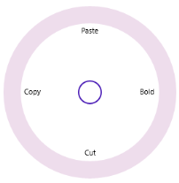

# Populating Items 

## Items Source  

Radial menu items can be populated with the business object collection. Let us create a RadialMenu which will show the list of Application commands.   

The Application command model look likes below.  



  public class ApplicationCommand

    {

        public string Name { get; set; }

        public string ImagePath { get; set; }

        public ICommand Command { get; set; }

    }



Create the Application command collection as follows. 



private List<ApplicationCommand> options;

public List<ApplicationCommand> Options

   {

            get { return options; }

            set { options = value; }

   }



Populate the Application command collection as follows. 



 Options = new List<ApplicationCommand>(); 

 Options.Add(new ApplicationCommand() { Name="Bold" , ImagePath="bold.png" });    			  Options.Add(new ApplicationCommand() { Name = "Cut" , ImagePath="cut.png"}); 

 Options.Add(new ApplicationCommand() { Name = "Copy" ,ImagePath="copy.png"}); 

 Options.Add(new ApplicationCommand() { Name = "Paste" ,ImagePath="paste.png"});



Bind the Application command collection to the ItemsSource property of the RadialMenu control. 



<navigation:SfRadialMenu IsOpen="True" ItemsSource="{Binding Options}"/>



This will populate the RadialMenu as shown in the image below. 

## Display Member Path 

DisplayMemberPath property of the Radial Menu used to define which business model property needs to be displayed inside the header of the Radial Menu items.



<navigation:SfRadialMenu IsOpen="True" ItemsSource="{Binding Options}"

DisplayMemberPath="Name"

                         />



Displaying member path

## Command Path

CommandPath property of the Radial Menu can be used to bind the command in the business object to the radial menu item when items are populated using data binding. 



<navigation:SfRadialMenu IsOpen="True" DisplayMemberPath="Name" CommandPath="Command"

                                 ItemsSource="{Binding Options}" />



## Item Template 

ItemTemplate property of the RadialMenu can be used to customize the header part of the radial menu items.  



 

<navigation:SfRadialMenu IsOpen="True" ItemsSource="{Binding Options}">

            <navigation:SfRadialMenu.ItemTemplate>

                <DataTemplate>

                    <StackPanel >

                        <Image Height="15" Width="15" Source="{Binding ImagePath}"/>

                        <TextBlock Margin="0,5,0,0" Text="{Binding Name}"/>

                    </StackPanel>

                </DataTemplate>

            </navigation:SfRadialMenu.ItemTemplate>

   </navigation:SfRadialMenu>



