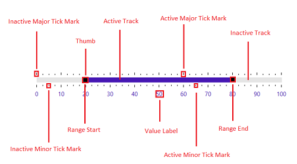

---
layout: post
title: Visual Structure | SfRangeSlider | wpf | Syncfusion
description: This section describes the visual elements of the Syncfusion WPF RangeSlider (SfRangeSlider) control.
platform: wpf
control: SfRangeSlider 
documentation: ug
---

# Visual Structure of WPF RangeSlider(SfRangeSlider)

This section describes the visual elements of the RangeSlider control and defines terms and concepts used in the RangeSlider.

* **Inactive Major Tick Mark** —  Inactive major ticks to give the better indication between the Minimum to RangeStart and RangeEnd to Maximum.
* **Inactive Minor Tick Mark** — Inactive minor ticks to give the better indication between Major ticks in unselected part.
* **Active Minor Tick Mark** — Active minor ticks to give the better indication between Major ticks in selection part. 
* **Active Major Tick Mark** — Active major ticks to give the better indication between the RangeStart and RangeEnd thumbs.
* **Thumb** — Thumb can be dragged along the track.  
* **Active Track** — Selection range marked with RangeStart and RangeEnd thumbs.
* **Inactive Track** — The horizontal or vertical line is used to move the thumbs along it.
* **Range Start** — Thumb indicates the start of the selection range.
* **Range End** — Thumb indicates the end of the selection range.
* **Value Label** — indicates the value of the RangeSlider.
