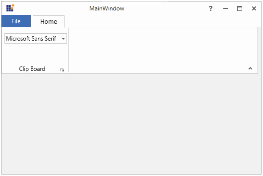

# RibbonComboBox in WPF Ribbon

RibbonComboBox control is used to display the list of items, as ComboBox.

## Add ComboBoxItems

ComboBoxItems are the items with `Header` property that is used to set header.





<syncfusion:Ribbon Name="_ribbon" HorizontalAlignment="Stretch" VerticalAlignment="Top">
<syncfusion:RibbonTab Name="_ribbonTab1" Caption="HOME" IsChecked="True">
<syncfusion:RibbonBar Name="_ribbonBar1" Header="RibbonBar1">
<syncfusion:RibbonButton Label="Cut"/>
<syncfusion:RibbonButton Label="Copy"/>
</syncfusion:RibbonBar>
<syncfusion:RibbonBar Name="_ribbonBar2" Width="150" Header="RibbonBar2">     
<syncfusion:ButtonPanel>
<syncfusion:RibbonComboBox SelectedItem="Arial" Width="80">
<syncfusion:RibbonComboBoxItem>Arial</syncfusion:RibbonComboBoxItem>
<syncfusion:RibbonComboBoxItem>Tahoma</syncfusion:RibbonComboBoxItem>
<syncfusion:RibbonComboBoxItem>Calibri</syncfusion:RibbonComboBoxItem>
</syncfusion:RibbonComboBox>
<syncfusion:RibbonComboBox SelectedItem="12" Width="50">
<syncfusion:RibbonComboBoxItem>11</syncfusion:RibbonComboBoxItem>
<syncfusion:RibbonComboBoxItem>12</syncfusion:RibbonComboBoxItem>
<syncfusion:RibbonComboBoxItem>13</syncfusion:RibbonComboBoxItem>
</syncfusion:RibbonComboBox>
</syncfusion:ButtonPanel>
</syncfusion:RibbonBar>         
</syncfusion:RibbonTab>
<syncfusion:RibbonTab Caption="EDIT"  IsChecked="False"/>
<syncfusion:RibbonTab Caption="VIEW"  IsChecked="False"/>
</syncfusion:Ribbon>





Create instance for `RibbonComboBox` and add it to RibbonBar Items in Code behind





ButtonPanel _buttonPanel = new ButtonPanel();
RibbonComboBox _ribbonComboBox1 = new RibbonComboBox() { Width=80};
RibbonComboBox _ribbonComboBox2 = new RibbonComboBox() { Width=50};
RibbonComboBoxItem comboBoxItem1 = new RibbonComboBoxItem() { Content = "Arial" };
RibbonComboBoxItem comboBoxItem2 = new RibbonComboBoxItem() { Content = "Calibri" };
RibbonComboBoxItem comboBoxItem3 = new RibbonComboBoxItem() { Content = "Tahoma" };
RibbonComboBoxItem comboBoxItem4 = new RibbonComboBoxItem() { Content = "11" };
RibbonComboBoxItem comboBoxItem5 = new RibbonComboBoxItem() { Content = "12" };
RibbonComboBoxItem comboBoxItem6 = new RibbonComboBoxItem() { Content = "13" };     
_ribbonComboBox.Items.Add(comboBoxItem1);
_ribbonComboBox.Items.Add(comboBoxItem2);
_ribbonComboBox.Items.Add(comboBoxItem3);
_RibbonComboBox1.Items.Add(comboBoxItem4);
_ribbonComboBox1.Items.Add(comboBoxItem5);
_ribbonComboBox1.Items.Add(comboBoxItem6);
_buttonPanel.Children.Add(_ribbonComboBox1);
_buttonPanel.Children.Add(_ribbonComboBox2);
_ribbonBar2.Items.Add(_buttonPanel);





Dim _buttonPanel As New ButtonPanel()
Dim _ribbonComboBox1 As New RibbonComboBox() With {.Width=80}
Dim _ribbonComboBox2 As New RibbonComboBox() With {.Width=50}
Dim comboBoxItem1 As New RibbonComboBoxItem() With {.Content = "Arial"}
Dim comboBoxItem2 As New RibbonComboBoxItem() With {.Content = "Calibri"}
Dim comboBoxItem3 As New RibbonComboBoxItem() With {.Content = "Tahoma"}
Dim comboBoxItem4 As New RibbonComboBoxItem() With {.Content = "11"}
Dim comboBoxItem5 As New RibbonComboBoxItem() With {.Content = "12"}
Dim comboBoxItem6 As New RibbonComboBoxItem() With {.Content = "13"}
_ribbonComboBox.Items.Add(comboBoxItem1)
_ribbonComboBox.Items.Add(comboBoxItem2)
_ribbonComboBox.Items.Add(comboBoxItem3)
_RibbonComboBox1.Items.Add(comboBoxItem4)
_ribbonComboBox1.Items.Add(comboBoxItem5)
_ribbonComboBox1.Items.Add(comboBoxItem6)
_buttonPanel.Children.Add(_ribbonComboBox1)
_buttonPanel.Children.Add(_ribbonComboBox2)
_ribbonBar2.Items.Add(_buttonPanel)





## Add ComboBox to the simplified layout

When the simplified layout is enabled, the RibbonComboBox can be added and displayed in a single line as shown below. To know more about the simplified layout, refer [here](https://help.syncfusion.com/wpf/ribbon/simplifiedlayout).





<syncfusion:RibbonWindow x:Class="RibbonButton_IconTemp.Window1"
        xmlns="http://schemas.microsoft.com/winfx/2006/xaml/presentation"
        xmlns:x="http://schemas.microsoft.com/winfx/2006/xaml"
        xmlns:d="http://schemas.microsoft.com/expression/blend/2008"
        xmlns:mc="http://schemas.openxmlformats.org/markup-compatibility/2006"
        xmlns:local="clr-namespace:RibbonButton_IconTemp" xmlns:skin="clr-namespace:Syncfusion.SfSkinManager;assembly=Syncfusion.SfSkinManager.WPF"
        mc:Ignorable="d" xmlns:syncfusion="http://schemas.syncfusion.com/wpf"
        skin:SfSkinManager.VisualStyle="MaterialLight"
        Title="Untitled 1 - Ribbon Control" Height="450" Width="800">
    <Grid x:Name="grid">
        <syncfusion:Ribbon x:Name="_ribbon" VerticalAlignment="Top" EnableSimplifiedLayoutMode="True" LayoutMode="Simplified">
            <syncfusion:RibbonTab Caption="HOME"  IsChecked="True">
                <syncfusion:RibbonBar Header="Font">
                    <syncfusion:RibbonComboBox Width="80">
                        <syncfusion:RibbonComboBoxItem>Arial</syncfusion:RibbonComboBoxItem>
                        <syncfusion:RibbonComboBoxItem IsSelected="True">Tahoma</syncfusion:RibbonComboBoxItem>
                        <syncfusion:RibbonComboBoxItem>Calibri</syncfusion:RibbonComboBoxItem>
                    </syncfusion:RibbonComboBox>
                    <syncfusion:RibbonComboBox Width="50">
                        <syncfusion:RibbonComboBoxItem>11</syncfusion:RibbonComboBoxItem>
                        <syncfusion:RibbonComboBoxItem IsSelected="True">12</syncfusion:RibbonComboBoxItem>
                        <syncfusion:RibbonComboBoxItem>13</syncfusion:RibbonComboBoxItem>
                    </syncfusion:RibbonComboBox>
                </syncfusion:RibbonBar>
            </syncfusion:RibbonTab>
        </syncfusion:Ribbon>
    </Grid>
</syncfusion:RibbonWindow>





Ribbon ribbon = new Ribbon();
ribbon.VerticalAlignment = VerticalAlignment.Top;
ribbon.EnableSimplifiedLayoutMode = true;
ribbon.LayoutMode = LayoutMode.Simplified;
// Creating new tabs
RibbonTab homeTab = new RibbonTab();
homeTab.Caption = "Home";
homeTab.IsChecked = true;

// Creating new bar
RibbonBar fontBar = new RibbonBar();
fontBar.Header = "Font";
// Creating items

RibbonComboBox ribbonComboBox1 = new RibbonComboBox() { Width = 80 };
RibbonComboBox ribbonComboBox2 = new RibbonComboBox() { Width = 50 };
RibbonComboBoxItem comboBoxItem1 = new RibbonComboBoxItem() { Content = "Arial" };
RibbonComboBoxItem comboBoxItem2 = new RibbonComboBoxItem() { Content = "Calibri" };
RibbonComboBoxItem comboBoxItem3 = new RibbonComboBoxItem() { Content = "Tahoma", IsSelected=true };
RibbonComboBoxItem comboBoxItem4 = new RibbonComboBoxItem() { Content = "11" };
RibbonComboBoxItem comboBoxItem5 = new RibbonComboBoxItem() { Content = "12", IsSelected = true };
RibbonComboBoxItem comboBoxItem6 = new RibbonComboBoxItem() { Content = "13" };
ribbonComboBox1.Items.Add(comboBoxItem1);
ribbonComboBox1.Items.Add(comboBoxItem2);
ribbonComboBox1.Items.Add(comboBoxItem3);
ribbonComboBox2.Items.Add(comboBoxItem4);
ribbonComboBox2.Items.Add(comboBoxItem5);
ribbonComboBox2.Items.Add(comboBoxItem6);

// Adding items to bar
fontBar.Items.Add(ribbonComboBox1);
fontBar.Items.Add(ribbonComboBox2);

// Adding bars to the tabs
homeTab.Items.Add(fontBar);

// Adding tabs to ribbon
ribbon.Items.Add(homeTab);
grid.Children.Add(ribbon);
SfSkinManager.SetVisualStyle(this, VisualStyles.MaterialLight);





When arranging in simplified layout alone, the **Margin**, **Width** and **Height** values of the RibbonComboBox can be ignored as it will be resized automatically to the standard width and height. If the RibbonComboBox is to be shown in both normal and simplified layout, the **Margin**, **Width** and **Height** properties can be set for normal layout alone using triggers.





<syncfusion:RibbonComboBox syncfusion:SimplifiedLayoutSettings.DisplayMode="Normal,Simplified" >
    <syncfusion:RibbonComboBox.Style>
        
    </syncfusion:RibbonComboBox.Style>
</syncfusion:RibbonComboBox > 





## Autosize width in RibbonComboBox

RibbonComboBox can be auto sized by not providing width to the RibbonComboBox and the width will be based on the selected item text. 

If the width is given, then the width is set to the RibbonComboBox instead of the selected item text.

The following code example demonstrates how to set auto-width to the ComboBoxAdv control. 





<syncfusion:Ribbon x:Name="ribbon" HorizontalAlignment="Left" Height="94" VerticalAlignment="Top" Width="517">
<syncfusion:RibbonTab Background="Transparent" Caption="Home" FocusVisualStyle="{x:Null}" Focusable="False" MinWidth="23">
<syncfusion:RibbonBar Focusable="False" Header="Clip Board">
<syncfusion:RibbonComboBox SelectedItem="Arial" Margin="0,10,0,0">
<syncfusion:RibbonComboBoxItem>Arial</syncfusion:RibbonComboBoxItem>
<syncfusion:RibbonComboBoxItem>Tahoma</syncfusion:RibbonComboBoxItem>
<syncfusion:RibbonComboBoxItem>Microsoft Sans Serif</syncfusion:RibbonComboBoxItem>
</syncfusion:RibbonComboBox>
</syncfusion:RibbonBar>                
</syncfusion:RibbonTab>
</syncfusion:Ribbon>





