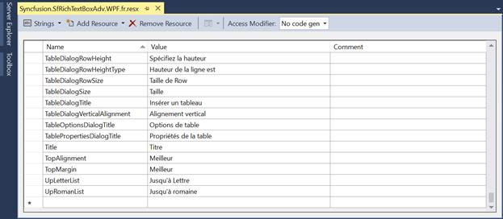
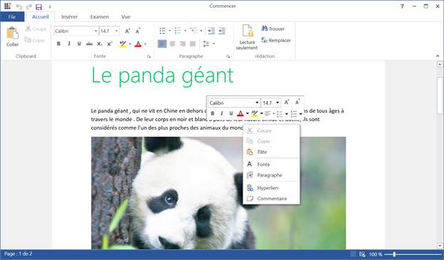

# Localization

Localization is the process of configuring the application to a specific language. SfRichTextBoxAdv provides support to localize all the static text in ribbon and all its dialogs. Localization can be done by adding resource file (Resx) and setting the specific culture in the application.

## Setting Current UI Culture

For localizing your application to specific culture, you have to set the ‘CurrentUICulture’ as required before invoking the InitializeComponent() method.

The following code example demonstrates how to set culture information for localizing an application.



public MainWindow() 
{ 
	System.Threading.Thread.CurrentThread.CurrentUICulture = new System.Globalization.CultureInfo("fr-FR");

	InitializeComponent();
}



Partial Public Class MainWindow
Public Sub New()
System.Threading.Thread.CurrentThread.CurrentUICulture = new System.Globalization.CultureInfo("fr-FR")
InitializeComponent()
End Sub
End Class





## Adding Resource file

* Create a folder with name ‘Resources’ in your application.
* Add default English(“en-US”) [Resx](http://www.syncfusion.com/downloads/support/directtrac/general/ze/Resources86404579) (resource) file of SfRichTextBoxAdv and SfRichTextRibbon in the ‘Resources’ folder named as Syncfusion.SfRichTextBoxAdv.WPF.resx and Syncfusion.SfRichTextRibbon.WPF.resx respectively
* Create Resx (resource) files and named as Syncfusion.SfRichTextBoxAdv.WPF. [Culture name].resx and Syncfusion.SfRichTextRibbon.WPF. [Culture name].resx. For example, Syncfusion.SfRichTextBoxAdv.WPF.fr.resx and Syncfusion.SfRichTextRibbon.WPF.fr.resx for French culture. For your reference, French(“fr-FR”) [Resx](http://www.syncfusion.com/downloads/support/directtrac/general/ze/ResourceFile-912008822) file.

* Add the resource key such as name and its corresponding localized value in Resource Designer of Syncfusion.SfRichTextBoxAdv.WPF.fr.resx and Syncfusion.SfRichTextRibbon.WPF.fr.resx file.

N> If you have not used SfRichTextRibbon in your application, you can skip Syncfusion.SfRichTextRibbon.WPF.[Culture name].resx file mentioned above.

The following screenshot shows the localization in SfRichTextBoxAdv and SfRichTextRibbon

