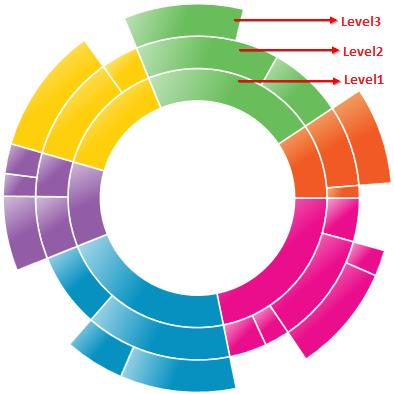

---

layout: post
title: Levels of Sunburst.
description: This section explains the hierarchical level of the SunburstChart.
platform: wpf 
control: SfSunburstChart 
documentation: ug

---

# Levels

Sunburst chart is used to display hierarchical data. You can add more than one hierarchical data in [`Levels`](https://help.syncfusion.com/cr/wpf/Syncfusion.UI.Xaml.SunburstChart.SfSunburstChart.html#Syncfusion_UI_Xaml_SunburstChart_SfSunburstChart_Levels) collection of Sunburst chart. Each level of the hierarchy is represented by circle. 

The following code shows how to add the hierarchical level in Levels collection.





<sunburst:SfSunburstChart.Levels>

           <sunburst:SunburstHierarchicalLevel/>
           
</sunburst:SfSunburstChart.Levels>





SunburstHierarchicalLevel level = new SunburstHierarchicalLevel();
sunburstChart.Levels.Add(level);





## GroupMemberPath

It is the string property used to map the group category value in sunburst ItemsSource.

You can define the Levels as shown in the code sample.





<sunburst:SfSunburstChart.Levels>

        <sunburst:SunburstHierarchicalLevel GroupMemberPath="Level1"/>
        <sunburst:SunburstHierarchicalLevel GroupMemberPath=" Level2"/>
        <sunburst:SunburstHierarchicalLevel GroupMemberPath=" Level3"/>

</sunburst:SfSunburstChart.Levels>





SunburstHierarchicalLevel level1 = new SunburstHierarchicalLevel();
level1.GroupMemberPath = "Level_1";

SunburstHierarchicalLevel level2 = new SunburstHierarchicalLevel();
level2.GroupMemberPath = "Level_2";

SunburstHierarchicalLevel level3 = new SunburstHierarchicalLevel();
level3.GroupMemberPath = "Level_3";

sunburstChart.Levels.Add(level1);
sunburstChart.Levels.Add(level2);
sunburstChart.Levels.Add(level3);
			




