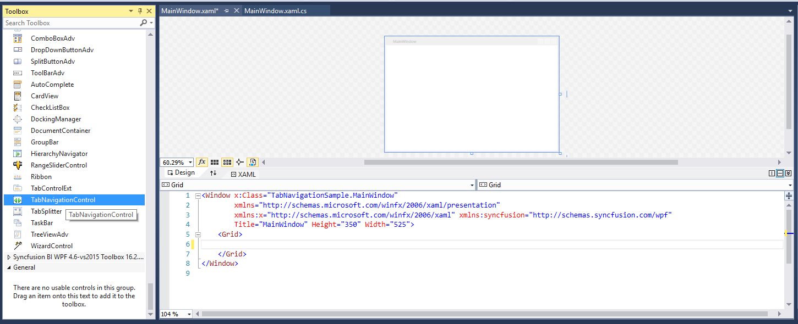

# Getting Started

## Assembly deployment

Refer [control dependencies](https://help.syncfusion.com/wpf/control-dependencies#tabnavigation) section to get the list of assemblies or NuGet package needs to be added as reference to use the control in WPF application.

## Creating simple application with TabNavigation

You can create the WPF application with TabNavigation control as follows:

1. [Creating project](#creating-the-project)
2. [Adding control via Designer](#adding-control-via-designer)
3. [Adding control manually in XAML](#adding-control-manually-in-xaml)
4. [Adding control manually in C#](#adding-control-manually-in-c)

###  Creating the project

Create a new WPF project in the Visual Studio to display the TabNavigation with functionalities.

### Adding control via Designer

The TabNavigation control can be added to the application by dragging it from the toolbox and dropping it in a designer view. The required assembly references will be added automatically.

### Adding control manually in XAML

In order to add control manually in XAML, do the below steps,

1. Add the below required assembly references to the project,
	* Syncfusion.Tools.WPF 
	* Syncfusion.Shared.WPF 
2. Import Syncfusion WPF schema **http://schemas.syncfusion.com/wpf** in XAML page.
3. Declare TabNavigation control in XAML page.



<Window xmlns="http://schemas.microsoft.com/winfx/2006/xaml/presentation"
        xmlns:x="http://schemas.microsoft.com/winfx/2006/xaml"
        xmlns:syncfusion="http://schemas.syncfusion.com/wpf" 
        x:Class="WpfApplication1.MainWindow"
        Title="MainWindow" Height="350" Width="525">
    <Grid>
        <!-- TabNavigation Control -->
        <syncfusion:TabNavigationControl x:Name="tabNavigation"/>
    </Grid>
</Window>



### Adding control manually in C\#

In order to add control manually in C#, do the below steps,

1. Add the below required assembly references to the project,
	* Syncfusion.Tools.WPF 
	* Syncfusion.Shared.WPF 
2. Import TabNavigationControl namespace **using Syncfusion.Windows.Tools.Controls;**.
3. Create TabNavigationControl instance and add it to the window.



using Syncfusion.Windows.Tools.Controls;
namespace TabNavigationSample
{
    /// 

    /// Interaction logic for MainWindow.xaml
    /// 

    public partial class MainWindow : Window
    {
        public MainWindow()
        {
            InitializeComponent();
			//For adding TabNavigation Control
			TabNavigationControl tabNavigation = new TabNavigationControl();
			grid.Children.Add(tabNavigation);
        }       
    }
}



### Adding Items using TabNavigationItem

You can populate the TabNavigation control by adding objects directly to the [Items](https://docs.microsoft.com/en-us/dotnet/api/system.windows.controls.itemscontrol.items?view=netframework-4.7.2) collection. Items added to the TabNavigation are wrapped in [TabNavigationItem](https://help.syncfusion.com/cr/wpf/Syncfusion.Windows.Tools.Controls.TabNavigationItem.html) containers.



<!-- TabNavigationControl -->
<syncfusion:TabNavigationControl x:Name="tabNavigation">
    <!-- TabNavigationItem 1 -->
	<syncfusion:TabNavigationItem Header="1">
		<syncfusion:TabNavigationItem.Content>
			<Grid>
				<TextBlock Text="Item 1"/>
			</Grid>
		</syncfusion:TabNavigationItem.Content>
	</syncfusion:TabNavigationItem>
    <!-- TabNavigationItem 2 -->
	<syncfusion:TabNavigationItem Header="2">
		<syncfusion:TabNavigationItem.Content>
			<Grid>
				<TextBlock Text="Item 2"/>
			</Grid>
		</syncfusion:TabNavigationItem.Content>
	</syncfusion:TabNavigationItem>
	<!-- TabNavigationItem 3 -->
	<syncfusion:TabNavigationItem Header="3">
	    <syncfusion:TabNavigationItem.Content>
			<Grid>
				<TextBlock Text="Item 3"/>
			</Grid>
		</syncfusion:TabNavigationItem.Content>
	</syncfusion:TabNavigationItem>
	<!-- TabNavigationItem 4 -->
	<syncfusion:TabNavigationItem Header="4">
		<syncfusion:TabNavigationItem.Content>
			<Grid>
				<TextBlock Text="Item 4"/>
			</Grid>
		</syncfusion:TabNavigationItem.Content>
	</syncfusion:TabNavigationItem>
</syncfusion:TabNavigationControl>


TabNavigationControl tabNavigation = new TabNavigationControl();
//TabNavigationItem
TabNavigationItem item1 = new TabNavigationItem();
item1.Header = "1";
item1.Content = "Item 1";

TabNavigationItem item2 = new TabNavigationItem();
item2.Header = "2";
item2.Content = "Item 2";

TabNavigationItem item3 = new TabNavigationItem();
item3.Header = "3";
item3.Content = "Item 3";

TabNavigationItem item4 = new TabNavigationItem();
item4.Header = "4";
item4.Content = "Item 4";

//Adding items to TabNavigationControl
tabNavigation.Items.Add(item1);
tabNavigation.Items.Add(item2);
tabNavigation.Items.Add(item3);
tabNavigation.Items.Add(item4);



### Binding ItemsSource

TabNavigationControl supports binding data to different data sources such as IList Data Source, XML Data Source, Observable Collection Data Source. Refer [Data binding](https://help.syncfusion.com/wpf/tabnavigation/data-binding) section for more details.



<syncfusion:TabNavigationControl TransitionEffect="Slide" ItemsSource="{Binding MyCollection}"/>





namespace TabNavigationSample
{
    /// 

    /// Interaction logic for MainWindow.xaml
    /// 

    public partial class MainWindow : Window
    { 
		TabNavigationItem temp;
        public MainWindow()
        {
            InitializeComponent();
			MyCollection = new ObservableCollection<TabNavigationItem>();
			for (int i = 0; i < 10; i++)
			{
				temp = new TabNavigationItem();
				temp.Header = i;
				temp.Content= "Item " + i.ToString();
				MyCollection.Add(temp);
			}
			this.DataContext = this;
		}
		public ObservableCollection<TabNavigationItem> MyCollection 
		{
			get { return (ObservableCollection<TabNavigationItem>)GetValue(MyCollectionProperty); }
			set { SetValue(MyCollectionProperty, value); }
	    }
		// Using a DependencyProperty as the backing store for MyCollection.  This enables animation, styling, binding and so on
		public static readonly DependencyProperty MyCollectionProperty = DependencyProperty.Register("MyCollection", typeof(ObservableCollection<TabNavigationItem>), typeof(MainWindow), new PropertyMetadata(null));
	}
}



