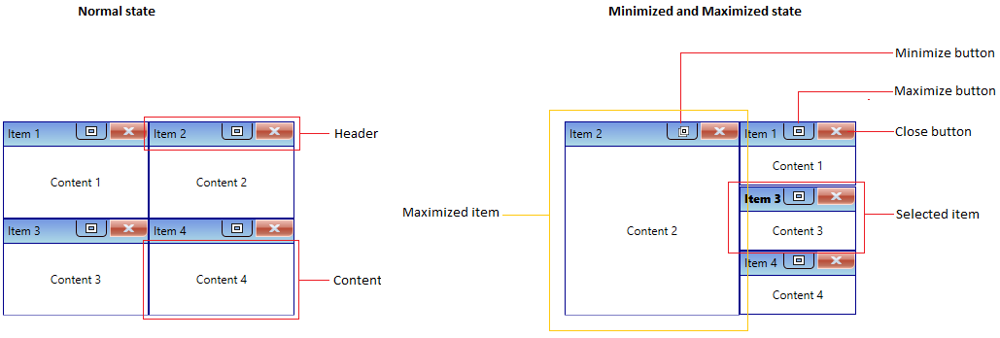
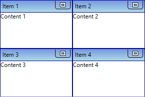
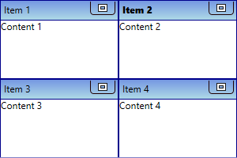
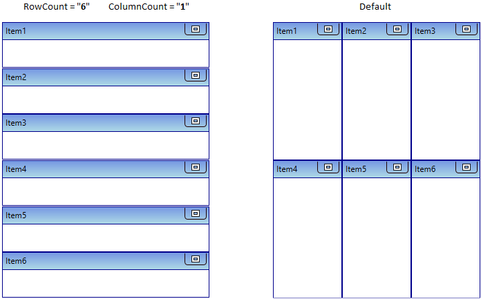

# Getting Started with WPF TileViewControl

This section describes how to create a [TileViewControl](https://help.syncfusion.com/cr/wpf/Syncfusion.Windows.Shared.TileViewControl.html) control in a WPF application and overview of its basic functionalities.

## Structure of TileViewControl

## Assembly deployment

Refer to the [Control Dependencies](https://help.syncfusion.com/wpf/control-dependencies#tileview) section to get the list of assemblies or NuGet package that needs to be added as a reference to use the control in any application.

Refer to this [documentation](https://help.syncfusion.com/wpf/visual-studio-integration/nuget-packages) to find more details about installing nuget packages in a WPF application.

## Adding WPF TileViewControl via designer

1) The `TileViewControl` can be added to an application by dragging it from the toolbox to a designer view. The following dependent assemblies will be added automatically:

* Syncfusion.Shared.WPF

2) Set the properties for `TileViewControl` in design mode using the SmartTag feature.

## Adding WPF TileViewControl via XAML

To add the `TileViewControl` manually in XAML, follow these steps:

1) Create a new WPF project in Visual Studio.

2) Add the following required assembly references to the project:

* Syncfusion.Shared.WPF

3) Import Syncfusion WPF schema **http://schemas.syncfusion.com/wpf**, and declare the `TileViewControl` in XAML page.





<Window x:Class="TileViewControl_sample.MainWindow"
        xmlns="http://schemas.microsoft.com/winfx/2006/xaml/presentation"
        xmlns:x="http://schemas.microsoft.com/winfx/2006/xaml"
        xmlns:d="http://schemas.microsoft.com/expression/blend/2008"
        xmlns:mc="http://schemas.openxmlformats.org/markup-compatibility/2006"
        xmlns:local="clr-namespace:TileViewControl_sample"
        xmlns:syncfusion="http://schemas.syncfusion.com/wpf"
        mc:Ignorable="d"
        Title="MainWindow" Height="450" Width="800">

    <Grid Name="grid">
        <syncfusion:TileViewControl Name="tileViewControl"
                             Height="200"
                             Width="200"/>
    </Grid>
</Window>




## Adding WPF TileViewControl via C#

To add the `TileViewControl` manually in C#, follow these steps:

1) Create a new WPF application via Visual Studio.

2) Add the following required assembly references to the project:

* Syncfusion.Shared.WPF

3) Include the required namespace.




using Syncfusion.Windows.Shared;




4) Create an instance of `TileViewControl`, and add it to the window.




// Creating an instance of the TileViewControl
TileViewControl tileViewControl = new TileViewControl();

// Setting height and width to TileViewControl
tileViewControl.Height = 200;
tileViewControl.Width = 300;




N> [View Sample in GitHub](https://github.com/SyncfusionExamples/syncfusion-wpf-tileview-control-examples/blob/master/Samples/Getting-Started)

## Populating items using TileViewItem

You can add the tileview items inside the control by adding the [TileViewItem](https://help.syncfusion.com/cr/wpf/Syncfusion.Windows.Shared.TileViewItem.html) into the `TileViewControl.Items` collection property.




<syncfusion:TileViewControl Name="tileViewControl">
    <syncfusion:TileViewItem Content="Content 1" Header="Item 1" />
    <syncfusion:TileViewItem Content="Content 2" Header="Item 2" />
    <syncfusion:TileViewItem Content="Content 3" Header="Item 3" />
    <syncfusion:TileViewItem Content="Content 4" Header="Item 4" />
</syncfusion:TileViewControl>




TileViewControl tileViewControl = new TileViewControl();
tileViewControl.Items.Add(new TileViewItem() { Content="Content 1",
    Header = "Item 1" });
tileViewControl.Items.Add(new TileViewItem() { Content="Content 2",
    Header = "Item 2" });
tileViewControl.Items.Add(new TileViewItem() { Content="Content 3",
    Header = "Item 3" });
tileViewControl.Items.Add(new TileViewItem() { Content = "Content 4",
    Header = "Item 4" });




N> [View Sample in GitHub](https://github.com/SyncfusionExamples/syncfusion-wpf-tileview-control-examples/blob/master/Samples/Getting-Started)

## Populating items using collection binding

You can populate items to the `TileViewControl` by setting the collection value to the `ItemsSource` property.




// Model.cs
public class TileItem {
    public string Header { get; set; }
    public string Content { get; set; }
    public TileItem() {
    }
}

//ViewModel.cs
public class ViewModel : NotificationObject {
    private ObservableCollection<TileItem> tileViewItems;
    public ObservableCollection<TileItem> TileViewItems {
        get { return tileViewItems; }
        set {
            tileViewItems = value;
            this.RaisePropertyChanged(nameof(TileViewItems));
        }
    }

    public ViewModel() {
        tileViewItems = new ObservableCollection<TileItem>();
        PopulateCollection();
    }

    public void PopulateCollection() {
        //Adding the tileview items into the collection
        TileViewItems.Add(new TileItem() { Header = "Item 1", Content = "Content 1" });
        TileViewItems.Add(new TileItem() { Header = "Item 2", Content = "Content 2" });
        TileViewItems.Add(new TileItem() { Header = "Item 3", Content = "Content 3" });
        TileViewItems.Add(new TileItem() { Header = "Item 4", Content = "Content 4" });   
    }
}







<syncfusion:TileViewControl ItemsSource="{Binding TileViewItems}" 
                            Name="tileViewControl">
    <syncfusion:TileViewControl.ItemContainerStyle>
        
    </syncfusion:TileViewControl.ItemContainerStyle>
    
    <syncfusion:TileViewControl.DataContext>
        <local:ViewModel/>
    </syncfusion:TileViewControl.DataContext>
</syncfusion:TileViewControl>




N> [View Sample in GitHub](https://github.com/SyncfusionExamples/syncfusion-wpf-tileview-control-examples/blob/master/Samples/Binding-Object)

## Select a TileViewItem

You can select any `TileViewItem` by mouse click on the specific `TileViewItem`. You can get the selected item by using the `SelectedItem` property. You can also get the selected value and its index by using the `SelectedValue` and `SelectedIndex` properties. The default value of `SelectedItem` property is `null`.

N> You can select only one item at a time.




<syncfusion:TileViewControl Name="tileViewControl">
    <syncfusion:TileViewItem Content="Content 1" Header="Item 1" />
    <syncfusion:TileViewItem Content="Content 2" Header="Item 2" />
    <syncfusion:TileViewItem Content="Content 3" Header="Item 3" />
    <syncfusion:TileViewItem Content="Content 4" Header="Item 4" />
</syncfusion:TileViewControl>




TileViewControl tileViewControl = new TileViewControl();
tileViewControl.Items.Add(new TileViewItem() { Content="Content 1",
    Header = "Item 1" });
tileViewControl.Items.Add(new TileViewItem() { Content="Content 2",
    Header = "Item 2" });
tileViewControl.Items.Add(new TileViewItem() { Content="Content 3",
    Header = "Item 3" });
tileViewControl.Items.Add(new TileViewItem() { Content = "Content 4",
    Header = "Item 4" });




N> [View Sample in GitHub](https://github.com/SyncfusionExamples/syncfusion-wpf-tileview-control-examples/blob/master/Samples/Getting-Started)

### Select TileViewItem programmatically using property

You can select a particular `TileViewItem` programmatically by using the [TileViewItem.IsSelected](https://help.syncfusion.com/cr/wpf/Syncfusion.Windows.Shared.TileViewItem.html#Syncfusion_Windows_Shared_TileViewItem_IsSelected) property.




<syncfusion:TileViewControl Name="tileViewControl">
    <syncfusion:TileViewItem Content="Content 1" Header="Item 1" />
    <syncfusion:TileViewItem IsSelected="True"
                             Content="Content 2" Header="Item 2" />
    <syncfusion:TileViewItem Content="Content 3" Header="Item 3" />
    <syncfusion:TileViewItem Content="Content 4" Header="Item 4" />
</syncfusion:TileViewControl>




TileViewControl tileViewControl = new TileViewControl();
tileViewControl.Items.Add(new TileViewItem() { Content="Content 1",
    Header = "Item 1" });
tileViewControl.Items.Add(new TileViewItem() { Content="Content 2",
    Header = "Item 2", IsSelected = true });
tileViewControl.Items.Add(new TileViewItem() { Content="Content 3",
    Header = "Item 3" });
tileViewControl.Items.Add(new TileViewItem() { Content = "Content 4",
    Header = "Item 4" });




N> [View Sample in GitHub](https://github.com/SyncfusionExamples/syncfusion-wpf-tileview-control-examples/blob/master/Samples/Getting-Started)

## Selected item changed notification

The selected item changed in `TileViewControl` can be examined using `SelectionChanged` event. The `SelectionChanged` event contains the old and newly selected item in the `RemovedItems` and `AddedItems` properties.




<syncfusion:TileViewControl SelectionChanged="TileViewControl_SelectionChanged" 
                            Name="tileViewControl">
    <syncfusion:TileViewItem Content="Content 1" Header="Item 1" />
    <syncfusion:TileViewItem Content="Content 2" Header="Item 2" />
    <syncfusion:TileViewItem Content="Content 3" Header="Item 3" />
    <syncfusion:TileViewItem Content="Content 4" Header="Item 4" />
</syncfusion:TileViewControl>




tileViewControl.SelectionChanged += TileViewControl_SelectionChanged;




You can handle the event as follows,




private void TileViewControl_SelectionChanged(object sender, SelectionChangedEventArgs e) {
    //Get old and new selected TileView item
    var oldItem = e.RemovedItems;
    var newItem = e.AddedItems;
}




## Arrange TileViewItem in rows and columns

You can change the number of tileview items displayed in view by setting the value to [RowCount](https://help.syncfusion.com/cr/wpf/Syncfusion.Windows.Shared.TileViewControl.html#Syncfusion_Windows_Shared_TileViewControl_RowCount) and [ColumnCount](https://help.syncfusion.com/cr/wpf/Syncfusion.Windows.Shared.TileViewControl.html#Syncfusion_Windows_Shared_TileViewControl_ColumnCount) properties. The default value of `RowCount` and `ColumnCount` properties is `0`.




<syncfusion:TileViewControl RowCount="6" ColumnCount="1"
                            Name="tileViewControl"  >
    <syncfusion:TileViewItem Header="Item1"/>
    <syncfusion:TileViewItem Header="Item2"/>
    <syncfusion:TileViewItem Header="Item3"/>
    <syncfusion:TileViewItem Header="Item4"/>
    <syncfusion:TileViewItem Header="Item5"/>
    <syncfusion:TileViewItem Header="Item6"/>
</syncfusion:TileViewControl>




tileViewControl.RowCount = 6;
tileViewControl.ColumnCount = 1;




N> [View Sample in GitHub](https://github.com/SyncfusionExamples/syncfusion-wpf-tileview-control-examples/blob/master/Samples/Arrange-Items)

## Minimize or maximize the TileViewItem

You can minimize or maximize the `TileViewItem` by click on the `MinMaxButton`. you can change the header and content for the minimized and maximized items separately by using the [TileViewItem.MinimizedHeader](https://help.syncfusion.com/cr/wpf/Syncfusion.Windows.Shared.TileViewItem.html#Syncfusion_Windows_Shared_TileViewItem_MinimizedHeader), [TileViewItem.MinimizedItemContent](https://help.syncfusion.com/cr/wpf/Syncfusion.Windows.Shared.TileViewItem.html#Syncfusion_Windows_Shared_TileViewItem_MinimizedItemContent) and [TileViewItem.MaximizedHeader](https://help.syncfusion.com/cr/wpf/Syncfusion.Windows.Shared.TileViewItem.html#Syncfusion_Windows_Shared_TileViewItem_MaximizedHeader) , [TileViewItem.MaximizedItemContent](https://help.syncfusion.com/cr/wpf/Syncfusion.Windows.Shared.TileViewItem.html#Syncfusion_Windows_Shared_TileViewItem_MaximizedItemContent) properties.




<syncfusion:TileViewControl Name="tileViewControl">
    <syncfusion:TileViewItem Header="Item 1" Content="Content 1"
                             MinimizedItemContent="Min Content 1"
                             MaximizedItemContent="Max Content 1"
                             MinimizedHeader="Min Item 1"
                             MaximizedHeader="Max Item 1"/>
    <syncfusion:TileViewItem Header="Item2" Content="Content 2"
                             MinimizedItemContent="Min Content 2"
                             MaximizedItemContent="Max Content 2"
                             MinimizedHeader="Min Item 2"
                             MaximizedHeader="Max Item 2"/>
    <syncfusion:TileViewItem Header="Item3" Content="Content 3"
                             MinimizedItemContent="Min Content 3"
                             MaximizedItemContent="Max Content 3"
                             MinimizedHeader="Min Item 3"
                             MaximizedHeader="Max Item 3"/>
    <syncfusion:TileViewItem Header="Item4" Content="Content 4"
                             MinimizedItemContent="Min Content 4"
                             MaximizedItemContent="Max Content 4"
                             MinimizedHeader="Min Item 4"
                             MaximizedHeader="Max Item 4"/>
</syncfusion:TileViewControl>




TileViewControl tileViewControl = new TileViewControl();
tileViewControl.Items.Add(new TileViewItem() { Header = "Item 1", 
    Content = "Content 1", MaximizedItemContent = "Max Content 1", 
    MinimizedItemContent = "Min Content 1",
    MinimizedHeader="Min Item 1", MaximizedHeader="Max Item 1"});
 tileViewControl.Items.Add(new TileViewItem() { Header = "Item 2",
     Content = "Content 2", MaximizedItemContent = "Max Content 2",
     MinimizedItemContent = "Min Content 1",
     MinimizedHeader="Min Item 2", MaximizedHeader="Max Item 2"});
 tileViewControl.Items.Add(new TileViewItem() { Header = "Item 3",
     Content = "Content 3", MaximizedItemContent = "Max Content 3",
     MinimizedItemContent = "Min Content 1",
     MinimizedHeader="Min Item 3", MaximizedHeader="Max Item 3"});
 tileViewControl.Items.Add(new TileViewItem() { Header = "Item 4",
     Content = "Content 4", MaximizedItemContent = "Max Content 4",
     MinimizedItemContent = "Min Content 1",
     MinimizedHeader="Min Item 4", MaximizedHeader="Max Item 4"});




N> [View Sample in GitHub](https://github.com/SyncfusionExamples/syncfusion-wpf-tileview-control-examples/blob/master/Samples/MinMax-TileItem)

## Closing TileViewItem 

You can close the `TileViewItem` by clicking the close button which is placed top-right corner of the header panel. If you want to display the close button on `TileViewItem`, use the [TileViewItem.CloseButtonVisibility](https://help.syncfusion.com/cr/wpf/Syncfusion.Windows.Shared.TileViewItem.html#Syncfusion_Windows_Shared_TileViewItem_CloseButtonVisibility) property value as `Visible`. 




<syncfusion:TileViewControl Name="tileViewControl">
    <syncfusion:TileViewItem Header="Item 1" 
                             CloseButtonVisibility="Visible"/>
    <syncfusion:TileViewItem Header="Item 2" 
                             CloseButtonVisibility="Visible"/>
    <syncfusion:TileViewItem Header="Item 3" 
                             CloseButtonVisibility="Visible"/>
    <syncfusion:TileViewItem Header="Item 4" 
                             CloseButtonVisibility="Visible"/>
</syncfusion:TileViewControl>




TileViewControl tileViewControl = new TileViewControl();
tileViewControl.Items.Add(new TileViewItem() { Header = "Item 1",
    CloseButtonVisibility= Visibility.Visible});
tileViewControl.Items.Add(new TileViewItem() { Header = "Item 2",
    CloseButtonVisibility = Visibility.Visible });
tileViewControl.Items.Add(new TileViewItem() { Header = "Item 3",
    CloseButtonVisibility = Visibility.Visible });
tileViewControl.Items.Add(new TileViewItem() { Header = "Item 4",
    CloseButtonVisibility = Visibility.Visible });




N> [View Sample in GitHub](https://github.com/SyncfusionExamples/syncfusion-wpf-tileview-control-examples/blob/master/Samples/Closing-TileItem)

## Custom UI of TileViewItem

You can customize the header and content of `TileViewItem` appearance by using the [HeaderTemplate](https://help.syncfusion.com/cr/wpf/Syncfusion.Windows.Shared.TileViewControl.html#Syncfusion_Windows_Shared_TileViewControl_HeaderTemplate) and `ItemTemplate` properties. The `DataContext` of the `HeaderTemplate` property is `TileViewItem.Header` and `dataContext` of the `ItemTemplate` property is `TileViewItem.Content`.




<Window.Resources>
    <DataTemplate x:Key="contentTemplate">
        <Grid>
            <TextBlock VerticalAlignment="Center" 
                       HorizontalAlignment="Center"
                       Text="{Binding}"
                       Foreground="Blue"/>
        </Grid>
    </DataTemplate>
    
    <DataTemplate x:Key="headerTemplate">
        <Grid>
            <TextBlock VerticalAlignment="Center" 
                       HorizontalAlignment="Center"
                       Text="{Binding}"
                       Foreground="Red"/>
        </Grid>
    </DataTemplate>
</Window.Resources>
<Grid>
    <syncfusion:TileViewControl HeaderTemplate="{StaticResource headerTemplate}"
                                ItemTemplate="{StaticResource  contentTemplate}"
                                Name="tileViewControl">
        <syncfusion:TileViewItem Header="Item 1" Content="Content 1"/>
        <syncfusion:TileViewItem Header="Item 2" Content="Content 2" />
        <syncfusion:TileViewItem Header="Item 3" Content="Content 3"/>
        <syncfusion:TileViewItem Header="Item 4" Content="Content 4"/>
    </syncfusion:TileViewControl>
</Grid>




N> [View Sample in GitHub](https://github.com/SyncfusionExamples/syncfusion-wpf-tileview-control-examples/blob/master/Samples/Custom-UI)