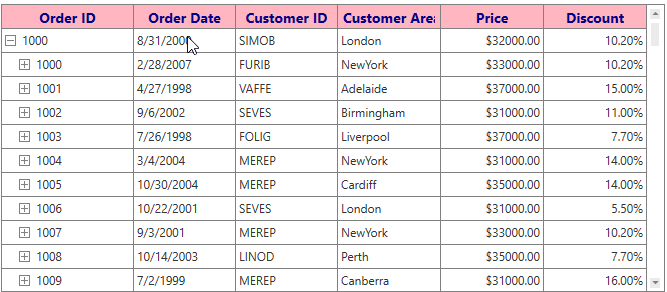
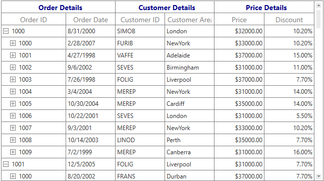
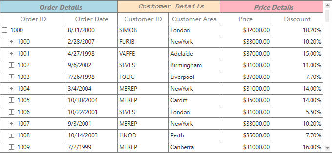

# Styles and Templates

## Styling Column Header

The header cell can be customized by writing style of TargetType [TreeGridHeaderCellControl](https://help.syncfusion.com/cr/wpf/Syncfusion.UI.Xaml.TreeGrid.TreeGridHeaderCell.html). You can set to particular SfTreeGrid by setting [SfTreeGrid.HeaderStyle](https://help.syncfusion.com/cr/wpf/Syncfusion.UI.Xaml.TreeGrid.SfTreeGrid.html#Syncfusion_UI_Xaml_TreeGrid_SfTreeGrid_HeaderStyle) property and the particular column can be styled by setting [TreeGridColumn.HeaderStyle](https://help.syncfusion.com/cr/wpf/Syncfusion.UI.Xaml.TreeGrid.SfTreeGrid.html#Syncfusion_UI_Xaml_TreeGrid_SfTreeGrid_HeaderStyleProperty) property.

N> `TreeGridColumn.HeaderStyle` takes higher priority than `SfTreeGrid.HeaderStyle` property.



<Window.Resources>
    
</Window.Resources>

<syncfusion:SfTreeGrid Name="treeGrid" Grid.Column="1" Grid.Row="1"
                                HeaderStyle="{StaticResource headerStyle}"
                                AutoExpandMode="RootNodesExpanded"
                                AutoGenerateColumns="False"
                                ChildPropertyName="Children"
                                ItemsSource="{Binding EmployeeDetails}"
                                LiveNodeUpdateMode="AllowDataShaping">



### Styling Stacked Headers

The appearance of stacked header can be customized by writing style of TargetType [TreeGridStackedHeaderCell](https://help.syncfusion.com/cr/wpf/Syncfusion.UI.Xaml.TreeGrid.TreeGridStackedHeaderCell.html).



<Window.Resources>
    
</Window.Resources>



### Setting Different Style for Each Stacked Header

You can apply the different style to stacked header by overriding the [default renderer](https://help.syncfusion.com/cr/wpf/Syncfusion.UI.Xaml.TreeGrid.Cells.TreeGridCellRendererCollection.html#Syncfusion_UI_Xaml_TreeGrid_Cells_TreeGridCellRendererCollection_ContainsValue_Syncfusion_UI_Xaml_TreeGrid_Cells_TreeGridCellRendererBase_) of StackedHeader.



<Application.Resources>
    
    
    
</Application.Resources>


//Default TreeGridStackedCellRenderer is removed.
this.treeGrid.CellRenderers.Remove("StackedHeader");
//Customized TreeGridStackedCellRenderer is added.
this.treeGrid.CellRenderers.Add("StackedHeader", new TreeGridCustomStackedRenderer());

public class TreeGridCustomStackedRenderer : TreeGridStackedHeaderCellRenderer
{
    public TreeGridCustomStackedRenderer()
    {
    }
    public override void OnInitializeEditElement(TreeDataColumnBase dataColumn, TreeGridStackedHeaderCell uiElement, object dataContext)
    {
        if (dataColumn.ColumnIndex == 0)
            uiElement.Style = App.Current.Resources["style1"] as Style;
        else if (dataColumn.ColumnIndex == 2)
            uiElement.Style = App.Current.Resources["style2"] as Style;
        else 
            uiElement.Style = App.Current.Resources["style3"] as Style;
        base.OnInitializeEditElement(dataColumn, uiElement, dataContext);
    }        
}



